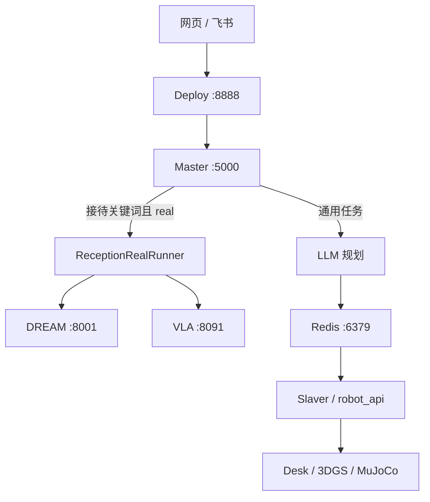

# FQPlanner 大脑项目

面向要在本机把大脑跑起来、从网页或飞书发任务、看仿真画面的人。下文命令默认在项目根目录执行，大脑主机地址为 `192.168.5.35`。

真机接待逐步启动看 [联调说明：三端联调启动](docs/联调说明_三端联调启动.md)。VLA 口径看 [接口说明_操控VLA](docs/接口说明_操控VLA.md)。全部资料见 [文档目录](docs/README.md)。

## 1. 大脑做什么

FQPlanner 是任务编排层，不直接控电机。飞书或网页把任务交给 Master；导航走 DREAM，抓放走 VLA。



两条链不要混：

| | 通用任务 | 公司任务（接待） |
|---|---|---|
| 入口 | 网页 / 飞书自然语言 | 飞书或网页触发，Master 判 `reception` |
| 本机仿真 | Desk `:5008`（无画面） | 看图优先 3DGS `:5002`，否则 MuJoCo `:5001` |
| 真机 | 无 | DREAM `:8001` + VLA `:8091` |
| 网页四宫格 | 取决于谁在听；Desk 本身不出图 | 当前仿真后端的四路相机 |

接待固定顺序：导航到茶水间（table2）→ 抓瓶装可乐 → 过门 → 导航回工位（table1）→ 放下。VLA 当前是 `hand_state_only`：终态 `COMPLETED_HAND_STATE_ONLY` 只说明左手开合加至少 3 帧证据，**不等于**图像证实可乐在手上或已放到桌面。

飞书和 8888 网页共用 `robot_api.intent`，只分两类：天气/百科等闲聊不 `publish_task`；「开始接待」「桌上有什么」等交给大脑。认不出、又可能动手的句子按任务处理，避免误聊把真动作吃掉。

通用、看图、接待这三类顶层任务，仿真和真机跑完都会做事后复盘。真机接待仍是固定 DREAM → VLA 顺序，复盘不改规划、不重放动作。DeepSeek 根据执行账本写候选经验，调不通就降模板；默认只落到 `master/memory/reflections/`（git 忽略），不改 SOP。只有 mock「开始接待」还兼容原来的 `write_sop`。飞书任务卡会多一行「复盘：」。

关闭复盘：`master/config.yaml` 中设置 `reflection.enabled: false`，或设置环境变量 `REFLECTION_ENABLED=0`。只用模板、不调用模型：`FQPLANNER_REFLECTION_LLM=off`。

## 2. 冷机怎么开

面板：`http://192.168.5.35:5678`（`web/run_panel.py`，systemd `fqplanner-panel`）。无登录，只能在可信网络使用。冷机只有面板自启，业务进程默认全停。

建议顺序：

1. **Redis** `:6379` → **Master** `:5000`；
2. **Deploy** `:8888`；要发飞书再启动**飞书桥接**，通用任务再启动 **Slaver**；
3. 要看图：先启动 **3DGS** `:5002`，起不来再启动 **MuJoCo** `:5001`；
4. 真机接待另行启动 DREAM / VLA；面板真机层两张卡片同时绿灯后才发任务。

当前 `master/config.yaml` 为 `collaborator.clear: false`，重启 Master **不会主动清空** Redis 协作库；但会中断当前 Master 进程和正在处理的任务，因此面板仍会先确认。只有显式改成 `true` 时，启动 Master 才清空对应协作库。面板启停的是本机 tmux，不会替你发布任务。

| 服务 | 地址 |
|---|---|
| 面板 | `http://192.168.5.35:5678` |
| 任务网页 | `http://192.168.5.35:8888` |
| Master | `http://127.0.0.1:5000` |
| 3DGS | `http://127.0.0.1:5002` |
| MuJoCo | `http://127.0.0.1:5001` |
| Desk | `http://127.0.0.1:5008`（无画面） |
| DREAM | `192.168.5.18:8001`；9882 仅绑定导航机回环地址，由大脑面板转发 |
| VLA | `192.168.5.194:8091` |

首次配置：

```bash
cp .env.example .env
```

飞书、SSH、远端地址从根目录 `.env` 读取。不要提交填写后的 `.env`。公开模板中 `RECEPTION_MODE=mock` 是安全默认值，并且它优先于 `master/config.yaml` 的 `reception_real.enabled`；真机环境必须显式改成 `RECEPTION_MODE=real` 或移除该环境变量。旧地址 `192.168.5.185` 和 `192.168.0.108` 已停用。

每个服务一个 tmux session：

```bash
tmux attach -t redis|master|deploy|feishu|slaver|desk|mujoco|gs
```

日志位于 `log/YYYY-MM-DD/<服务>/`。

## 3. 仿真后端和网页四宫格

`:8888` 任务控制台的四宫格不是四个仿真，而是当前一个仿真后端的四路相机。

Deploy 选图顺序：3DGS `:5002` → MuJoCo `:5001`。Desk `:5008` 没有 `/camera/latest`，不会显示在四宫格。

| 后端 | 画面 | 四路相机 |
|---|---|---|
| 3DGS `:5002` | 扫描高斯场景 | 俯视、头、右腕、左腕 |
| MuJoCo `:5001` | 几何厨房 / 轻量台面 | 俯视、正面、腕部、中心视角 |
| Desk `:5008` | 无画面 | — |

直播是实时渲染；回放是任务逐步截取的 JPEG。3DGS 首次出图会执行 CUDA JIT，可能需要一分多钟；期间 `/camera/latest` 返回一两 KB 的黑图属于正常初始化现象。

需要代理时：

```bash
export http_proxy=http://127.0.0.1:7897
export https_proxy=http://127.0.0.1:7897
```

真机接待不经过 3DGS / MuJoCo，机器人执行走 DREAM 和 VLA。

## 4. 网页和飞书怎么发任务

两个入口最终都进入 Deploy `:8888` → Master `:5000`。

- **网页**：在任务框提交。闲聊不会发送给大脑，运动类任务先确认；“开始接待”按钮视为已确认；
- **飞书**：私聊直接发，群聊使用 `@机器人 /task <内容>`；`/help`、`/status` 是桥接命令；
- `LARK_TASK_MODE=dry_run` 只发送卡片，不提交任务；`active` 才会真实发布。

真机接待中途失败并修好现场后，使用网页的**断点继续**，不要重新点击“开始接待”触发空手预检。

飞书配置：

```text
LARK_APP_ID=<应用 ID>
LARK_APP_SECRET=<应用密钥>
LARK_BRAIN_URL=http://127.0.0.1:8888
```

启动飞书桥接：

```bash
.venv_feishu/bin/python integrations/feishu/run.py
```

同一应用只能运行一个桥接进程，本机需要能访问 `open.feishu.cn`。

Master 在接待任务进入 Pipeline 前执行只读 `task_preflight`。DREAM `:8001` 或 VLA `:8091` 未就绪时返回 `status=rejected`，不会开始真实动作。

## 5. 发任务前 30 秒

1. 面板 Redis / Master 为绿色；
2. 要看图：3DGS 或 MuJoCo 为绿色，四宫格不是持续一两 KB 的黑图；
3. 要用飞书：飞书卡片为绿色，`LARK_TASK_MODE=active`；
4. 真机接待：DREAM 与 VLA 两张卡片均为绿色；
5. 确认现场支撑、肩带、急停及人工闸门已经按联调说明完成。

查看执行过程：

- 面板日志区；
- `log/YYYY-MM-DD/master/` 中的 `[task]` / `[reception]`；
- DREAM / VLA 探测和 SSH 输出位于当天 `monitor.log`。

## 6. 排障速查

| 现象 | 先看 |
|---|---|
| 网页提交没反应 | Master / Redis 是否监听；Deploy 日志是否调用 Master |
| 网页提示闲聊 | 改用明确任务表达，如“开始接待”“桌上有什么” |
| 四宫格持续黑图 | 3DGS 是否仍在首次 JIT；渲染日志是否异常 |
| 四宫格是几何块面 | 3DGS `:5002` 未启动，已回退 MuJoCo `:5001` |
| 飞书能聊天但不发任务 | `LARK_TASK_MODE` 及运动任务确认状态 |
| 接待立即 `rejected` | 检查 `task_preflight` 中 DREAM 8001 / VLA 8091 |
| 预检提示仍持有 `cola_can_1` | 抓取后失败，应使用“断点继续” |
| 导航失败但原因不清楚 | Master 日志中的 `未满足:`、`code` 和 `reason` |
| 飞书任务卡没有复盘 | 任务是否结束、复盘开关和模型配置 |
| CUDA / 3DGS 无法启动 | `nvidia-smi`；使用 `.venv_3dgs`，不要使用 nouveau |

## 7. 深入阅读

| 文档 / 文件 | 用途 |
|---|---|
| [文档目录](docs/README.md) | 架构、接口、联调、规划和排障索引 |
| [架构说明：三端架构](docs/架构说明_三端架构.md) | 当前系统全局架构 |
| [联调说明：三端联调启动](docs/联调说明_三端联调启动.md) | 大脑、导航、VLA/NX 启动、人工闸门、预检和收工 |
| [接口说明：大脑 Brain](docs/接口说明_大脑%20Brain.md) | Master 编排、状态、断点继续和证据策略 |
| [接口说明：导航 NAV](docs/接口说明_导航NAV.md) | DREAM 世界、状态和四段导航合同 |
| [接口说明_操控VLA](docs/接口说明_操控VLA.md) | 抓放接口和证据等级 |
| [Linux 控制面板](web/README.md) | 面板启停、一键脚本和站立 Enter |
| `master/sop/reception_real.py` | 真机接待阶段 |
| `master/sop/episode.py`、`master/sop/reflect.py` | 任务账本和事后复盘 |
| `master/run.py`、`deploy/run.py` | 网页如何转到 Master |
| `robot_api/intent.py` | 闲聊和任务如何分流 |
| `robot_api/look.py` | 飞书看图 |
| `web/run_panel.py` | 面板进程管理 |
