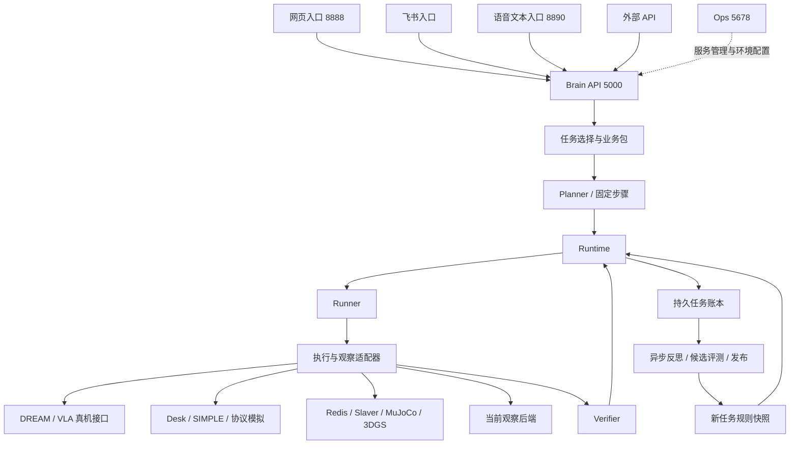

# 架构设计：系统架构与演进

更新日期：2026-10-09。范围为 Connection 大脑、独立入口、执行后端与学习模块的职责、设计理由和后续演进。当前结构按本仓库代码核对，现场通过范围按带日期的联调证据引用；本文不代表重新验收真机或改变部署配置。

本文合并原三端架构、重构前后对比和重构规划，作为唯一架构与演进主文档。接口字段、操作步骤在对应接口说明维护；每轮实验在多端联调维护。已过时的实施步骤、临时目录和迁移过程保留在 Git 历史，不再作为当前运行指南。

## 1. 当前架构

### 1.1 系统职责与调用方向

Connection 是任务级大脑，不直接控制电机。Runtime 是任务状态唯一权威；Planner 生成计划，业务包定义固定流程，Runner 执行既定步骤，Verifier 核验证据。

| 模块或端 | 负责 | 边界 |
| --- | --- | --- |
| 网页、飞书、语音文本入口 | 接收输入、必要确认、转发与展示 | 各自直连大脑，不持有另一份业务任务账本 |
| Brain 应用层 | 组装模块、工作器生命周期、API 与快照 | 一个大脑进程管理有界后台工作器；慢模型和执行调用不应阻塞控制请求 |
| Runtime | 任务、步骤、尝试、状态、恢复与事实落账 | 只读状态查询不推进任务；旧任务迟到结果不能覆盖新任务 |
| Planner / 业务包 | 能力约束内规划；定义固定 SOP | 模型不向固定接待流程注入坐标、跳步或额外动作 |
| Runner / 适配器 | 请求构造、提交、原命令查询、证据转换 | 不自主更换目标或路线，不把网络异常当作已停止 |
| Verifier | PASS / FAIL / UNKNOWN | 下游声称成功仍需身份、时间和效果证据；缺证据不能升级为成功 |
| DREAM | 定位、审核、路径规划、导航准入及执行终态 | 不自动调用 VLA；大脑不绕过导航安全链 |
| VLA | 抓放、策略停止、动作通路归还及操控证据 | 不决定下一段导航，不启动第二个 LowCmd 控制器 |
| NX / SONIC | 本体控制、输入采纳、本地保护 | 端口可用不等于本体已接管，物理保护不能由任务恢复解除 |
| Ops | 服务启停、健康、日志、运行环境 | 不发布接待任务，不充当第二个任务调度器 |
| learning | 反思、示教候选、评测、影子、发布与回滚 | 不在线改内核代码，不改变已经打开任务的规则快照 |

DREAM/VLA 使用 `fq/reception-lan/v1`。真机层常见导航端口 8001、VLA 8091、审核页 9882；实际地址来自 `config/networks.yaml` 当前网络和有效覆盖，不在架构文档维护第二张固定 IP 表。真机侧策略、relay、相机和控制器的详细操作见[控制面板](接口说明_控制面板.md)、[导航](接口说明_导航NAV.md)和[操控](接口说明_操控VLA.md)。

### 1.2 业务与执行后端

接待、通用任务、现场观察、桌面整理及历史演示共用 Runtime。明确登记触发词直接选业务；其他表述由 LLM 按登记范围选择。超范围需求应澄清或拒绝，不能静默套入固定 SOP。

完整单罐接待为 `reception.single_can` v1：table2 导航 → pick → relay2 导航 → relay3 横移 → table1 导航 → place；本地准备、可选检查、核验和交接节点围绕这六个动作展开。模型不能改写固定导航合同。`reception.single_can.nav_only` 仅由明确触发词选择，包含两个准备节点和四段导航；成功只表示仅导航测试完成。

`INITIALIZING`、`FETCHING_WORLD` 当前为本地节点；`/api/task_preflight` 返回兼容就绪值，不是真实三端预检。首段派发的导航门另查下游状态；不可达或未开时等待人工，继续会重新检查。接口的具体缺口见[大脑接口](接口说明_大脑%20Brain.md#81-流程与请求身份)。

| 后端 | 当前用途与限制 |
| --- | --- |
| 真机接待 | 大脑直连 DREAM / VLA；由实际派发许可和下游闸门决定准入，不能写死“当前始终关闭” |
| `reception_mock` | 历史接待演示，标记 `reception.demo`；不等于正式单罐 HTTP 接待 |
| `reception_protocol` | 独立 NAV/VLA 协议模拟，覆盖合同、异常和控制流程；不是物理运动证明 |
| `reception_simple` | SIMPLE O6 连续 MuJoCo 回合，复用接待客户端与核验；执行器可选旧房间或新办公室，验收按场景分别记录 |
| Desk | 通用抓放和整理的抽象状态后端，直接 HTTP，无实时相机 |
| `simple_o7` | SIMPLE O6 通用单步抓取，与 `reception_simple` 的六段接待能力区分 |
| MuJoCo / 3DGS | 既有通用工具路径继续经 Redis / Slaver；各自的运动与抓放真实性边界见联调记录 |
| 现场观察 | 使用显式选择的观察后端，不生成身体命令，不在后端不可用时自动换另一台相机 |

运行环境由全局模式加接待、通用执行、观察模块覆盖组成。草稿在 `config/execution.yaml`，生效快照在 `data/system/execution.json`；新任务绑定执行身份与环境版本，恢复附着原后端。切换需经过准入检查、健康核查、应用及失败回退，不能通过删除任务账本清除阻塞。未接入的通用真机能力明确不可用，不回落仿真。

### 1.3 工程与数据归属

SIMPLE 新办公室接入沿用远端 HTTP 服务、命令账本及每任务一个物理回合的结构。
场景选择发生在远端执行器内部，由办公室布局映射和动作描述适配到同一 Episode；大脑仍逐段派发和核验。
办公室资产保留独立快照，派生碰撞布局同时供物理与抓放规划使用；导航复用 O6 SONIC 的目标反馈控制，
不并行启动办公室演示的 ROS 自动任务循环。实际场景、资产哈希和校准物体差异写入执行证据，
接口及使用方式见 [SIMPLE 仿真接口](接口说明_simple%20o6%20仿真.md#新办公室场景office_v2)。

| 路径 | 维护内容 |
| --- | --- |
| `src/brain/app.py`、`application.py`、`workers.py` | 应用组装、统一生命周期、有界作业与控制 |
| `src/brain/kernel/` | Planner、Runtime、Runner、Verifier 与短时记忆 |
| `src/brain/packages/`、`skills/` | 业务包、固定流程、能力目录 |
| `src/brain/adapters/` | 模型、DREAM、VLA、Desk、Slaver、SIMPLE 与观察适配 |
| `src/brain/learning/` | 反思、示教、经验、评测、发布与回滚 |
| `src/brain/storage/`、`observability/`、`api/` | 持久账本、事件与统一 HTTP API |
| `src/entries/`、`clients/`、`contracts/` | 独立入口、共用客户端与合同 |
| `src/ops/`、`src/shared/` | 运维、配置、地址、日志与环境事务 |
| `src/execution/`、`simulation/` | 按需执行底座、仿真后端与独立服务 |
| `config/` | 配置模板、本机配置、业务规则与静态场景 |
| `data/tasks/` | 当前 Runtime 任务账本与事件；每步保存尝试和原命令 |
| `data/memory/`、`data/business/` | 经验、反思、示教及现场资料 |
| `data/timelines/`、`data/experiments/` | 回放与独立实验记录 |
| `data/retired/` | 历史数据，只读保存，不作为当前任务恢复入口 |
| `logs/` | 按日期和服务保存的过程日志与诊断 |

源码根为 `src`，不是 Python 包名；不存在正常运行用的 `src/connection` 兼容层。启动使用 `python -m brain`、`entries.web`、`entries.feishu`、`entries.voice`、`ops`。依赖安装与启动命令集中在[项目 README](../README.md)，运行步骤集中在[控制面板](接口说明_控制面板.md#三端启动与任务发布)。

任务存储沿用文件账本、目录互斥、版本检查和原子写入，不因旧规划提到 SQLite 就更换大脑存储；远端执行器可以独立使用 SQLite。旧 `ReceptionStore` 的相位文件不是另一份当前状态权威。迁移要保存来源和校验值，不把历史成功标签改名后强行续跑；工程迁移映射见 `tests/contracts/e6_file_map.json`、`tests/contracts/retired_test_coverage.json`。

## 2. 核心机制与设计理由

### 2.1 任务、命令与恢复

任务表示整轮目标，步骤表示流程中的环节，尝试记录一次执行，`command_id` 标识下游事务。保留这几个层级是为了区分“查询旧动作”和“再做一次动作”，避免超时、丢回包或重启造成重复抓放。

- 查询必须使用原命令；404、HTTP 500、连接断开本身均不能证明动作未执行。
- 可识别的提交拒绝与不确定提交分开保存；原命令已成功时先核验，不能因为用户点继续就重复动作。
- 新尝试须按当前控制规则确认原动作未开始或已结束，并保留旧请求和失败记录；重试用新的命令号。
- 暂停保留流程并请求停止当前动作；继续核查当前环节；跳过保留人工放弃记录。含跳过的流程结束不记全部成功。
- **取消任务只结束大脑编排与本地等待，不调用导航或操控取消接口，不声明本体已停。** 导航重启及现场停止独立处理。进程退出也不是物理停止证明。
- 取消关闭派发并隔离旧作业结果，避免迟到规划、执行或反思污染新任务。只读查询不增加重试次数。

此处解释机制，接口参数、可操作状态和详细判据以[大脑控制接口](接口说明_大脑%20Brain.md#12-任务控制接口)为唯一维护点。

### 2.2 核验与跨端交接

效果达成、原策略停止、动作出口归还、本体采纳新控制源是四件不同的事。手闭合不等于抓住物体，TCP 端口空闲不等于 NX 已接管。Verifier 检查身份、带时区时间、效果及停止证据；`hand_state_only` 不能让物体抓放通过。

当前大脑普通交接先查询原命令、导航和操控状态；无控制器凭证时，可以按原命令成功且已停、资源已释放、两侧无活动命令及通路就绪放行，记录 `transport_ready_without_receipt`。如果下游返回凭证，仍核查身份与有效期。跨越人工跳过的交接有显式例外，记录 `manual_skip`，不把原失败命令伪造成成功，下一端仍可按自身前置条件拒绝。具体实现与最终收尾见[大脑交接规则](接口说明_大脑%20Brain.md#83-控制交接与人工跳过)。

这些联调放行规则不等于真实控制器接管协议已经验收。不得将现有通路证据写成来源、代次、控制器实例均已被本体确认。5556 单发布者、现场定位批准、操控批准及本体保护继续属于对应端职责。

### 2.3 记忆、模型建议与学习

短时窗口只裁剪读取视图，默认最近 20 条、30 分钟；不删除事件账本或未核清命令。PASS 建立的进展保留来源，不随短时窗口过期；其他观测须带来源、观测时间和有效期。过期观测降为线索，冲突保留双方证据，不能拼成确定位置。实现见 `kernel/memory.py`。

模型参与通用规划、范围受限的业务选择及异常建议。异常建议绑定原任务、命令与账本版本，`automatic=false`；迟到或无效建议不能执行控制，格式非法时回退规则建议。当前网页显示中文原因与原始英文错误，不把 LLM 分析当作确定根因；API 可保留 `recovery_advice`。

反思读取执行快照，在在线执行闭环之外生成经验。保存反思文件不等于经验已生效：可归因的失败模板进入候选，经过离线评测和不派发动作的影子验证，才允许发布。单次首次成功、人工完成或同一步重试不能冒充自主改进证据。发布合并原活动规则并保留 `parent_id`，回滚沿父版本；新任务绑定快照，旧任务不随发布变化。

当前实现是有限规则和场景的学习切片，不代表通用自主学习、自动修代码或自动物理重试。相关代码为 `learning/reflection.py`、`releases.py` 和 `kernel/verifier.py`；示教保存也只进入候选。后台反思是否启用由配置和任务设置决定，不用文件是否存在推断本轮实际收益。

### 2.4 为什么保持这些工程边界

独立入口便于故障隔离，网页关闭后大脑仍可处理已接受任务；核心使用一个进程及受管理工作器，避免多个服务争写同一任务。Redis 只为仍依赖它的 Slaver 路径保留，不能为了统一目录删除执行底座，也不需要为此新增消息总线或工作流平台。

接口、账本与实际动作以任务和命令关联。日志是诊断证据，不是状态权威；查询和监测不自动推进任务。后端可替换，但不能通过降低核验标准“统一”真机与仿真。每次环境切换、部署和恢复都需区分进程在线、协议可用和物理动作通过。

## 3. 后续演进

以下为尚待完成或扩大的范围，不是新增 API 承诺，不因架构文档合并自动实施。每项先明确合同与验收，再更新接口和真实联调证据。

| 方向 | 当前边界 | 下一步与完成标准 |
| --- | --- | --- |
| 真正的任务前检查 | `task_preflight` 为兼容结果，准备节点不查全世界 | 明确只读检查项、结果时效与错误出口；服务不可达及条件变化不能误放行，接口与现场负例均验证 |
| 真机完整接待 | 已有仅导航多轮证据；完整 NAV + VLA + 本体闭环未由这些结果证明 | 完整跑通抓取、持物导航、放置和收尾，保留物体效果、停止、控制归属及每步原命令 |
| 控制器接管协议 | 当前无凭证可按通路就绪放行；这不是本体采纳证明 | 对齐真实源/目标、任务/命令、控制器实例/代次和有效期；覆盖迟到回包、重启、新 STOP 使旧凭证失效等负例 |
| 跨重启恢复与独立诊断 | 能保存账本和查询原命令；远端持久化及物理世界恢复能力不统一 | 先建立只读恢复诊断合同，再验证各端重启、丢回包和旧命令未知；不得通过新 ID 掩盖重复执行 |
| Slaver 在线控制 | 旧路径缺统一持久命令查询与在线停止证据 | 补齐命令身份、查询、停止和重启后核查；再证明可安全暂停和继续 |
| 仿真能力拓展 | SIMPLE 固定 O6 场景通过；3DGS 完整抓放缺验收 | 按场景、物体、种子记录成功失败；补齐物理效果和状态连续性，不把协议成功当物理成功 |
| 在线视觉与场景更新 | 部分后端无相机，物体效果主要来自各端回包 | 保证图像来源、时间与命令一致；跨任务和跨后端图像不能复用为证据 |
| 语音、求助与多机 | 已有已识别文本入口；完整语音业务、求助执行、多机调度未齐 | 分别定义能力、任务归属与完成标准；多机明确各任务和资源权威，不增加平行状态源 |
| 学习收益 | 候选、评测、影子、发布/回滚已有切片 | 用独立任务验证收益及回归，不以反思条数衡量；保持旧任务快照、可追溯和可回滚 |

增加能力时先检查现有业务包、适配器和接口是否能承接；只有职责改变才修改整体架构。未实现项明确写“待实施”，有代码但未做现场实验写“待验证”，不能混用。

## 4. 重要变更记录

| 日期 | 变化及原因 | 提交或证据 |
| --- | --- | --- |
| 2026-09-23 | 逐步引入 Runtime、来源与时效记忆、业务包和受限规则发布，避免不同业务各维护执行状态 | `4ae7667`、`5315c8b`、`5389d1a`、`debf3e5`、`d65a8f3`；各切片完成不代表全部扩展目标完成 |
| 2026-09-24 | 独立入口、应用工作器、最终源码和数据目录归并；旧 GlobalAgent / TaskQueue / 接待循环退出正常路径 | `d85e9b9`、`2086767`、`aec6fca`；重构前基线 `e1723f8`，整理后基线 `567f035`；迁移细节查 Git 与迁移映射 |
| 2026-09-24 | 接入独立 SIMPLE 服务，区分旧 O7 失败与 O6 原生抓取 | `b399d6a`；[抓取联调](多端联调_20260924_simple%20o6%20抓取接入.md) |
| 2026-09-28 | O6、Desk 恢复和仿真证据核验补齐；协议模拟提供可重复的接口实验 | `0567426`；[仿真通用任务](多端联调_20260928_仿真通用任务验收.md)、[模拟真机](多端联调_20260928_模拟真机.md) |
| 2026-10-08 | 控制器凭证改可选，明确人工跳过交接例外；增加仅导航 SOP 与门不可达等待行为 | `e81ec71`、`ac72de6`、`a37bc82`、`2459bf9`；当前规则见大脑接口，不把放行策略当接管验收 |
| 2026-10-08～09 | SIMPLE 从单步抓取扩展为独立接待路由，保留同一物理回合并导出网页任务回放 | `3e706f6`；[接入与物理实验](多端联调_20261008_simple%20o6%20仿真.md)、[正式网页验证](多端联调_20261009_simple%20o6%20网页接待.md) |
| 2026-10-09 | 真机仅导航联调暴露定位、终态、段序和远端服务问题；大脑细化原始错误展示、历史尝试和四个任务按钮 | [当日联调与代码核对](多端联调_20261009_大脑与导航流程及任务控制.md)；不把最后一轮重试成功写成一次通过 |
| 2026-10-09 | 文档统一为接口说明、多端联调、架构设计；当前规则只保留一个维护位置 | [文档目录与维护规则](README.md) |
| 2026-10-09 | 新办公室作为现有 SIMPLE 接待回合的可选场景，复用工作进程和合同，不新增大脑循环；区分导航演示与完整抓放接入 | [新房子联调](多端联调_20261009_simple%20o6%20新房子接待.md) |

历史提交可用 `git show <提交>:<当时文件路径>` 查询。原规划中的临时 `compat` / `src/connection` 和“真机许可保持关闭”等表述属于当时切换记录；当前以代码、生效配置与具体任务证据为准。
