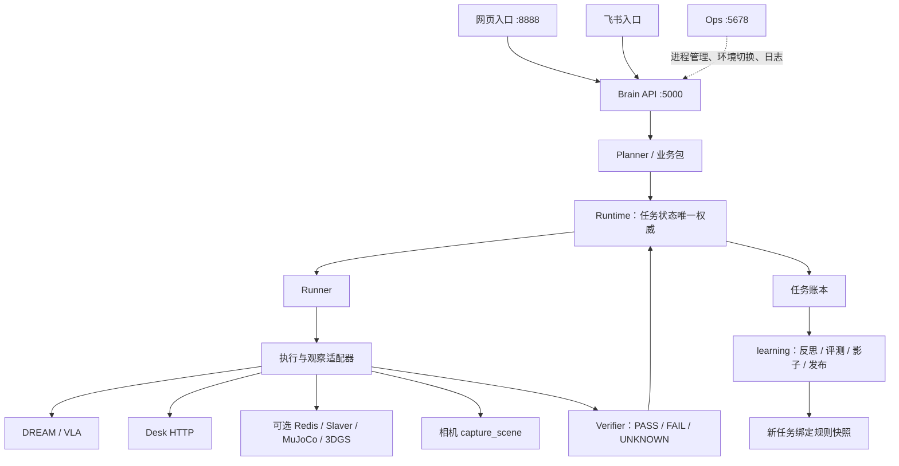

# 架构说明：三端架构

更新日期：2026-09-24
适用范围：FQPlanner 大脑、DREAM 导航、VLA 操控以及 G1/NX 真机链路  
契约版本：`fq/reception-lan/v1`

本文用于快速建立当前系统的全局认知。接口字段以三份“接口说明”为准，现场启停以唯一的“联调说明：三端联调启动”为准，尚未落地的能力以“规划说明”为准。

## 1. 系统定位

FQPlanner 是任务入口、意图分流和任务级编排层，不直接控制电机。

- DREAM 负责定位、规划和四段导航；
- VLA 负责抓取、放置、灵巧手和动作通路交接；
- NX/SONIC 是机载实际控制与安全执行层；
- Brain 统一组装 Planner、业务包、Runtime、Runner、Verifier 与异步学习；Runtime 是任务状态唯一权威；
- 面板 `:5678` 只负责进程启停、健康和日志，不负责发布任务。

## 2. 当前总体架构



一个大脑进程管理有界后台线程；网页、飞书与 Ops 各自独立。规划不派发动作，学习不修改内核代码。DREAM/VLA HTTP 合同与 command_id 字符串格式保持不变。接待直连 DREAM/VLA；Desk 通用任务直接使用原 HTTP；MuJoCo / 3DGS 的既有工具路径经 Slaver，只有这条路径需要 Redis。现场观察不产生身体命令。

软件默认入口已迁入 `src/connection`。2026-09-24 已重启本机大脑与独立入口并通过健康检查，真机动作许可保持 false；这不是原四阶段全部完成的声明。

## 3. 机器与服务部署

| 角色 | 当前地址 | 主要服务 |
| --- | --- | --- |
| 大脑 | `192.168.5.35` | 面板 5678、Redis 6379、Master 5000、Deploy 8888、仿真 5001/5002/5008 |
| DREAM 导航机 | `192.168.5.18` | 导航 HTTP 8001、人工审核页 9882 |
| VLA 工作站 | `192.168.5.194` | VLA HTTP 8091、导航/VLA relay 5556 |
| NX 机载计算机 | `192.168.5.240` | SONIC、相机 5555、灵巧手 |

旧 Windows 大脑 `192.168.0.108`、旧 DREAM `192.168.0.185` / `192.168.5.185` 均不是当前现场地址。

## 4. 任务入口与分流

### 4.1 网页入口

```text
浏览器
→ Deploy :8888 /publish_task
→ Master :5000 /publish_task
→ BrainApplication.publish() → BrainService → Runtime
```

网页只转发 API 并渲染页面；现场、经验、示教、媒体与时间线由大脑提供，网页退出不影响已接受任务。

### 4.2 飞书入口

```text
飞书消息
→ FeishuBridge 意图识别与必要的人工确认
→ BrainClient
→ Brain API :5000
```

网页和飞书最终进入同一个 Master。天气、百科等闲聊不会发布任务；接待、观察和其他动作请求进入任务分流。

### 4.3 统一分流

接待、通用任务、现场观察、桌面整理和接待演示都使用同一 Runtime。业务包给出步骤，通用任务由 Planner 拆解；目标后端由已应用环境配置选择，支持模块覆盖。没有应用配置时才使用既有配置兼容值。真机接待仍受 `kernel_enabled` 与交接闸门约束；未接入的真机通用能力明确拒绝，不回落仿真。

## 5. 真机接待 Pipeline

代码入口：`brain.packages.reception` 提供固定相位，`brain.kernel.runtime` 推进，`brain.adapters.execution.BodyAdapter` 调用既有客户端。旧接待执行循环已从当前源码退出，历史实现保留在 Git。下述底层路线与端口约束保留；旧 `hand_state_only` 不能使新内核任务成功，交接查询未确认会阻断下一动作。

当前固定顺序：

```text
只读预检 DREAM / VLA / 世界与关系图
→ DREAM 导航到 table2
→ 跳过 DREAM 细检（当前 dream_inspection_enabled=false）
→ VLA pick cola_can_1
→ 按当前证据策略确认抓取结果
→ DREAM 导航到 relay2
→ DREAM 横移到 relay3
→ DREAM 导航到 table1
→ VLA place cola_can_1
→ 按当前证据策略确认放置结果
→ 写终态并触发事后复盘
```

任一步明确失败、取消、超时或进入不确定状态，后续业务动作停止。

### 5.1 当前证据等级

当前配置：

```yaml
vla_result_policy: hand_state_only
dream_inspection_enabled: false
grasp_photo_verification_enabled: false
place_photo_verification_enabled: false
camera_owner: vla
```

因此正常终态是 `COMPLETED_HAND_STATE_ONLY`，表示灵巧手开合及 VLA 终态满足当前门槛，不等同于视觉证明可乐确实被抓住或放到桌面。

若以后启用严格物体证据或照片判真，终态和验收口径必须同步更新接口说明。

### 5.2 导航与操控边界

- Master 是唯一任务级编排者；
- DREAM 不自动调用 VLA，也不通过 `/nav_done` 自动触发抓放；
- VLA 不决定下一段导航；
- 大脑不连接 5556，也不直接发布 ROS goal、Token 或电机指令；
- 导航和 VLA 共用工作站 5556 动作出口，切换必须保证单一发布者；
- VLA 动作结束需停止策略并归还 relay，Master 才能进入下一段。

需要特别区分：

```text
VLA 策略停止
≠ 5556 端口归还
≠ NX 已解除 safe hold
≠ NX 已采用导航输入
```

完整的跨源控制接管增强仍在规划中，不能仅凭端口恢复推断 NX 已完成接管。

## 6. DREAM 导航架构

DREAM 在 `192.168.5.18:8001` 对外提供健康、世界、关系图、导航提交、命令查询和总状态。

接待任务包含四段导航：

1. table2：到茶水间目标桌；
2. relay2：门外接近点；
3. relay3：横移过门；
4. table1：返回工位桌。

DREAM 保留定位、9882 人工初始位姿审核、Gateway、Token、碰撞保护和真实终态判定。Master 只能提交已约定目标并轮询结果，不能绕过导航安全链。

## 7. VLA 操控架构

VLA Bridge 在 `192.168.5.194:8091` 提供：

- 健康与控制状态；
- pick/place 异步任务；
- 任务查询与取消；
- 相机状态和动作后快照。

当前抓取使用 Phase-Aware RTC，放置复用经审核的 place 脚本。Bridge 复用已经运行的 SONIC、NX 相机和 LinkerHand，不启动第二个 LowCmd 控制器。

相机由 NX 上的 VLA 相机服务唯一打开，Bridge 只读订阅 `192.168.5.240:5555`；DREAM 和大脑不重复打开 RealSense。

place 仍包含现场人工批准，等待批准不等于动作失败。

## 8. 通用任务与仿真架构

通用任务先在 Runtime 开任务并绑定版本，再调用 Planner；Runner 执行，Verifier 按真实证据核验。Desk 直连 `robot_api` 的原抓放 HTTP；MuJoCo / 3DGS 保留 Redis → Slaver → robot_api 的工具执行通路，返回证据后由 Runtime 更新账本。Slaver 不持有业务任务状态权威。

- Desk `:5008`：无四宫格画面；
- MuJoCo `:5001`：几何仿真；
- 3DGS `:5002`：扫描场景画面；
- 四宫格严格使用已选观察模块，不跨环境寻找相机；
- 仿真画面不是 DREAM/VLA 真机执行链的一部分。

## 9. 状态、恢复与复盘

### 9.1 真机任务状态

`ReceptionStore` 将当前接待状态写入：

```text
data/retired/reception/current_task.json
```

记录包括 `task_id`、运行相位、失败相位、命令 ID、持物状态和恢复次数。

### 9.2 断点继续

网页 `:8888` 已支持 `resume: true`：

- 沿用原 `task_id`；
- 从 `failed_phase` 继续；
- 跳过已经完成的步骤；
- 续跑预检允许任务处于持物状态；
- 不通过重新发布“开始接待”实现恢复。

当前限制：

- 只支持真机接待；
- 飞书入口尚未提供断点继续操作；
- DREAM/VLA 重启后若历史命令丢失，续跑仍可能失败；
- 独立 recovery-check、下游状态核定和跨重启保证仍属未来规划。

### 9.3 事后复盘

真机接待、mock 接待和通用顶层任务结束后都会生成统一 episode，并由 DeepSeek 或降级模板提炼候选经验。

复盘只读取执行账本：

- 不改变本轮规划；
- 不重放机器人动作；
- 默认写入 `data/memory/reflections/`；
- 真机默认不修改 SOP。

## 10. 启动依赖与安全边界

冷机启动顺序：

```text
Redis
→ Master
→ Deploy
→ 按需启动飞书 / Slaver / 仿真
→ 启动 DREAM 一键流程及 VLA/NX 真机链
→ 完成站立、解肩带、9882 初始位姿等人工闸门
→ 只读预检
→ 发布真机任务
```

关键安全边界：

- 机器人必须有支撑、肩带和现场急停；
- 9882 初始位姿审核不能自动代点；
- place 人工批准不能由大脑模拟；
- 未证明策略停止、动作出口归还或控制接管时，不得继续下一动作；
- 面板和 HTTP 服务在线不等于机器人具备安全动作条件；
- LLM 不得改变固定接待顺序或决定解除实体安全保持。

## 11. 当前能力与未完成项

已落地：

- 网页和飞书统一任务入口；
- Runtime 与接待固定相位（真机动作许可关闭）；
- DREAM 四段导航与 VLA pick/place HTTP 调用；
- VLA 当前真实 hook、8091 Bridge、5556 relay 与安全门控；
- 网页断点继续 MVP；
- 统一任务账本和事后复盘；
- Linux 面板统一启停、日志和真机状态展示。

仍有限制或待实施：

- 真机下游若只给 hand_state_only 弱证据，新内核不会把它判为任务成功；
- 内核跨重启只查询原命令；真实远端查询与交接能力仍须现场核实；
- 5556 归还后 NX 控制接管的完整事务化协议仍在规划；
- 多罐循环、自动重抓和通用真机任务不在当前范围；
- 真机异常恢复仍需要现场人员判断和批准。

## 12. 代码入口

| 职责 | 正常实现 |
| --- | --- |
| 大脑组装 / 生命周期 | `src/brain/app.py`、`application.py`、`workers.py` |
| 规划、状态、执行、核验 | `src/brain/kernel/` |
| 业务包 / 技能 | `src/brain/packages/`、`skills/` |
| DREAM / VLA / Desk / Slaver / 相机 | `src/brain/adapters/` |
| 反思、评测、发布、示教 | `src/brain/learning/` |
| 账本 / 日志 | `src/brain/storage/`、`observability/` |
| HTTP API | `src/brain/api/` |
| 网页 / 飞书 | `src/entries/`（共享 `clients`、`contracts`） |
| 运维 | `src/ops/` |
| 通用执行底座 | `src/execution/`，按需使用 |

旧源码目录和兼容层已经退出。配置集中于 `config/`，任务与经验位于 `data/`，日志位于 `logs/`。旧接待数据只读存档，不作为新任务续跑入口。最终替换记录见规划第 16 节。

## 13. 配套文档

接口：

- [接口说明_大脑 Brain](接口说明_大脑%20Brain.md)
- [接口说明_导航NAV](接口说明_导航NAV.md)
- [接口说明_操控VLA](接口说明_操控VLA.md)

现场联调：

- [联调说明：三端联调启动](联调说明_三端联调启动.md)

统一规划：

- [规划说明：具身大脑重构](规划说明_具身大脑重构.md)：第 16 节为当前工程，第 17 节为控制交接与恢复约束。

排障案例：

- [2026-08-31：抓取后导航控制未恢复](案例排障_20260831_抓取后导航控制未恢复.md)
- [2026-09-17：导航启动人工闸门超时](案例排障_20260917_导航启动人工闸门超时.md)
