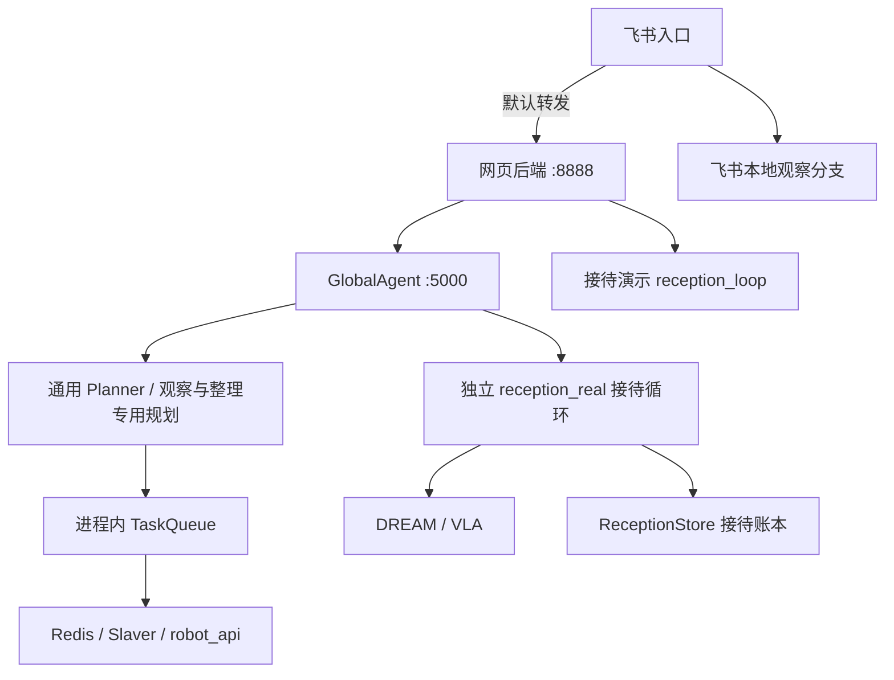
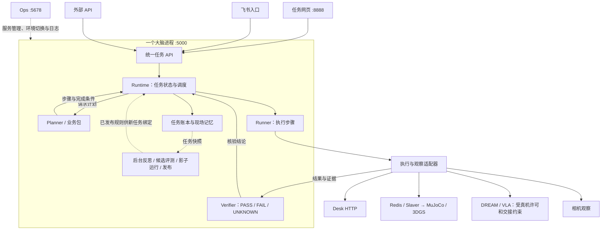

# 架构说明：重构前后对比

更新日期：2026-09-28
适用范围：Connection 大脑、任务入口、执行适配、目录组织与运维方式。  
状态：统一 Runtime、独立入口、最终目录替换及面板分组已经落地；真机交接验收、语音、求助、多机等剩余范围未因此完成。

本文记录已经发生的变化，不新增规划，也不修改冻结的模块职责。当前架构以[三端架构](架构说明_三端架构.md)为主，实施与剩余约束以[重构规划](规划说明_具身大脑重构.md)第 16、17 节为准；后续提交与仿真验收见第 18 节。运行代码与配置变化后，应同步更新相关说明；历史行为不能作为当前操作依据。

## 1. 对比基线与结论

| 基线 | Git 提交 | 含义 |
| --- | --- | --- |
| 重构前 | `e1723f8` | 第一阶段内核实现之前，仍使用 GlobalAgent、通用 TaskQueue 和独立接待执行循环 |
| 重构后 | `567f035` | 统一调度、工程替换、环境目录归并和运维面板分组完成后的代码 |
| 后续联调 | `0567426` | 2026-09-28 的 SIMPLE O6 接入、仿真执行与核验修复；不改变上述重构对比基线 |

重构前，通用任务、接待、观察等业务在不同分支中组织执行，任务状态与运行数据分散。重构后，所有业务任务进入同一套大脑应用，由 Runtime 统一管理任务状态、执行推进、核验、取消和恢复；入口、业务规则、学习流程和执行后端具有明确边界。

统一的是任务机制。通用任务仍需要 Planner，接待仍使用已审核的业务相位，桌面整理仍采用已有关系判断与技能展开。没有把所有任务都改成由大模型自由决定路线。

## 2. 总体变化

| 对比项 | 重构前 | 重构后 |
| --- | --- | --- |
| 大脑组织 | `master/agents/agent.py` 共 1853 行，集中承担分流、规划调用、调度和状态协调 | `brain` 应用组装内核、业务包、适配器、存储、学习与 API，各模块按职责组织 |
| 接待执行 | `master/sop/reception_real.py` 共 1173 行，独立维护接待线程和状态 | 接待业务包提供相位，共用 Runtime、Runner 和 Verifier |
| 任务状态 | 通用任务使用进程内 TaskQueue；接待使用 ReceptionStore；查询旁路也可能修改旧接待状态 | Runtime 是唯一任务状态权威，账本统一存入 `data/tasks`，查询读取状态投影 |
| 任务入口 | 网页承载部分业务执行与媒体逻辑；飞书默认经网页 `:8888` 转发，也有本地观察分支 | 网页和飞书分别直连大脑 `:5000`，不持有大脑账本；业务观察进入 Runtime |
| 成功判定 | 工具返回、业务流程和接待核验分别判断，证据口径不一致 | Verifier 输出 PASS / FAIL / UNKNOWN；弱证据不直接升级为物体抓取或放置成功 |
| 尝试与恢复 | 接待续跑使用整次任务的 `resume_count`；按相位保存命令会覆盖历史尝试 | 每一步保留尝试历史；恢复先查询原 `command_id`，只读重查不增加尝试 |
| 现场记忆 | 场景 YAML、接待账本、经验与 episode 各自读写 | 现场观测记录来源、时间、有效期；过期作为线索，冲突保留来源 |
| 反思迭代 | 已有反思、失败归因和经验写入，缺少候选评测与版本回滚机制 | 后台反思读取任务快照；已落地的候选规则切片具备评测、影子运行、发布与回滚 |
| 工程目录 | 生产代码分散在 `master`、`deploy`、`web`、`integrations` 等根目录 | 源码统一到 `src`；配置、数据、日志、本机环境分别归档 |
| 环境选择 | 后端选择散在各模块配置与启动方式里 | 全局环境加模块覆盖，CLI 与面板共用受控应用流程 |
| 运维界面 | 大脑、入口、执行依赖与三个仿真服务混在“大脑层” | 分为大脑层、运行环境、真机层；日常默认看大脑日志 |

上述变化保留 DREAM / VLA 的既有 HTTP 合同和命令身份规则，不新增默认 Middleware，也不改变导航、操控与本体的职责。

## 3. 执行链路前后对比

### 3.1 重构前



接待、观察和桌面整理在 GlobalAgent 内提前分流。接待有独立生命周期，通用任务主要由队列驱动；网页接待演示和飞书本地观察还存在其他执行入口。增加恢复、核验或日志能力时，需要分别处理多条链路。

### 3.2 重构后



虚线表示事后学习、规则读取或运维关系。学习不处于身体动作闭环内，不自动修改内核代码，也不把新规则插入已打开的任务。图中的真机适配路径表示代码接线，不能据此认为当前已允许派发真机动作。

### 3.3 各业务现在走哪里

| 业务 | 现在的计划来源与执行方式 |
| --- | --- |
| 通用任务 | Planner 生成步骤与完成条件，交给 Runtime 执行和核验 |
| 开始接待、接待续跑 | 接待业务包提供既定相位；恢复附着原任务，先核查原命令 |
| 现场观察 | 观察业务包通过 LookAdapter 调用既有相机能力；不发身体命令，成功观测进入现场记忆 |
| 桌面整理 | 关系判断和已有技能展开为步骤，再由 Runtime 推进；不再另跑旧队列 |
| 网页接待演示 | 进入同一大脑的 Runtime，使用接待 mock 流程，不再由网页启动旧接待循环 |
| 网页、飞书的状态查询与任务控制 | 请求同一个 Brain API，读取或操作同一个任务权威 |

业务规划仍有差异，生命周期管理已经统一。具体接线见 [PlanningService](../src/brain/planning.py)、[BrainService](../src/brain/service.py)和[执行适配选择](../src/brain/adapters/ports.py)。

## 4. 内核机制发生了什么变化

### 4.1 原命令、尝试历史与恢复

以“抓取请求发出，但回包丢失”为例：新 Runtime 保留原命令及请求快照，任务进入 `recovery_required`。恢复先查询原 `command_id`；核清之前不会因为超时就另发一次抓取，也不会继续派发后面的身体动作。

任务身份区分 `task_id`、`step_id`、`attempt_id`、`command_id`。同一步的历史尝试保留在账本里，新的物理尝试按该步计数增加 `-r{n}`；只读查询不增加计数。命令字符串沿用既定形状，如 `nav-{key}-{token}`、`vla-pick-{token}`、`vla-place-{token}`。

取消受理是 `cancelling`；停止、命令终态与资源处置全部核清后才是 `cancelled`。人工闸门未完成使用 `waiting_human`，暂停使用 `paused`，不能都合并成恢复状态。持久账本不等于能够保证跨进程物理动作恰好执行一次。

### 4.2 核验与现场记忆

旧接待的 `COMPLETED_HAND_STATE_ONLY` 只说明旧证据策略下的结果，不能转换成新内核的 `succeeded`。新核验要求证据满足当次合同；只有手部开合或缺少抓取、放置终态时，不能把物体写成已在夹爪或已在目标桌面。动作效果已经核验、但交接未确认时，保留已确认的进展，阻断下一段身体动作，不能把交接失败当成重新抓放的理由。

现场描述等观测带来源、带时区的观测时间和 `valid_until`；过期后只作为线索，有冲突时不返回一条确定事实。核验确认的进展保留，但不能因此假定现实环境永远不变。短时上下文默认最近 20 条、30 分钟，可配置；窗口裁剪读取结果，不删除账本、事件文件或未核清命令。

### 4.3 规划、反思与迭代

规划和反思都已归入 `src/brain`。Planner 负责形成计划，不直接派发动作；Runner 执行授权步骤，不自行改业务目标或路线。反思归入 `learning`，使用持久化任务快照在后台处理，不回写另一项任务的状态。

已落地的规则切片要求候选有可核对的失败归因，经过匹配业务包与技能的评测、影子运行后才可发布。影子运行不提交身体端口；人工完成和重复尝试不计为自主成功。发布保存业务包规则快照，版本记录 `parent_id`，回滚沿该快照的来源版本返回。新任务绑定打开时的规则版本，已打开任务保留原版本。

这些是受约束的经验迭代机制，不表示系统已经具备任意规则的自动验证或自动改代码能力。实现可查 [Runtime](../src/brain/kernel/runtime.py)、[Verifier](../src/brain/kernel/verifier.py)、[记忆](../src/brain/kernel/memory.py)、[反思工作器](../src/brain/learning/worker.py)和[发布账本](../src/brain/learning/releases.py)。

## 5. 目录与旧代码去向

### 5.1 主要迁移关系

以下表示职责归属变化，不表示文件逐个改名或原样搬迁。

| 重构前的位置 | 重构后的位置与职责 |
| --- | --- |
| `master/agents/agent.py` | `src/brain/application.py`、`service.py`、`kernel/`、`packages/`：生命周期、任务应用、内核与业务规则 |
| `master/agents/planner.py` | `src/brain/kernel/planner.py`、`planning.py`、`adapters/planning_inputs.py`：规划机制、编排与输入适配 |
| `master/sop/reception_real.py` | `src/brain/packages/reception.py`、`kernel/`、`adapters/`：相位、统一执行与身体合同 |
| `master/sop/reflect.py` | `src/brain/learning/`：反思、经验、候选评测与发布 |
| `master/integrations/` | `src/brain/adapters/`：DREAM、VLA 等外部能力适配 |
| `deploy/`、`integrations/feishu/` | `src/entries/web/`、`src/entries/feishu/`：独立入口 |
| `web/` | `src/ops/`：运维面板和环境应用 |
| `slaver/`、`robot_api/`、`serve_dream/` 等 | `src/execution/`：保留的执行能力与通信底座 |

### 5.2 现在的目录

```text
Connection/
├── src/
│   ├── brain/              大脑应用、内核、业务包、学习、存储与 API
│   ├── entries/            任务网页、飞书和语音文本入口
│   ├── ops/                运维与运行环境管理
│   ├── execution/          Slaver、机器人接口与执行服务
│   ├── contracts/          共享数据合同
│   ├── clients/            大脑 HTTP 客户端
│   └── shared/             配置、路径、日志等基础设施
├── config/                 模板、本机配置、业务规则与静态场景
├── data/                   任务、经验、媒体、飞书数据库与环境快照
├── logs/                   按日期和服务保存日志
├── venv/                   core、gpu、cuda、deps；整个目录不入 Git
├── simulation/             仿真后端与资产
├── tests/                  回归测试
├── scripts/                初始化、验证、切环境和迁移工具
├── infra/                  systemd、Docker/ROS 部署设施
└── docs/                   架构、接口、联调与实施记录
```

`src` 是源码根，不是再套一层项目。没有 `src/connection`，项目只保留根目录的一份 `pyproject.toml`。具体目录职责与启动方式见[项目 README](../README.md)。

旧 GlobalAgent、旧队列、旧 Planner 实现、旧接待循环和 Python 导入兼容壳已经退出当前源码；历史可查 Git `e1723f8`，工程替换前的过渡形态可查 `d85e9b9`。没有运行时自动回退到旧实现的分支。旧接待数据只读保存在 `data/retired/reception`，不转换旧终态，也不作为新 Runtime 的恢复入口。

日志和面板 API 中仍出现的 `master`、`deploy` 是保留的服务标识；实际启动的是 `python -m brain`、`python -m entries.web`，不代表仍在运行旧代码。

## 6. 进程、环境与日常使用

### 6.1 一个大脑进程，受管理的工作线程

大脑内部由一个生命周期管理器组织 Runtime 状态线程、规划工作线程、I/O 与控制工作线程，以及后台反思工作器。任务状态修改由 Runtime 所在线程统一处理；等待网络或模型响应时，控制请求有单独的处理通道。账本进程锁拒绝第二个大脑同时持有同一本账。实现见 [BrainApplication](../src/brain/application.py)和[工作线程管理](../src/brain/workers.py)。

网页、飞书和 Ops 各自独立。网页退出不代表任务取消，重启入口不需要重建大脑账本。整个系统仍包含执行服务和仿真进程；“一个大脑”不表示把 GPU 仿真、入口和机器人服务都塞进一个进程，也不表示最后一次面板整理减少了服务数量。

### 6.2 Redis、Slaver 与后端选择

| 路径 | 当前依赖与边界 |
| --- | --- |
| Desk 通用执行 | 大脑直接调用 Desk HTTP，不依赖 Redis / Slaver；Desk 不提供相机画面 |
| MuJoCo / 3DGS 动作执行 | 仍经过 Redis / Slaver 执行底座，因此这两个组件保留 |
| 现场观察与网页画面 | 使用配置中的观察后端；观察选择与动作执行选择可以不同 |
| 真机接待 | 使用既有 DREAM / VLA 客户端，受真机派发许可、核验与交接约束 |

`config/execution.yaml` 提供全局选择和接待、通用执行、观察的单独覆盖。应用环境会检查在途任务、命令与资源，验证配置并在失败时回退；不会因为选择“真机”而自动取得动作许可。尚未接好的真机通用执行与观察能力明确报告不可用，不自动退回仿真。操作方式见[统一环境配置](../config/README.md#统一切换仿真与真机)。

### 6.3 运维面板

| 页面 | 重构后的日常用途 |
| --- | --- |
| 大脑层 | 大脑、任务网页、飞书、语音文本入口；主要区域看大脑日志，入口可单独开关 |
| 运行环境 | 配置全局环境与模块覆盖；启停 Desk、MuJoCo、3DGS；高级折叠区管理 Redis / Slaver |
| 真机层 | DREAM / VLA 健康、远端启停和日志 |

任务过程统一查看大脑日志；入口与执行服务的原始诊断日志仍保留，不把所有进程输出混成一个文件。切换面板侧栏不会应用环境配置，入口开关不会切走大脑主日志。详见[运维面板](运维面板.md)。

## 7. 已完成范围、验证与剩余工作

### 7.1 已完成的软件与工程范围

- 通用任务、接待、观察、桌面整理及接待演示进入统一 Runtime。
- 任务账本、尝试历史、三态核验、基础恢复、现场记忆及规则发布切片落地。
- 网页、飞书与大脑解耦；规划和学习归入同一个大脑应用。
- 旧源码与兼容层退出，配置和数据迁移到明确目录，本机环境归并到 `venv/`。
- 运行环境统一配置，面板按大脑、环境、真机分组。

### 7.2 已有验证记录

| 验证轮次 | 2026-09-24 的结果 | 证明范围 |
| --- | --- | --- |
| 最终目录与环境替换 | 292 条测试、27 项 DREAM 自测通过；安装包与部署检查完成 | 工程替换及已有行为回归，详见重构规划第 16 节 |
| 运维面板分组 | 59 条运维测试、9 项浏览器检查通过；实际页面只读检查完成 | 服务分组、入口开关交互、日志选择、环境表单与布局 |
| 面板更新部署 | 只重启 Ops；8 个业务 tmux pane PID 与配置核对未变 | 面板更新没有启停业务服务或切换执行环境 |

这些是各轮实施的验证记录，本次编写对比文档没有重新运行软件回归。测试数量不能相加当作覆盖范围，也不能代替真机现场验收。

### 7.3 仍未完成或不能推断完成的范围

- 真机受控交接、下游原命令查询与停止确认等能力仍需核实并完成现场验收。`BodyAdapter.handoff()` 当前明确返回不可用。
- 真机通用执行、真机观察不能仅凭环境配置选项认为已经接通；语音执行、求助、多机等剩余能力未在这次工程替换中完成。2026-09-29 的语音文本入口只转发已识别文字，不包含真机采集，也不等于语音执行技能已经接入。
- 独立恢复检查 API、完整跨端持久恢复与远端协议改造仍有未完成范围。
- 规则评测与发布只覆盖已实现的候选模板和证据合同，不代表原四阶段全部范围完成。

2026-09-24 工程替换结束时，本机接待选择真机适配，通用执行选择 Desk，观察选择 3DGS；`reception_real.kernel_enabled=false`。这个字段当前表示真机派发许可关闭，任务仍然进入新 Runtime，不再回落旧接待。后续真机放行继续按[重构规划](规划说明_具身大脑重构.md)第 9.7、17 节执行。


### 7.4 后续仿真验收（2026-09-28）

最新提交 `0567426` 已补齐 SIMPLE O6 接入、Desk 原任务恢复及仿真执行和核验修复。Desk 抓放、SIMPLE O6 抓取并稳定持有、MuJoCo 抓取—导航—放置、3DGS 导航已在所列任务范围内通过；3DGS 完整抓放尚未通过，Slaver 在线停止和持久化命令查询仍有缺口。完整结果、失败证据及回归记录以[仿真通用任务验收](联调说明_仿真通用任务验收.md)为准，不将有限仿真任务通过扩大为真机验收完成。

该次实验结束时，日常入口为通用执行 Desk、观察 3DGS、接待 mock，真机派发许可仍为 false；这更新了上文 2026-09-24 的配置快照。提交进度汇总见[重构规划第 18 节](规划说明_具身大脑重构.md#18-最新提交与验收索引2026-09-28)。
