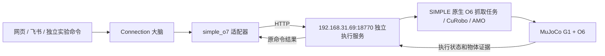
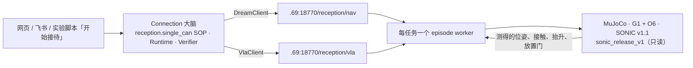

# SIMPLE 仿真接入（当前 O6，配置名保留 simple_o7）

实验日期：2026-09-24；文档更新：2026-09-28。O6 已完成三轮完整大脑抓取实验，结果见第 7 节。
旧 O7 失败记录保留在第 6 节，不能当作当前 O6 的结果。

## 1. 接入边界

Connection 新增 `simple_o7` 执行适配器，复用现有 Planner、Runtime、Runner 和 Verifier。
网页和飞书的发布接口不变。初次接入未切换默认运行环境；2026-09-28 正式入口验收曾临时切换，结束后恢复 Desk，见第 9 节。真机动作许可没有开启。



对方项目是 Ubuntu 22.04、RTX 4080 SUPER、Docker `simple:260904`，Python 3.10、MuJoCo 3.3.6。
当前 O6 抓取使用 CuRobo 运动规划、AMO 身体平衡和手臂力矩 PD，在 MuJoCo 内执行。
旧 O7 抓可乐入口仍使用 SONIC。项目还有 Isaac Sim 4.5 渲染能力，本次没有接入该画面。
本接入不调用 GR00T 5555，不将静态文件服务 18765/18766 当执行接口。

## 2. 文件与部署

Connection 中：

| 路径 | 职责 |
|---|---|
| `src/brain/adapters/simple_o7.py` | 远端场景与能力输入、计划约束、提交、查询、取消、证据转换 |
| `src/brain/adapters/ports.py` | 注册新后端，保存执行目标身份 |
| `src/shared/execution_profile.py` | 环境配置接受 `simple_o7` |
| `src/ops/simple_remote.py` | 面板读取远端健康、日志及独立容器启停 |
| `simulation/backends/simple_o7/service/o6.py` | O6 场景身份、源文件指纹和末段物理持有核验 |
| `simulation/backends/simple_o7/` | 独立服务的部署源码，单独运行，不导入大脑 |
| `scripts/simple_o7_experiment.py` | 使用隔离账本运行同一套大脑的实验入口 |
| `tests/brain/test_simple_o7.py` | HTTP 合同、账本、重启、取消和 Runtime 验证 |

远端机器上（`<REMOTE_WORKSPACE>` 为部署工作区，`<CONNECTION_ROOT>` 为本机仓库根目录，使用命令前替换为实际路径）：

```text
<REMOTE_WORKSPACE>/
├── code/
│   ├── SIMPLE/
│   └── SIMPLE-o7-verify/        # 原项目，只读使用
└── connection-simple-o7/       # 我们的服务，与 code 平级
    ├── service/
    ├── config.json
    ├── .env                    # SIMPLE_O7_TOKEN，不进 Git
    ├── start.sh
    ├── manage.py               # 仅启停我们的容器；未核清命令阻止停止
    └── runtime/
        ├── commands.sqlite3
        ├── worker.log
        └── episodes/<episode_id>/
            ├── source_fingerprint.json
            ├── prepared/      # 仅旧 O7 使用
            ├── plan/          # 仅旧 O7 使用
            ├── execution/
            └── *.log
```

容器名为 `connection-simple-o7`，端口为 18770。原项目挂载到 `/mnt/simple:ro`。
我们产生的输出、缓存、编译缓存和运行记录都写在自己的目录。没有修改原项目源码、场景、模型或控制参数，未重启既有容器。

首次创建服务：在远端独立目录运行 `bash start.sh`。已有容器用 `python3 manage.py start` / `python3 manage.py stop`。
停止脚本在命令账本互斥内检查未结束命令并关闭新命令入口；有未核清命令时拒绝停止。
面板也只调用这个脚本，不操作其他容器。
查看服务日志用 `docker logs --tail 100 connection-simple-o7`，阶段日志在各 episode 目录。
`docker stop connection-simple-o7` 会停止整个服务及其工作进程，不等价于业务取消；有任务时先走取消并核对停止回执。
当前未安装系统自启动单元，也不管理其他服务。

## 3. 当前能力和状态连续性

当前 O6 只接受复合能力 `pick_hold_can`：抓取校准汤罐、抬升、稳定持有。Planner 的标准子任务为 `抓取 can`。
实际资产是 `graspnet1b:2`，不是旧 O7 可乐模型；两种物体身份保持区分，O6 服务拒绝旧抓可乐指令。
第一版只允许一项这样的子任务；导航、放置、其他物体、桌面整理、多步计划会在动作提交前拒绝。

一个新任务对应一个新仿真实验 episode。O6 由原生脚本完成场景初始化、规划和物理执行，保留报告、轨迹和最终物理状态。
同一个任务不允许通过新命令或 `-r1` 重新初始化场景。失败重查原命令；需要新的实验时使用新的任务账本和任务 ID。
物理执行结束后保留最终状态文件；目前不是可跨多个身体动作持续运行的通用仿真会话。

`/v1/scene` 提供的是新 episode 的场景模板：O6 来源为 `native_task_template`，旧 O7 为 `scene_manifest`，两者均标记 `new_episode_template_not_live_camera`。
它不是视觉模型观测，也不是另一个任务结束后的实时场景。执行查询中的 `observation` 来自该命令实际物理执行的末帧遥测。
当前没有接入现场描述、实时相机和网页图像；不能把其他仿真器的画面当作 SIMPLE 画面。

## 4. 接口与核验

合同版本为 `connection/simple-o7/v1`，不改 DREAM/VLA 的 `fq/reception-lan/v1`。
除健康检查外，需要 `Authorization: Bearer <SIMPLE_O7_TOKEN>`。

| 方法与路径 | 作用 |
|---|---|
| `GET /health` | 服务和场景清单可读性；不代表抓取物理验收通过 |
| `GET /v1/scene` | 当前场景版本、初始清单和能力边界 |
| `POST /v1/commands` | 提交一条带任务、步骤和场景版本的抓取命令 |
| `GET /v1/commands/{command_id}` | 查询原命令；没有该命令时返回 404，不重新执行 |
| `POST /v1/commands/{command_id}/cancel` | 持久化取消意图；受理不代表已经停止 |
| `GET /v1/logs?lines=100` | 最近命令摘要和有界阶段日志，供面板显示 |

提交字段：`contract_version`、`command_id`、`task_id`、`step_id`、`action`、`object_id`、`scene_revision`。
O6 使用 `action=pick_hold_can`、`object_id=can`；旧 O7 使用 `pick_hold_coke`、`coke`。
相同命令与相同载荷返回原记录，不重新启动工作进程；相同命令不同载荷返回 409。
同一任务第二个命令、执行器繁忙或原命令未核清时拒绝新命令。只读查询不会创建重试。

命令账本用 SQLite 事务持久化。HTTP 服务重新创建时只读原账本，不自动重放。
工作进程独立写回结果。当前 Docker 部署重启整个容器会中断在途工作进程，可能留下未核清记录，重启后仍不得自动重试；只在原命令已核清时重启容器。
取消由工作进程终止自己创建的子进程组并等待退出，确认后才写 `stopped/resources_released`。
缺乏停止证据时，记录继续阻止新实验。

物理证据需要任务和命令身份匹配、带时区时间、实际终态、进程停止和资源释放。
成功还要求抬升、稳定持有时长、受保护碰撞阈值、末帧手部接触和无外部支撑等字段符合现有执行标准。
运动规划通过、进程退出 0、手部闭合或单独一个成功字段都不够。
O6 从 `diagnostic_trajectory.npz` 重算末段持有：抬升至少 8 厘米、物体与手有接触、无桌面支撑、速度不高于 2 厘米/秒、连续至少 1 秒。
同时要求原生任务通过、有限的最终状态、最大受检穿透不高于 3 毫米、身体倾角不高于 20 度；碰撞检查包含物理子步峰值。
O6 不伪造旧 O7 的 `lowering_verified`，旧 O7 的三秒持有等判据仍保留。
大脑仍按 PASS / FAIL / UNKNOWN 核验；没有通过就不写入持有事实。

## 5. 使用方式

### 不切换主服务的独立实验

本机 `.env` 中配置 `SIMPLE_O7_TOKEN`，与远端独立服务一致。健康检查：

```bash
cd "<CONNECTION_ROOT>"
venv/core/bin/python scripts/simple_o7_experiment.py health
```

运行一个新实验；每次新实验使用新的目录：

```bash
venv/core/bin/python scripts/simple_o7_experiment.py run \
  --ledger data/experiments/simple_o7/trial-001 \
  --task '抓起桌上的罐子并稳定持有'
```

这个命令调用现有模型和 Planner，再经 Runtime 执行，不是固定计划绕过大脑。
任务账本、运行配置和环境锁只属于实验目录；不写主服务的 `data/tasks`、已应用环境配置或经验发布库。
实验默认不自动反思、发布经验。`run` 返回 0 表示任务成功，2 表示任务没有成功。

```bash
# 只读检查原任务及原命令
venv/core/bin/python scripts/simple_o7_experiment.py query --ledger data/experiments/simple_o7/trial-001
# 取消；若仍为 cancelling，等远端确认后再核对取消
venv/core/bin/python scripts/simple_o7_experiment.py cancel --ledger data/experiments/simple_o7/trial-001
```

`resume` 走现有 Runtime 的恢复入口，先查询原命令；它不保证失败的物理动作可以重试。
本后端明确拒绝同一任务再次初始化场景。对已确认的环境前置失败，应保留失败记录，核对实验配置后新开任务。

### 通过配置切换通用执行

`config/examples/robot_api.yaml` 已有禁用的 `simple_o7` 示例；本机也已添加对应地址，未启用。
模块选择可写为：

```yaml
modules:
  execution:
    mode: simulation
    simulation_backend: simple_o7
```

面板已重载。打开「运行环境」，在「通用执行 / 桌面整理」中选择「仿真 / SIMPLE（O6 远端）」，预览后应用。
该分组名沿用统一面板；选择 SIMPLE 不代表它支持桌面整理，能力约束仍会拒绝这类任务。
环境层新增第四张 `SIMPLE（远端）` 卡片，显示实际手版本、健康状态、日志，可启停我们的独立容器。
面板 SSH 参数在本机 `.env`：`SIMPLE_SSH_TARGET`、`SIMPLE_REMOTE_DIR`，使用 SSH 密钥或 `SIMPLE_SSH_PASSWORD`；口令不进 Git。
环境应用会检查远端健康并重启本机大脑使配置生效，不启停远端容器，也不为 SIMPLE 新增 Slaver/Redis 依赖。
本次未执行默认环境切换。旧 Desk「整理牛奶」任务 `34c23fa5bee2476a98e0d8f6ccdc9c3c` 已于 2026-09-28 修复并沿原任务续跑至 `succeeded`，切换阻塞已解除，详见第 8 节。
此前三轮 O6 实验使用独立账本；现在可在主面板应用 SIMPLE 环境，网页和飞书随后使用该已应用配置。
若观察模块仍指向 3DGS，该模块画面属于 3DGS，不能用作 SIMPLE 实验核验。

## 6. 2026-09-24 旧 O7 联调记录（历史）

已经由本机现有 Planner 为“抓起桌上的可乐并稳定持有”生成单步 `抓取 coke`，经 Runtime 提交到远端。
首个真实命令为 `simple-o7-1-bd114bc9d8b0`，远端 episode 为 `cbe03d2cbc45d503fef94252`。
本机账本在 `data/experiments/simple_o7/first-20260924/`。

当时 O7 场景版本 `2.0.0`，manifest SHA256 为 `69398b2707c41c03ba9ca59df01d5a6a05b986e0adda96a8323b94957eabc60d`。
按原脚本默认参数，机器人基座约 `[0.7, 1.2, 0.7826]`，可乐约 `[1.4706, 1.1929, 0.8477]`。
六个抓取姿态都未满足可达性阈值，末端位置误差约 0.22–0.36 米。首次规划报 `No eligible grasp endpoint`。
服务随后补充直接识别该前置失败，回包原因是 `no_eligible_grasp_endpoint`，不会继续启动 CuRobo 和物理抓取。

大脑进入 `recovery_required`，未写入持有事实，没有物理抓取成功记录。
这证明了远端调用、失败证据和 Runtime 停止边界；**不代表成功抓取已验收**。
当时读取的 O7 场景文档也没有给出该资产配置的完整抓取验收。
该 O7 场景的可达性问题尚未修复。本次随后识别并接入了既有的 O6 原生任务，结果见下一节；没有修改其控制算法或场景资产。

离线测试覆盖原命令幂等、冲突拒绝、HTTP/账本重建、超时与丢回包、取消、伪成功、真实证据核验、同任务不重置、环境路由隔离。
这一轮的 O7 成功路径使用假执行服务验证，O7 真实服务未通过物理抓取。
完整回归命令为 `venv/core/bin/python scripts/run_tests.py`，当时结果为 310 条测试和 27 项 DREAM 自测通过。

另外已在真实服务上验证：

- 准备阶段进行中取消：`simple-o7-1-ef9a26782884` 最终为 `cancelled`，`stopped` 和 `resources_released` 均为 true；本机 Runtime 同样到达 `cancelled`。
- 重启我们自己的服务容器后，仍能查询首个失败命令，返回相同 episode。
- 再次提交首个命令的原始载荷，返回原失败记录，没有创建新 episode 或重新执行。
- 对照记录在 `data/experiments/simple_o7/validation-20260924.json`。只重启了我们新增的容器。

## 7. O6 接入与三轮完整大脑实验

### 本次定位到的差异

1. 面板此前仅加入了配置选项，没有注册远端服务卡片，运行中的旧面板也尚未重载。已补齐环境层卡片、日志、启动/重启/停止，并实际重载和浏览器验证。
2. 同一 `SIMPLE-o7-verify` 路径仍保留 O7 入口；O6 的完整执行代码位于 `generated-data/o6-planner-production-20260923/src`。仅沿用普通 `src` 导入路径不能使用这套完整 O6 任务。
3. O6 原生入口、物体资产和核验条件均与 O7 不同。适配器按当前服务能力生成 `抓取 can`，身体执行与物理证据使用 O6 合同；旧 O7 记录仍可按原命令查询。

### 可复现配置

远端独立目录的 `config.json` 选择 `robot_variant=o6`，`o6_overlay=generated-data/o6-planner-production-20260923/src`，默认 `seed=101`，阶段超时 600 秒。
工作进程将该目录放在子进程 `PYTHONPATH` 最前面，执行既有的脚本：

```text
/workspace/simple/.venv/bin/python /mnt/simple/scripts/validate_g1_o6_cycle.py
  --data-root /mnt/simple/data --task grasp --seed 101
  --world-tracking --torso-feedback --tracking-iterations 10
  --plan-attempts 1 --max-frames 1800
  --output /opt/connection-simple-o7/runtime/episodes/<episode_id>/execution
```

这使用既有 O6 任务参数，不编辑上游代码或物理模型。随机种子变化只用于独立新实验；本次没有测试不同摆位或不同物体。
每个 episode 保存源文件指纹、阶段日志、`report.json`、`diagnostic_trajectory.npz`、`final_physics_state.npz` 和执行模型。

### 2026-09-24 实测结果

先进行一次 O6 原生抓取探针，种子 101，743 帧成功。随后由 Connection 的真实模型规划，经现有 Runtime、远端执行器和 Verifier 连跑三次：

| 实验账本后缀 | 种子 | 帧数 | 末帧抬升 | 连续稳定持有 | 最大受检穿透 | Runtime |
|---|---:|---:|---:|---:|---:|---|
| `o6-runtime-01` | 101 | 743 | 12.52 cm | 1.00 s | 1.686 mm | `succeeded` |
| `o6-runtime-02` | 102 | 740 | 12.16 cm | 1.00 s | 1.719 mm | `succeeded` |
| `o6-runtime-03` | 103 | 745 | 12.52 cm | 1.00 s | 1.284 mm | `succeeded` |

三次账本均位于本机 `data/experiments/simple_o7/`，每次只有一个命令，没有 `-r` 重试：

- `simple-o7-1-fdd1ccc749ae` → episode `b8169a11564b821b0342de8c`
- `simple-o7-1-b64c4f676193` → episode `1aeb0243be83a6fba4a2a764`
- `simple-o7-1-4dc6c1d399ad` → episode `7aec9c4d833e039599d029df`

汇总文件：`data/experiments/simple_o7/o6-validation-20260924.json`。这些是实际 MuJoCo 物理执行结果，不是假服务成功回包。
核验通过后大脑持有事实为 `can`。这只证明固定校准场景的抓取与稳定持有，不证明导航、放置、多步接待或泛化能力；原生报告的 `production_ready` 仍为 false。

本轮完整回归为 317 条测试与 27 项 DREAM 自测通过；随后增加物体身份回归，SIMPLE 专项 25 条通过。
覆盖接触丢失、桌面支撑、短时持有、快速运动、子步碰撞、NaN、错误任务类型、O7/O6 对象混用、停止时的新命令隔离。

### 2026-09-28 收尾核对

- 面板经真实 HTTP 操作调用 SSH 管理脚本重启了我们自己的容器，O6 健康检查通过。
- 三个原命令查询仍为 `succeeded`；重复提交各自原载荷时，episode 和更新时间均未变化，没有重放。
- 面板日志显示最近命令的结果摘要与阶段进度，过长的完整报告保留在远端 episode 中并显示路径。
- 主大脑默认环境仍为 Desk，真机动作许可关闭。此前阻塞切换的旧任务现已修复并成功续跑，新任务也验证通过，详见第 8 节。

## 8. 2026-09-28 修复 Desk 任务，解除主入口切换阻塞

原任务不是执行器仍在移动：第一瓶牛奶已抓起，后续「导航到 milk_area」返回固定桌面的无操作回执，通用适配器却没有对应核验语义，因此进入 UNKNOWN。失败取消留下派发关闭标记；重启后适配器又丢失内存回执。原计划中的「将 milk_1 放置到 milk_area」也不被旧解析器识别。

修复范围：

- 规划提示按当前能力决定是否导航。Desk 计划在第一次抓取前完整校验并统一放置句式；已在固定工作范围内的区域导航从新计划中省去，不发身体命令。不支持的动作、物体或目标先拒绝。
- 已持有物体直接放置；即使其坐标已在目标区，仍需核验释放，不能因坐标重合就把整理判为完成。
- Desk 重启时只恢复 Runtime 已落账、任务/步骤/命令身份一致且确认停止与资源释放的执行回执。缺失、错配、超时或没有停止证据时仍保持 UNKNOWN，不能根据当前物体位置猜测旧命令成功。
- 旧 Desk 导航只有在原无操作回执完整、目标区域存在时才通过固定工作范围核验；此规则不作用于 DREAM 或其他仿真器。
- 显式续跑先查原命令。核清后 Runtime 才解除之前未完成取消的派发限制；更新的并发取消仍优先。确认调用已经停止但效果未知时，也允许正常取消，不伪造效果成功。

实测通过网页入口 `8888 /publish_task` 执行，没有手改任务状态或删除账本：

| 验证 | 任务 | 结果 |
|---|---|---|
| 原任务断点继续 | `34c23fa5bee2476a98e0d8f6ccdc9c3c` | `succeeded`，6/6；沿用原命令，无重抓、无重试 |
| 初始桌面重新规划 | `desk-milk-verify-814c68aacfff` | `succeeded`，5/5；四个抓放动作与一次只读核验，无导航 |

原任务续跑时未重启或重置 Desk，两瓶牛奶最终位于牛奶区，其他六件物体保持原样。
确认原任务成功并保存证据后，才重置 Desk 开展第二项新任务验证。新任务完成后：

- `milk_1` 位置 `[0.54795, 0.60808, 0.75]`，已释放。
- `milk_2` 位置 `[0.54590, 0.59247, 0.75]`，已释放。
- 夹爪为空，`blocks_new_motion=false`，环境切换的空闲检查通过。
- 飞书使用的共用 BrainClient 读取到同一成功任务；本次没有向飞书发送消息。

大脑服务已重启加载修复。运行配置仍为 Desk，未替用户切换到 SIMPLE。
完整回归 324 条和 DREAM 自测 27 项通过；最后补充放置句式后，Desk 恢复专项 6 条再次通过。
原账本快照、续跑结果、新任务计划及前后场景保存在 `data/experiments/desk-recovery-20260928/`。

## 9. 2026-09-28 正式入口补验

后续全仿真验收中，已通过面板临时切换至 `simple_o7`，由正式网页入口发布任务 `simple-web-01-45e8ec11`。大脑规划出单步罐子抓取，原命令 `simple-o7-1-eb0145e8ec11` 完成，Runtime 判定 `succeeded`（1/1）。这项验证使用正式任务账本，补足第 7 节隔离账本实验之外的入口调用证据。

O6 的能力边界没有扩大：此次证明抓取并稳定持有，不证明放置、导航或多步世界持续性。实验结束后日常入口回到 Desk，真机许可保持关闭。四个后端的成功、失败及最终配置见 [仿真通用任务验收](联调说明_仿真通用任务验收.md)。

## 10. 2026-10-08 地址迁移与单罐接待全流程接入

### 地址与环境

SIMPLE 主机地址改为 `192.168.31.69`（主机名 `fangqi-4080s`），容器、端口 18770、令牌和远端目录不变。
本机修改：`config/robot_api.yaml`（不入库）、`.env` 的 `SIMPLE_SSH_TARGET`、`src/ops/simple_remote.py` 与 `scripts/simple_o7_experiment.py` 的默认值、`config/examples/`。

现场发现并处理：

- 远端容器已运行 10 天，容器内 PyTorch 初始化 CUDA 偶发失败（宿主机内核日志 `NV_ERR_NO_MEMORY / Cannot allocate sysmem`）。账本核清后用 `manage.py` 重启我们自己的容器，CUDA 恢复；未动其他容器。
- 本机设置了桌面代理 `HTTP_PROXY=127.0.0.1:7890`，大脑访问 `.69` 被代理拦截成 HTTP 502。`shared/networks.py` 的 `apply_proxy_bypass()` 现在把 `robot_api.yaml` 中 SIMPLE 主机也加入 `NO_PROXY`（与各端 IP 同样处理）。

### 远端已有内容的核查

`.69` 上没有现成可被大脑调用的“开始接待”服务。可用的物理能力有两部分：

1. `SIMPLE-o7-verify/.../sonic_release_v1`（2026-09-29 冻结）：O6 灵巧手 + SONIC v1.1 全身控制的 11 个 MuJoCo 任务，其中 `cross_table` / `multileg_carry` 是“抓取—持物行走—放到另一张桌”。
2. `~/g1-navigation-sim`（2026-10-08）：ROS g1pilot 规划器 + SONIC 的纯导航仿真，房屋场景，没有物体和操控。

因此接入方式为：在我们自己的独立服务上实现与真机相同的 `fq/reception-lan/v1` NAV/VLA 接口，后面驱动同一个连续的 O6 + SONIC 物理回合。上游代码只读导入，没有修改。

### 链路



大脑侧新增接待后端 `reception_simple`：与 `reception_protocol` 一样复用 `BodyAdapter`、`DreamClient`、`VlaClient` 和全部核验，只是端点来自 `robot_api.yaml` 的 `simple_o7.url` 加固定前缀；没有“仿真即通过”分支。面板「运行环境」新增「仅接待 SIMPLE 仿真」按钮和接待下拉项「单罐接待 · SIMPLE 远端物理仿真」。

### 语义目标到仿真位姿

真机地图坐标不复用。合同里的目标按语义映射到正式房间（`formal_room`）坐标：

| 合同目标 | 仿真对象 | 仿真站位 (x, y, yaw) |
|---|---|---|
| `table_2` | 上游源桌 `table`（中心 0.30, 0.00） | (-0.62, 0.00, 0) |
| `door_1` relay2 → relay3 | 两个中继点，relay3 为保持朝向的横移 | (-0.70, 0.75, π/2) → (-0.90, 0.75, π/2) |
| `table_1` | 上游目标桌 `table2`（中心 0.30, 2.00） | (-0.50, 2.00, 0) |
| `cola_can_1` | `graspnet1b:2` 汤罐（O6 已标定的抓取物体） | 起点 (-0.30, 0.08) |

机器人从 (-0.90, 0.90) 出生。物体是汤罐而不是可乐模型：O6 抓取只对该资产标定过，换物体需要新的抓取标定。

### 每条命令执行什么、怎样核验

一个任务对应一个回合；第一条 `table_2` 导航启动 worker，之后每条命令推进回合中的一段，命令之间仿真时钟暂停，物理状态留在内存中不重置。

| 大脑步骤 | 仿真阶段 | 成功条件（全部来自测量） |
|---|---|---|
| NAVIGATING_TO_TABLE2 | 转身、行走、转向、接近取物桌、站稳 | 位置误差 ≤ 8 cm、朝向误差 ≤ 0.15 rad、0.5 s 平均速度 ≤ 8 cm/s、倾角 ≤ 10° |
| VLA_PICKING | 开手、预接近、接近、闭合、抬升保持、搬运姿态 | 上游抬升门（≥ 8 cm、0.5 s 稳定）+ 手部接触 + 无支撑 |
| NAVIGATING_TO_RELAY2 | 后退、转向、持物行走、站稳 | 同导航条件，且全程仍持物 |
| LATERAL_TO_RELAY3 | 保持朝向横移、站稳 | 同上 |
| NAVIGATING_TO_TABLE1 | 持物行走、转向、搬运避让、粗接近、站稳、修正一步、站稳 | 同上 |
| VLA_PLACING | 扶正、放置、修正、开手、撤手 | 上游放置门：落点误差、桌面支撑、直立、开手、手离罐 ≥ 16 cm、静止 0.5 s |

回包使用与协议模拟相同的字段；导航 `final_xyt` 为 `null`（仿真房间坐标不是地图坐标），测得位姿在 `result.simulation.measured_xyt`。操控证据 `evidence.source=simple_o6_physics`。控制器凭证是对“空闲且存活的回合”的实时观测。

恢复语义：导航段未到位（超时或测得超差）或被暂停时，机器人先站稳，回合保留并回退到该段最后一次行走；大脑「继续」用新的 `command_id`（如 `-r1`）重发同一段。物理失败（摔倒、掉罐、穿透超限）、抓取或放置失败会结束回合，新的尝试需要新任务。

### 调参记录（都写在代码注释里）

- 取物站位用 x = -0.62：上游任务从 -0.68 出生，SONIC 起步站稳后实际在约 -0.615 开始抓取。走到 -0.69 时抓取中基座后退把罐子带落（probe reception-2）。
- SONIC 在距目标 3 cm 内开始刹车并继续滑行 1–10 cm。取物桌的直线接近目标提前 4.5 cm；放桌的最后接近改为“粗接近 → 站稳 → 至少 12 cm 外的修正一步”，否则会落在上游 6 cm 完成半径内而不移动（brain-run-03）。
- 中继站稳必须带该段朝向；`StandSpec` 默认朝向 0 会让机器人原地转向（probe reception-4）。
- 横移改为向左，使最后一段与上游已验证的 `x = -0.90` 通道一致。

物理执行不是逐次确定的：CuRobo 在 GPU 上规划，同一种子的抓取轨迹有细微差别，之后的行走会分叉。单次成功不代表成功率。
