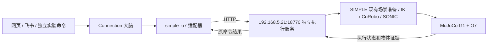

# SIMPLE O7 仿真接入

日期：2026-09-24。本文记录新增后端的代码、部署和实际验证范围。

## 1. 接入边界

Connection 新增 `simple_o7` 执行适配器，复用现有 Planner、Runtime、Runner 和 Verifier。
网页和飞书的发布接口不变。默认运行环境没有切换，真机动作许可没有开启。



对方项目是 Ubuntu 22.04、RTX 4080 SUPER、Docker `simple:260904`，Python 3.10、MuJoCo 3.3.6。
现有流程使用 CuRobo 运动规划、SONIC 控制；Isaac Sim 4.5 可用于记录状态的相机渲染。
本接入不调用 GR00T 5555，不将静态文件服务 18765/18766 当执行接口。

## 2. 文件与部署

Connection 中：

| 路径 | 职责 |
|---|---|
| `src/brain/adapters/simple_o7.py` | 远端场景与能力输入、计划约束、提交、查询、取消、证据转换 |
| `src/brain/adapters/ports.py` | 注册新后端，保存执行目标身份 |
| `src/shared/execution_profile.py` | 环境配置接受 `simple_o7` |
| `simulation/backends/simple_o7/` | 独立服务的部署源码，单独运行，不导入大脑 |
| `scripts/simple_o7_experiment.py` | 使用隔离账本运行同一套大脑的实验入口 |
| `tests/brain/test_simple_o7.py` | HTTP 合同、账本、重启、取消和 Runtime 验证 |

对方机器上：

```text
<REMOTE_WORKSPACE>/
├── code/
│   ├── SIMPLE/
│   └── SIMPLE-o7-verify/        # 原项目，只读使用
└── connection-simple-o7/       # 我们的服务，与 code 平级
    ├── service/
    ├── config.json
    ├── .env                    # SIMPLE_O7_TOKEN，不进 Git
    ├── start.sh
    └── runtime/
        ├── commands.sqlite3
        ├── worker.log
        └── episodes/<episode_id>/
            ├── source_fingerprint.json
            ├── prepared/
            ├── plan/
            ├── execution/
            └── *.log
```

容器名为 `connection-simple-o7`，端口为 18770。原项目挂载到 `/mnt/simple:ro`。
我们产生的输出、缓存、编译缓存和运行记录都写在自己的目录。没有修改原项目源码、场景、模型或控制参数，未重启既有容器。

服务启动：在远端独立目录运行 `bash start.sh`。已存在且停止的容器用 `docker start connection-simple-o7`。
查看服务日志用 `docker logs --tail 100 connection-simple-o7`，阶段日志在各 episode 目录。
`docker stop connection-simple-o7` 会停止整个服务及其工作进程，不等价于业务取消；有任务时先走取消并核对停止回执。
当前未安装系统自启动单元，也不管理其他服务。

## 3. 当前能力和状态连续性

当前只接受一个复合能力 `pick_hold_coke`：抓取可乐、抬升、稳定持有。Planner 的标准子任务为 `抓取 coke`。
第一版只允许一项这样的子任务；导航、放置、其他物体、桌面整理、多步计划会在动作提交前拒绝。

一个新的任务明确对应一个新的仿真实验 episode。该 episode 中，准备、可达性检查、轨迹规划和物理执行使用相互关联的产物。
同一个任务不允许通过新命令或 `-r1` 重新初始化场景。失败重查原命令；需要新的实验时使用新的任务账本和任务 ID。
物理执行结束后保留最终状态文件；目前不是可跨多个身体动作持续运行的通用仿真会话。

`/v1/scene` 提供的是新 episode 的场景清单，明确标记 `scene_manifest` 和 `new_episode_template_not_live_camera`。
它不是视觉模型观测，也不是另一个任务结束后的实时场景。执行查询中的 `observation` 来自该命令实际物理执行的末帧遥测。
当前没有接入现场描述、实时相机和网页图像；不能把其他仿真器的画面当作 SIMPLE 画面。

## 4. 接口与核验

合同版本为 `connection/simple-o7/v1`，不改 DREAM/VLA 的 `fq/reception-lan/v1`。
除健康检查外，需要 `Authorization: Bearer <SIMPLE_O7_TOKEN>`。

| 方法与路径 | 作用 |
|---|---|
| `GET /health` | 服务和场景清单可读性；不代表抓取物理验收通过 |
| `GET /v1/scene` | 当前场景版本、初始清单和能力边界 |
| `POST /v1/commands` | 提交一条带任务、步骤和场景版本的抓取命令 |
| `GET /v1/commands/{command_id}` | 查询原命令；没有该命令时返回 404，不重新执行 |
| `POST /v1/commands/{command_id}/cancel` | 持久化取消意图；受理不代表已经停止 |

提交字段：`contract_version`、`command_id`、`task_id`、`step_id`、`action=pick_hold_coke`、`object_id=coke`、`scene_revision`。
相同命令与相同载荷返回原记录，不重新启动工作进程；相同命令不同载荷返回 409。
同一任务第二个命令、执行器繁忙或原命令未核清时拒绝新命令。只读查询不会创建重试。

命令账本用 SQLite 事务持久化。HTTP 服务重新创建时只读原账本，不自动重放。
工作进程独立写回结果。当前 Docker 部署重启整个容器会中断在途工作进程，可能留下未核清记录，重启后仍不得自动重试；只在原命令已核清时重启容器。
取消由工作进程终止自己创建的子进程组并等待退出，确认后才写 `stopped/resources_released`。
缺乏停止证据时，记录继续阻止新实验。

物理证据需要任务和命令身份匹配、带时区时间、实际终态、进程停止和资源释放。
成功还要求抬升、稳定持有时长、受保护碰撞阈值、末帧手部接触和无外部支撑等字段符合现有执行标准。
运动规划通过、进程退出 0、手部闭合或单独一个成功字段都不够。
大脑仍按 PASS / FAIL / UNKNOWN 核验；没有通过就不写入“可乐已在夹爪”。

## 5. 使用方式

### 不切换主服务的独立实验

本机 `.env` 中配置 `SIMPLE_O7_TOKEN`，与远端独立服务一致。健康检查：

```bash
cd <CONNECTION_ROOT>
venv/core/bin/python scripts/simple_o7_experiment.py health
```

运行一个新实验；每次新实验使用新的目录：

```bash
venv/core/bin/python scripts/simple_o7_experiment.py run \
  --ledger data/experiments/simple_o7/trial-001 \
  --task '抓起桌上的可乐并稳定持有'
```

这个命令调用现有模型和 Planner，再经 Runtime 执行，不是固定计划绕过大脑。
任务账本、运行配置和环境锁只属于实验目录；不写主服务的 `data/tasks`、已应用环境配置或经验发布库。
实验默认不自动反思、发布经验。`run` 返回 0 表示任务成功，2 表示任务没有成功。

```bash
# 只读检查原任务及原命令
venv/core/bin/python scripts/simple_o7_experiment.py query --ledger data/experiments/simple_o7/trial-001
# 取消；若仍为 cancelling，等远端确认后再核对取消
venv/core/bin/python scripts/simple_o7_experiment.py cancel --ledger data/experiments/simple_o7/trial-001
```

`resume` 走现有 Runtime 的恢复入口，先查询原命令；它不保证失败的物理动作可以重试。
本后端明确拒绝同一任务再次初始化场景。对已确认的环境前置失败，应保留失败记录，核对实验配置后新开任务。

### 通过配置切换通用执行

`config/examples/robot_api.yaml` 已有禁用的 `simple_o7` 示例；本机也已添加对应地址，未启用。
模块选择可写为：

```yaml
modules:
  execution:
    mode: simulation
    simulation_backend: simple_o7
```

保留其他模块原配置，通过现有环境应用流程切换。面板新增了 `SIMPLE O7（远端）` 选项；运行中的旧面板进程需要重载新代码才支持新配置。
环境应用会检查远端健康并重启本机大脑使配置生效，不启停远端容器，也不为 SIMPLE 新增 Slaver/Redis 依赖。
本次未执行默认环境切换。若观察模块仍指向 3DGS，该模块画面属于 3DGS，不能用作 SIMPLE 实验核验。

## 6. 2026-09-24 联调结果与限制

已经由本机现有 Planner 为“抓起桌上的可乐并稳定持有”生成单步 `抓取 coke`，经 Runtime 提交到远端。
首个真实命令为 `simple-o7-1-bd114bc9d8b0`，远端 episode 为 `cbe03d2cbc45d503fef94252`。
本机账本在 `data/experiments/simple_o7/first-20260924/`。

当前场景版本 `2.0.0`，manifest SHA256 为 `69398b2707c41c03ba9ca59df01d5a6a05b986e0adda96a8323b94957eabc60d`。
按原脚本默认参数，机器人基座约 `[0.7, 1.2, 0.7826]`，可乐约 `[1.4706, 1.1929, 0.8477]`。
六个抓取姿态都未满足可达性阈值，末端位置误差约 0.22–0.36 米。首次规划报 `No eligible grasp endpoint`。
服务随后补充直接识别该前置失败，回包原因是 `no_eligible_grasp_endpoint`，不会继续启动 CuRobo 和物理抓取。

大脑进入 `recovery_required`，未写入持有事实，没有物理抓取成功记录。
这证明了远端调用、失败证据和 Runtime 停止边界；**不代表成功抓取已验收**。
对方当前场景文档本身也没有给出新资产配置的完整抓取验收。
下一条成功实验需要上游提供当前场景可复现的摆位与执行参数，或另行明确调整实验初始条件；本次没有擅自调整其机器人控制算法或场景资产。

离线测试覆盖原命令幂等、冲突拒绝、HTTP/账本重建、超时与丢回包、取消、伪成功、真实证据核验、同任务不重置、环境路由隔离。
成功路径使用假执行服务验证；真实服务的成功物理路径仍待上述场景前置条件满足。
完整回归命令为 `venv/core/bin/python scripts/run_tests.py`，本次结果为 310 条测试和 27 项 DREAM 自测通过。

另外已在真实服务上验证：

- 准备阶段进行中取消：`simple-o7-1-ef9a26782884` 最终为 `cancelled`，`stopped` 和 `resources_released` 均为 true；本机 Runtime 同样到达 `cancelled`。
- 重启我们自己的服务容器后，仍能查询首个失败命令，返回相同 episode。
- 再次提交首个命令的原始载荷，返回原失败记录，没有创建新 episode 或重新执行。
- 对照记录在 `data/experiments/simple_o7/validation-20260924.json`。只重启了我们新增的容器。
