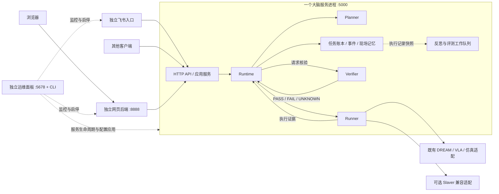

# 规划说明：具身大脑重构

版本：v0.14｜日期：2026-09-24｜状态：既有四阶段切片的审阅结论保留。按最新决定补齐第 13 节的统一调度迁移：通用任务、接待、现场观察、桌面整理及接待演示页共用 Runtime。软件实现完成，回归结果见第 13 节；不把本次编码等同于真机联调验收或四阶段全部完成。`kernel_enabled` 仍为 false，现在表示真机派发许可关闭，接待进入 Runtime 等待，不再自动回落旧接待。第 9.7 节的切换记录及下游能力核实仍有效。第 14 节补充全局运行环境、模块覆盖和受控应用，不代表真机能力新增。**第 16 节最终目录替换已完成部署：生产代码直接位于 src 下，旧实现与兼容壳已退出，本机相关服务已重启。当前目录、验收与切换记录以第 16 节为准；第 15 节保留为此前实施历史。**

v0.2 写入审阅结论：四阶段按第 5 节执行；空档只做第一阶段软件闭环，切换规则见第 4 节；任务状态补 `paused` 与 `waiting_human`；短时事件默认近 20 条、30 分钟、可配置；第一阶段局部恢复预算为 0，恢复发生在 Runtime。

v0.3 只补实施语义，不改第 2 节职责，也不扩大第 5 节的阶段范围。补的是：超时与续跑的现状、attempt 还不是完整身份、交接接口仍是拟新增、抓取与放置两侧的弱证据、取消受理和取消完成要分开、交接验收按目标区分、以及第 6.6 节的完成条件。

v0.4 补第 9 节，作为第一阶段的执行说明。第 6 节仍是约束，第 9 节规定先写什么、写在哪、怎样算软件闭环通过。不另开平行文档。

v0.5 补第 10 节，作为第二阶段的执行说明。短时窗口仍用第 8 节的近 20 条、30 分钟。不改第 2 节职责，不扩大第 5.2 节的范围。

v0.6 补第 11 节。第三阶段只部分落地：语音、求助没有执行体，不登记；现场观察和桌面整理的旧执行旁路在开关关闭时保留。这是第 5.3 节里尚未做到的部分，不是把该节改写成已经完成。不改第 2 节职责。

本文是 Connection 具身大脑的实施规划。架构基线已经冻结，本文不改模块职责，只规定分阶段落地、当前空档做什么、以及哪些口径不能写偏。

架构基线（仓库外，供对照，不在本文重写）：

- `Docs/调研/具身大脑架构.md`
- `Docs/架构图/` 四张定稿图：总览、内部线路、重构前现状、重构前简版

**规划入口统一：本文是仓库内唯一维护的规划说明。** 两份旧专项规划已退出；仍有效的控制交接、取消确认和断点恢复约束归并到第 17 节，其他旧接口草案、文件改造清单和阶段安排不再作为当前实施依据。历史全文可查 Git 提交 `fd21df8`，不保留平行归档文档。

阅读当前项目先看第 16 节（目录、部署与环境）和第 17 节（有效约束及待完成项）。第 1–15 节保留各轮实施背景和验收记录；其中旧目录、兼容入口及阶段内限制不代表当前工程状态。冻结职责仍按第 2 节，任务状态按第 6.2 节，真机放行要求按第 9.7 节。

## 阅读导航

| 阅读目的 | 章节 |
| --- | --- |
| 看当前目录、服务与本机环境 | 第 16 节 |
| 看控制交接、恢复约束与剩余工作 | 第 17 节 |
| 看这次做什么、现在为什么做 | [第 1 节](#1-结论) |
| 核对冻结边界 | [第 2 节](#2-冻结边界) |
| 看现有代码落在哪 | [第 3 节](#3-现状) |
| 看和真机联调怎么错开 | [第 4 节](#4-和现场排期的关系) |
| 审四阶段计划 | [第 5 节](#5-分阶段计划) |
| 看第一阶段具体拆到哪 | [第 6 节](#6-第一阶段落点) |
| 看不能写偏的口径 | [第 7 节](#7-口径) |
| 看已确认的决定 | [第 8 节](#8-已确认的决定) |
| 按第一阶段开工 | [第 9 节](#9-第一阶段执行说明) |
| 审工程组织、独立入口与旧代码退出计划 | 第 15 节（v0.12，工程迁移与软件验收记录） |

## 1. 结论

把已经散在各条链路里的任务管理、状态记录、核验和恢复抽成共用内核。业务流程描述顺序、规则和验收；能力差异走技能和适配器。大脑理解目标、组织技能、核验结果，并主动请求停止、取消和交接。实时控制、执行许可和安全停机仍在本体侧。

当前窗口：VLA 占用真机做标定和联调。这个空档做大脑的软件重构，不抢机器人。重构完成后再把接待接回来继续联调。

第一阶段只迁接待，打通一条可追踪、可取消、可核验、具备基础恢复的软件闭环。通用队列、现场观察、桌面整理先留在原路径。

复盘固化的是业务包和技能版本。内核代码走正常工程评审，不能由经验管道自动修改。

## 2. 冻结边界

这些职责已定，实施时不能改：

| 模块 | 负责 | 不负责 |
| --- | --- | --- |
| Planner | 按目标、现场状态和可用技能给出可修订计划，以及显式完成条件 | 直接下发动作 |
| Task Runtime | 任务状态的唯一权威：调度、资源协调、暂停、取消、恢复、结束，并决定何时重规划 | 把业务 SOP 写死在内核里 |
| Skill Runner | 执行技能；在授权范围内局部恢复和有限重试；压缩回报 | 改业务目标 |
| Verifier | 运行中、技能结束、任务结束三阶段核验，输出 PASS、FAIL、UNKNOWN | 因工具正常返回就宣布成功 |
| 状态与记忆 | 现场状态、历史事件、具身档案、业务知识；带来源、时效和冲突 | 代替 Runtime 做调度 |
| Experience Pipeline | 离线复盘、失败归因、候选规则、评测、门控发布、回滚 | 自动修改内核代码 |

贯穿消息是 SkillContract、ProgressEvent、AttemptRecord。

业务包承载目标、规则、流程模板、验收和异常策略。技能目录承载能力、版本、适用条件、执行方式和核验方法。二者从内核中分开。

Connection 可直连 DREAM 和 VLA，不默认新增 Middleware 进程。模块是职责边界，不是六个进程。

大脑不实现 L1/L0。大脑必须能主动请求停止、取消和交接。本体可以接受、拒绝或接管。停止、取消或交接未确认时，下一段身体动作不能发出。

## 3. 现状

行数按文件计：`master/agents/agent.py`（1853 行文件），`master/sop/reception_real.py`（1173 行文件）。

| 目标模块 | 现在在哪 | 差距 |
| --- | --- | --- |
| Task Runtime | `agent.py` 同时做分流、调度和状态协调。通用任务用进程内 TaskQueue。接待用独立线程和 ReceptionStore | 没有唯一任务权威。通用队列重启即失。断点继续只接接待 |
| Planner | `planner.py` 的 GlobalTaskPlanner。接待、现场观察、桌面整理在 `agent.py` 里用关键词提前分流 | 关键真机路径不经主决策器。计划是自然语言子任务，没有显式完成条件 |
| Skill Runner | 通用链路走 Redis、Slaver、MCP、robot_api。接待真机在 `reception_real.py` 里 HTTP 直连 DreamClient / VlaClient | 同一类导航和抓放有两套调用。Slaver 是联调时临时停用，不是可以删除 |
| Verifier | 工具返回、业务流程、ReceptionVerifier 各自判断。终态区分 SUCCEEDED 与 COMPLETED_HAND_STATE_ONLY。`ReceptionVerifier.verify()` 返回带 `verified` 布尔值的字典，没有 PASS / FAIL / UNKNOWN | 证据等级随链路变化。从 `VERIFYING_GRASP` 续跑且缺少抓取终态时，会把 `holding` 补成目标物体、位置写成 `in_gripper`，然后继续导航。缺少放置终态时，有机会沿用释放确认走到成功 |
| 状态与记忆 | 场景 YAML、技能 Markdown、接待账本、episode 复盘各自读写 | 不能统一回答物体在哪、做到哪、凭什么相信、是否过期 |
| 经验 | `reflect.py` 能写候选经验和 learned_rules | 没有评测、影子运行和回滚 |

现场观察对应 `_is_look_task`，桌面整理对应 `_is_desk_tidy_task`。专用分支不止接待一条，第三阶段一并收编。

接待真机已有可保留的资产：原子 JSON 账本、命令身份、预检、结果轮询、断点相位，以及 DreamClient / VlaClient 的取消方法。第一阶段是把这些提升为内核，不是推倒重写。下面几条是现状，不能写成已经满足第一阶段：

- 客户端在连接异常或 404 时会有界重查原 `command_id`。等待总期限耗尽抛出的是普通 `HttpContractError`，接待主流程把它写成 `FAILED`，不是 `recovery_required`。
- 断点继续时 `_resume_state()` 把整次接待的 `resume_count` 加一，从失败相位生成新命令，不是先把原命令跟踪完。`resume_count` 不是某一步的 `attempt_id`。`_prepare_command()` 按相位键覆盖 `commands[key]`，不保留该步的全部尝试。
- `_load_reception_snapshot()` 发现状态为 `RUNNING` 且执行线程已不在时，会改成 `RECOVERY_REQUIRED` 并落盘。查询路径也会写账本。
- 导航推进看通路是否就绪，放置成功校验仍要求 `navigation_port_ready`。交接的查询、继续和凭证校验仍未在真适配器接通，不是现成接口；当前边界归并到第 17 节。本文未核实远端部署版本。

## 4. 和现场排期的关系

两条线并行，不互相阻塞：

| 线 | 何时做 | 占用什么 |
| --- | --- | --- |
| 1.1 固化 SOP 的真机接待 | 机器人能调时继续标定和联调 | 真机、VLA、导航 |
| 大脑重构 | 真机被 VLA、标定或物理条件占用时做 | 软件与回放，不占真机 |

当前就是后一种：VLA 在用真机，空档重构大脑，完成后继续联调。

桌子高度、标定、一动就看不见，是物理和观察问题。重构不解决这些。它们只说明：手的开合不能当成物体已经放到目标上，联调时仍按证据验收。

重构期间，现有真机接待入口保持可运行。新内核先在软件里跑通，再在单独的切换点接入。切换前必须写清三件事：

1. 任务状态归谁。
2. 在途命令如何查询。
3. 旧进程何时停止。

切换后，同一时刻只有一条链路能持有真机。新旧两套不能各自恢复同一个物理动作。

## 5. 分阶段计划

四阶段按架构定稿执行，2026-09-22 审阅确认。每一阶段都有可观察的结果，并能回到上一稳定版本。第一阶段不收编现场观察、桌面整理和通用队列。

### 5.1 第一阶段：接口、状态机，迁入接待

目标：一条接待任务在软件里可追踪、可取消、可核验，并具备基础恢复。

做：

- 定下 task_id、step_id、attempt_id、command_id，以及三件套。
- Runtime 成为接待任务状态的唯一写入者。切换后，发布、续跑、取消和状态查询都服从 Runtime，包括今天会落盘的查询旁路。`force_new_task` 不绕过未知资源隔离。
- 已审核的接待相位仍由业务包提供。这一阶段不让 LLM 重排路线。Planner 接口留好，只有 Runtime 判定要重规划时才调用。
- 导航和抓放仍用现有 DreamClient、VlaClient，外面包上技能合同。command_id 生成规则先不改。
- Verifier 对到达、抓取、放置输出 PASS、FAIL、UNKNOWN。SUCCEEDED 只来自当次 PASS 和合同要求的证据。
- Runtime 能主动请求停止、取消和交接。取消打到原 command_id。交接未确认时，下一段派发次数为 0。
- 断点续跑若缺少抓取或放置终态，结论是 UNKNOWN，任务留在 recovery_required。不能写成物体已在夹爪或已在目标位置。
- 软件回放覆盖：取消、超时、回包丢失、重启后续跑，以及抓取和放置两侧的弱证据都不能升级为成功。
- 第一阶段就持久保存发送意图、原 command、不可变请求和合同快照。只读重查不增加 attempt，核清后才允许新尝试。

不做：

- 不占真机，不做受控真机联调（留到本阶段软件出口之后、机器人空出来时）。
- 不迁通用 TaskQueue，不收编现场观察和桌面整理。
- 不改 VLA 策略，不实现安全停机，不发 NX 裸 START/STOP。
- 不自动把 reflect 结果写回正在执行的接待包。
- 不删除 Slaver。

交付：

- 接待业务包（相位、验收、异常策略）与内核分开。
- 一条不依赖真机的回放测试，能演示追踪、取消、三态核验和基础恢复。
- 现有真机接待路径仍可按原入口启动。

完成后再接入真机的条件见第 6.6 节。机器人空出，并且软件回放通过，只是必要条件。

### 5.2 第二阶段：时效、溯源、短时事件、重启恢复

目标：同一条任务在超时和重启之后，先核对原命令和现场，再决定继续、等待或新开尝试。

做：

- 状态记录带来源、观测时间和有效期。过期位置只作为搜索线索。
- 冲突保留来源，不合并成一条“看起来确定”的事实。
- 时间记忆做成轻量事件记录。默认保留近 20 条、30 分钟，两项都可配置；第二阶段按实际任务长度调整，不在本规划里定死。5 到 10 条只是量级直觉，默认 20 条是为了长任务不把开头的现场前提挤掉。记录的是「已经做了什么」，不是视频级时空推理。
- 结果未知时只查询原 command_id，不新开物理命令。已确认进展保留。

不做：

- 不做家庭场景视频记忆，不上图数据库。
- 不做多机共享记忆。

交付：重启和断网用例。丢失回包后任务保持未知，直到原命令被核对。

### 5.3 第三阶段：抽出业务包和技能目录，验证能复用

目标：新业务主要加业务包、技能和适配器，而不是改 Runtime。

做：

- 接待的触发条件、相位和验收从 `agent.py` 的关键词分支移到业务包。
- 导航、观察、抓取、放置、语音、求助成为可注册技能。技能条目包含适用条件、执行方式和核验方法。
- 收编现场观察和桌面整理，去掉这两条关键词旁路。
- 用第二个场景，或另一台本体上的同一套技能，证明内核不用为新业务改调度。

不做：

- 不把每个技能做成独立 LLM Agent。
- 不把尚未验证的物体和场景写成已经支持。

交付：至少两个业务包跑在同一 Runtime 上。第二个包的接入不改任务状态机。

### 5.4 第四阶段：评测、发布、回滚；按需要扩展

目标：复盘结果经证明后才进入下次执行，并且可以退回。

做：

- 失败先归因，再形成候选规则。
- 离线评测、影子运行、门控晋升、版本发布和回滚。发布对象是业务包和技能版本。
- 影子运行只观察和评估，不同时下发真实动作。
- 需要语音时，通过独立语音能力适配器接入，明确输入、输出、生命周期和失败处理。
- 多机只在单机的任务身份、执行状态和证据已经可靠，并且业务需要时再做。方向是一台大脑管理多台机器人，当前按两台预留，不在本阶段默认开工。

不做：

- 经验管道不自动修改内核代码。内核改动走正常工程评审。
- 语音业务接入不属于当前交付承诺。
- 不把人工完成或持续重试算进自主成功率。

交付：一条候选规则从未经评测，到可回滚版本的路径。回滚后执行使用上一版本，不需要改内核。

## 6. 第一阶段落点

这一节只约束即将开写的第一阶段。状态名以 2026-09-22 审阅结论为准。本节不改第 2 节的职责。执行顺序和回放用例见第 9 节。

### 6.1 四个身份

| 身份 | 现在 | 第一阶段 |
| --- | --- | --- |
| task_id | 接待账本已有 | Runtime 主键。暂停、重启、取消都沿用它 |
| step_id | `PIPELINE_PHASES` 只是顺序相位表，写在 Runner 里 | 仍用这些相位名，顺序属于接待业务包 |
| attempt_id | `resume_count` 是整次接待的续跑计数，不是某一步的尝试编号。按相位键覆盖命令记录 | 账本按 step 记录 attempt。command_id 生成规则先不改。只读重查不增加 attempt；核清后才允许新尝试 |
| command_id | 连接异常或 404 时有界重查原 id。等待总期限耗尽写成 `FAILED`。续跑从失败相位生成新命令 | 结果未知时只查原 command_id，禁止新开物理命令。发送意图和不可变请求在第一阶段就持久保存 |

### 6.2 任务状态

只有 Runtime 能写任务终态。Runner 上报进度，Verifier 给三态，Runtime 落账。

| 状态 | 含义 | 是否终态 / 可否重开 |
| --- | --- | --- |
| running | 某一步正在执行 | 非终态，不可重开 |
| paused | 已暂停。进度保留，等待继续。不是故障，也不是结果未知 | 非终态，不可重开 |
| waiting_human | 等待人工或现场闸门。导航闸门超时属于这里，不是命令结果未知 | 非终态，不可重开 |
| verifying | 正在等待核验 | 非终态，不可重开 |
| cancelling | 已请求停止或取消，本体尚未确认收尾 | 非终态，不可重开 |
| recovery_required | 结果未知，或交接未确认。须核对原命令后才能继续 | 非终态，不可重开 |
| succeeded | 当次核验 PASS，且证据满足合同 | 终态，可以重开 |
| failed | 已确认失败并结束 | 终态，可以重开 |
| cancelled | 停止或取消已被确认，安全收尾完成 | 终态，可以重开 |

`paused` 和 `waiting_human` 不能并进 `recovery_required`。现场已有闸门超时案例（见 [案例排障：导航启动人工闸门超时](案例排障_20260917_导航启动人工闸门超时.md)）。`infeasible` 暂无对应场景，先不加。

`COMPLETED_HAND_STATE_ONLY` 保留为证据等级，不作为“物体已经到位”的任务成功。旧方案曾允许凭该状态结束和重开，这一口径已废止，以本节为准。旧账本不能只改名字就继续当作成功。迁移时，旧的该终态进入待核对，不自动映射为 `succeeded`。

SUCCEEDED 不能由配置开关抬成。断点续跑缺少抓取或放置终态时，Verifier 输出 UNKNOWN，任务进入 `recovery_required`。不能写“物体已在夹爪”或“物体已在 table_1”。

### 6.3 停止、取消、交接

这三件都是 Runtime 发出的请求，不是账本里的标记。

| 请求 | 发到哪 | 受理 | 完成 |
| --- | --- | --- | --- |
| 停止 | 当前动作发布者，在安全点停下 | 停止请求已发出 | 发布者停止有回执。已暂停必须有停止确认 |
| 取消 | 现有 `DreamClient.cancel` / `VlaClient.cancel`，对象是原 command_id | 取消请求已被受理，任务进入 `cancelling`。有 cancel 方法不等于闭环已完成 | 原命令终态、停止和资源处置都核清后才是 `cancelled`。核不清则留在 `recovery_required` |
| 交接 | 按第 17.2 节规定的 VLA 协调方对接。查询、继续和凭证接口仍是拟新增，不是现成能力。大脑不发 NX 裸 START/STOP | 交接请求已发出，且未派发下一段身体动作 | 按目标区分，不统一收成 `CONTROL_CONFIRMED`。抓取转导航要接管凭证；最终放置结束要 `SAFE_IDLE_CONFIRMED`；同一导航源的段间切换不新建跨源交接 |

本体可以接受、拒绝或接管。任一请求未确认时，下一步导航或抓放的派发次数为 0。控制切换按第 17.2 节区分动作效果、发布者停止、接管与安全待机；新增远端字段和接口必须经实际合同对齐，不能当作已部署能力。

### 6.4 三件套第一阶段最少字段

| 消息 | 最少字段 | 现有来源 |
| --- | --- | --- |
| SkillContract | 技能标识与版本，task / step / attempt，目标与对象，前置条件，证据要求，局部恢复预算，截止时间，command_id 规则 | 接待相位、导航路段、现有证据策略 |
| ProgressEvent | 四个身份，相位，进度，证据引用。动作结束、效果成立、发布者停止、交接确认分成不同事实 | ledger、远端状态、Dream/VLA 轮询 |
| AttemptRecord | 进入时的现场记录、合同快照、发出的 command_id、Verifier 结论、相对上一次尝试改了什么、结局 | commands、events、verification 日志 |

局部恢复预算为 0，2026-09-22 审阅确认。本阶段恢复发生在 Runtime 层：`recovery_required`、断点相位、原命令核对。Runner 只做非物理的重查与重观察，不做路线级恢复。导航和抓放失败交回 Runtime，不在 Runner 里换一条业务路线。

现有 `resume_count` 和按 key 覆盖的 `commands` 只是映射线索，不是 AttemptRecord。第一阶段保存的合同快照和原 command 记录不可被后续尝试覆盖。固定图片名不能成为唯一的证据关联。

### 6.5 代码落点（拟议，未实施）

新代码与现有接待入口并存，直到切换：

| 拟议位置 | 作用 |
| --- | --- |
| 内核：合同、Runtime、Verifier 门面 | 状态权威、三态落账、停止/取消/交接请求 |
| 接待业务包 | 现有相位顺序、验收和异常策略从 `reception_real.py` 的固定流程中抽出 |
| 适配器 | 包装现有 DreamClient、VlaClient，不重写传输 |
| `agent.py` 接待分支 | 切换前仍可走原入口；切换后改为向 Runtime 提交接待任务 |
| `reflect.py` | 继续产候选。第一阶段不把候选写回正在执行的包 |

不在第一阶段移动 Slaver、robot_api 和仿真后端。

切换后的发布、查询、暂停、继续和取消要进到现有入口和页面，不能只在内核里增加枚举。已接收任务的明确闸门等待进入 `waiting_human`。`get_task_status()` 今天仍由旧队列和接待状态拼装，实施时改为读 Runtime。

### 6.6 第一阶段完成条件

这些条件不增加业务范围。机器人空出并且软件回放通过，只说明可以开始谈切换，不能单独作为真机接入许可。

| 条件 | 默认 | 影响 | 反对 |
| --- | --- | --- | --- |
| 单写者 | 切换后，发布、续跑、取消、状态查询都服从 Runtime。`force_new_task` 不绕过未知资源隔离 | 今天的查询旁路会写账本。进程内标志和 Store 锁不能保证并发单写。要覆盖重复提交、并发续跑和迟到回包。不迁移通用队列 | 无 |
| 恢复记录 | 第一阶段持久保存发送意图、原 command、不可变请求和合同快照。只读重查不增加 attempt，核清后才允许新尝试 | 按 key 覆盖命令、固定图片名会丢掉尝试关联。不能只靠 `failed_phase` 决定重发。基础恢复不延到第二阶段 | 无 |
| 真机切换 | 软件回放使用写明版本的假服务合同。切换前核实下游停止、原命令查询和交接能力，缺失则阻挡动作 | 客户端有 cancel 方法，不等于取消闭环已完成 | 无 |
| 三态 | Verifier 分开处理证据支持、证据否定、证据不足。任务完成还要满足安全收尾 | 现有 `verified` 布尔值不能把所有 false 映射成 FAIL。旧测试仍认可 hand-only 终态和强制覆盖，新 Runtime 用独立验收，不改旧测试的原意来冒充通过 | 无 |
| 入口 | 第一阶段同步覆盖发布、查询、暂停、继续、取消和页面映射 | 只增加 `paused`、`waiting_human` 枚举，现场仍会不知道该等待、继续还是取消 | 无 |

## 7. 口径

实施和对外说明时保持下面这些说法。

| 话题 | 口径 |
| --- | --- |
| 重构范围 | 不只是统一几个接口。接待已有的账本、命令身份、预检和恢复要提升为内核能力，接待成为第一个业务包 |
| 固化产物 | 固化的是业务包和技能版本：顺序、参数、提示词、恢复策略。固定的是本任务已经绑定的业务包、技能和合同版本。Runtime 在执行中仍可暂停、取消、恢复，并在允许阶段请求重规划。当天结束不是自动发布条件，更新仍走评审或评测门控。内核代码走工程评审 |
| 语音能力 | 按业务需要实现独立适配器，当前不承诺语音业务交付 |
| Slaver | 联调期临时停用。通用执行底座保留。接待第一阶段仍直连 DREAM/VLA，第三阶段再谈是否并入同一执行层 |
| 记忆 | 第二阶段做轻量事件记录。默认近 20 条、30 分钟，可配置，按实际任务长度调整。这只是短时上下文窗口，不是任务账本、未解决命令和恢复证据的删除期限。挤出窗口的记录仍要能用于恢复和追溯。不做视频级时空推理 |
| 多机 | 第四阶段按业务需要。一台大脑、两台机器人只是预留，不是当前交付 |
| 完成判断 | 手张开、命令已接收、导航端口就绪，都不是物体已放到目标。证据不足就是 UNKNOWN |
| 真机问题 | 标定、桌高、遮挡由现场处理。重构提供的是核验和恢复位置，不替代标定 |

## 8. 已确认的决定

2026-09-22 审阅，五项一并确认。

| 决定 | 默认 | 影响 | 反对 |
| --- | --- | --- | --- |
| 四阶段按第 5 节执行 | 第一阶段不收编现场观察、桌面整理和通用队列 | 这三条链路保持原路径，直到第三阶段 | 无 |
| 空档只做第一阶段软件闭环 | 真机接待入口保持可运行 | 切换前写清任务状态归谁、在途命令如何查询、旧进程何时停止。切换后同一时刻只有一条链路能持有真机 | 无 |
| 任务状态 | 在原表上增加 `paused`、`waiting_human`。表头为「是否终态 / 可否重开」。不加 `infeasible` | 闸门超时进入 `waiting_human`，不能并进 `recovery_required` | 无 |
| 短时事件 | 默认近 20 条、30 分钟，可配置。第二阶段按实际任务长度调整 | 长任务不把开头的现场前提挤掉。5 到 10 条只作量级，不作为上限 | 无 |
| 局部恢复预算 | 第一阶段为 0 | 恢复在 Runtime：`recovery_required`、断点相位、原命令核对。Runner 只做非物理的重查与重观察，不做路线级恢复 | 无 |

v0.3 的实施补充见第 6.6 节，不改变上表五项。v0.4 的执行顺序见第 9 节，也不改变上表五项。v0.5 的执行说明见第 10 节，也不改变上表五项。v0.6 的执行说明见第 11 节，也不改变上表五项。

## 9. 第一阶段执行说明

第 6 节回答「不能做成什么样」。本节回答「按什么顺序写、写完怎样验收」。实现时以第 6 节和第 9 节为准，不改第 2 节的职责，不扩大第 5 节的范围。

第一阶段由本仓库实现。软件闭环的 diff 完成后，再按第 6.6 节和第 9.8 节做一次静态审阅。审阅通过之前，不把新内核接到真机，也不把默认开关打开。

2026-09-23 独立复跑通过：内核及审阅用例 38 条，旧接待入口 15 条。五个审阅阻塞项已有实现和测试。这只说明软件实施和审阅完成。`kernel_enabled` 仍为 false。真机切换仍按第 9.7 节另写记录，缺任何一项都不打开开关。

### 9.1 现在还不能直接写代码的原因

v0.3 没有规定这些执行事实：

- 新代码放在哪，旧接待入口哪一行先不动。
- 状态之间由什么事件迁移。
- `command_id` 字符串维持现有形状时，`attempt` 计数加在哪一级。
- 软件回放的假服务要回答哪些查询，交接凭证没有真接口时怎样验收。
- 哪一条测试通过，才算第 6.6 节的一条完成条件被覆盖。

### 9.2 并存

以下为第一阶段并存规则的历史记录。v0.9 应用入口已按第 13 节统一迁移；关闭真机许可不再自动执行旧接待。

默认开关关闭。关闭时，`agent.py`、`reception_real.py`、`master/run.py`、`deploy/run.py` 的现有行为保持不变，包括 `_load_reception_snapshot()` 今天会改写旧账本这一点。第一阶段不顺手修改这条旧查询，避免真机入口在开关关闭时变行为。

开关只影响「开始接待」。现场观察、桌面整理、通用队列仍走原路径。开关打开后，接待任务只进 Runtime；旧 Runner 不再持有这一条任务。同一时刻只有一条链路能发接待的身体动作。

新账本与旧账本分开目录。旧目录 `master/sop/runtime/reception/` 继续只给旧入口。新内核使用自己的运行目录，不读取旧文件来续跑，也不把旧的 `COMPLETED_HAND_STATE_ONLY` 收成 `succeeded`。

`force_new_task` 在新内核里不能越过未知资源。任务处于 `recovery_required`、`cancelling` 或仍有未核清命令时，拒绝新任务。这比旧入口更严，只约束新内核。

### 9.3 文件与参照

新增文件，不把逻辑再写回 `agent.py` 或 `reception_real.py`：

| 新文件 | 作用 | 对照着读，不要照搬结构 |
| --- | --- | --- |
| `master/kernel/contracts.py` | SkillContract、ProgressEvent、AttemptRecord | 第 6.4 节的字段 |
| `master/kernel/store.py` | 任务、步骤、尝试、命令快照；追加尝试，不按 key 覆盖历史 | `reception_store.py` 的原子写入和追加日志 |
| `master/kernel/runtime.py` | 唯一写任务状态；暂停、取消、恢复、结束 | 第 9.4 节的迁移表 |
| `master/kernel/runner.py` | 执行一个合同；预算为 0；只做非物理重查和重观察 | `dream_client.py`、`vla_client.py` 的查询和 cancel |
| `master/kernel/verifier.py` | PASS、FAIL、UNKNOWN | 第 9.5 节。不把 `ReceptionVerifier.verify()` 的布尔值直接映射过来 |
| `master/kernel/packages/reception.py` | 相位顺序、每步的证据要求和交接种类 | `reception_real.py` 的 `PIPELINE_PHASES` 与 `NAVIGATION_LEGS` |
| `master/kernel/adapters.py` | 包装现有客户端。真接口没有的交接查询返回「不可用」，不发明 NX 调用 | `DreamClient`、`VlaClient` |
| `master/tests/test_kernel_reception.py` | 假服务回放 | 第 9.8 节 |

`command_id` 的字符串形状维持 `_task_token()` 和现有前缀：`nav-{key}`、`vla-pick`、`vla-place`。任务主键用完整 `task_id`。token 仍只取末 12 位可见字符，这是为了不改下游看到的命令格式，不是新的身份定义。

同一 `step_id` 的第一次物理发送不带后缀。该步的后续新尝试使用 `-r{n}`，`n` 从 1 起，按这一步的 attempt 计，不再使用整次接待的 `resume_count`。只读重查沿用已保存的 `command_id`，不增加 `n`。上一条命令尚未核清时，不允许发出 `-r{n}`。

合同快照和当时的请求体一旦写入就不再改。新尝试追加记录。证据文件名必须带 `attempt_id`，不能只用固定图片名。

### 9.4 状态迁移

只有 Runtime 执行这张表。Runner 上报进度，Verifier 给三态，二者都不写任务终态。

| 当前状态 | 事件 | 下一状态 |
| --- | --- | --- |
| 无任务 | 接受接待 | `running` |
| `running` | 本步动作已结束，等待核验 | `verifying` |
| `verifying` | PASS，且后面还有步骤，交接条件已满足 | `running` |
| `verifying` | PASS，已是最后一步，且安全收尾满足合同 | `succeeded` |
| `verifying` | FAIL | `recovery_required` |
| `verifying` | UNKNOWN，含缺少终态、超时未核清、证据不足 | `recovery_required` |
| `running` | 现场闸门或人工批准未到 | `waiting_human` |
| `waiting_human` | 人工继续，且没有未核清命令 | `running` |
| `running` | 暂停请求已发出，停止回执已到 | `paused` |
| `running` | 暂停请求已发出，停止没有回执 | `recovery_required` |
| `paused` | 继续 | `running` |
| 任一非终态 | 取消请求已被受理 | `cancelling` |
| `cancelling` | 原命令终态、停止和资源处置都已核清 | `cancelled` |
| `cancelling` | 上述事实核不清 | `recovery_required` |
| `recovery_required` | 只读重查证明原命令未开始 | `running`，仍用原 attempt |
| `recovery_required` | 只读重查证明原命令已结束且证据足够 | `verifying` |
| `recovery_required` | 原命令已确认停止，且允许新尝试 | `running`，新 attempt，新 `command_id` |
| 任一非终态 | 再发布任务，或在资源未核清时 `force_new_task` | 拒绝，状态不变 |

`paused` 没有停止回执时不能进入。`waiting_human` 不能因为等得久就改成 `recovery_required`。

接待包里的交接按步区分，不使用同一个完成凭证：

| 步骤 | 交接 |
| --- | --- |
| 导航到 table2 之后抓取 | 要有抓取侧接管凭证，才允许 pick |
| 抓取之后导航到 relay2 | 要有导航侧接管凭证，才允许下发导航 |
| relay2 到 relay3，以及其后的同源导航段 | 不新建跨源交接 |
| 放置结束 | 要 `SAFE_IDLE_CONFIRMED`。只有 `CONTROL_CONFIRMED` 不能写成 `succeeded` |

真客户端还没有交接查询接口。适配器对真服务返回「不可用」。Runtime 把不可用当成未确认，下一段身体动作的派发次数为 0。软件回放里由假服务返回确认或缺失，用来测这张表。不在假服务里调用 NX，也不补发 START。

### 9.5 核验

| 见到的事实 | 判定 |
| --- | --- |
| 证据支持本步后置条件，且身份、时间符合合同 | PASS |
| 证据明确否定后置条件 | FAIL |
| 没有终态、超时未核清、看不清、置信不足、只有手部开合但合同要求物体证据 | UNKNOWN |

UNKNOWN 不是 FAIL。任务要到 `succeeded`，最后一步必须 PASS，并且该步要求的安全收尾也成立。`hand_state_only` 只记录证据等级。合同要求物体证据时，它不能成为 PASS，也不能成为 `succeeded`。

### 9.6 实施顺序

每一步都有自己的测试。上一步没过，不写下一步，也不打开开关。

| 顺序 | 写什么 | 通过标准 |
| --- | --- | --- |
| 1 | 合同和账本 | 同一步两次尝试都还在；旧记录不被覆盖 |
| 2 | 状态机，不连网络 | 第 9.4 节的迁移都有测试，非法迁移被拒绝 |
| 3 | 假 DREAM / 假 VLA | 能提交、按原 id 查询、取消只返回已受理；超时不生成新 id |
| 4 | Runner | 失败和超时回到 Runtime；Runner 不改相位顺序 |
| 5 | Verifier | 第 9.5 节三行都有测试，覆盖抓取和放置 |
| 6 | 接待包跑通假成功，并跑第 9.8 节 | 软件闭环的失败路径也过 |
| 7 | 默认关闭的开关，以及状态查询 | 关闭时旧入口测试仍按原断言通过。打开时接待走 Runtime，状态查询只读新账本 |

第 7 步要让现有任务状态字段能表达 `paused`、`waiting_human`、`cancelling`、`recovery_required`。不为此重做页面。开关默认保持关闭，直到第 9.7 节的切换记录另写清楚。

### 9.7 真机切换还不在这次编码里

软件测试通过之后，另写一页切换记录，至少包括第 4 节的三件事：任务状态归谁、在途命令如何查询、旧进程何时停止。还要写明当时的下游是否真能查询原命令、停止发布者、返回交接凭证。缺任何一项，开关保持关闭，不发真机动作。

这次编码不写这页记录，也不把开关默认打开。

### 9.8 软件回放必须覆盖

假服务要写明自己模拟的合同版本。下面每一行至少一条测试：

| 用例 | 应看到的结果 |
| --- | --- |
| 假服务全程给出足够证据，放置结束给出安全收尾 | `succeeded` |
| 等待总期限耗尽 | `recovery_required`，`command_id` 不变 |
| 未核清就续跑 | 只有对原 id 的查询，不出现新的 `-r` 命令 |
| 原命令确认未开始后再试 | 才允许新 attempt |
| 抓取缺终态 | UNKNOWN，不写 `in_gripper`，导航下发次数为 0 |
| 放置缺终态 | UNKNOWN，不写物体已在 `table_1`，不是 `succeeded` |
| 合同要求物体证据，但只有手部开合 | 不是 PASS，不是 `succeeded` |
| 抓取后交接未确认 | relay2 下发次数为 0 |
| relay2 到 relay3 | 不要求跨源交接凭证 |
| 放置后只有导航接管凭证，没有安全收尾 | 不是 `succeeded` |
| 取消请求只得到受理 | `cancelling` |
| 取消所需的停止和资源都核清 | `cancelled` |
| 取消事实核不清 | `recovery_required` |
| 导航闸门未完成 | `waiting_human` |
| 暂停没有停止回执 | 不是 `paused` |
| 任务未结束时再次发布 | 拒绝 |
| 资源未核清时 `force_new_task` | 拒绝 |

旧的接待测试继续证明旧入口。不用修改那些断言，来声明新内核已经通过。

## 10. 第二阶段执行说明

第 5.2 节回答「这一阶段做什么」。本节回答「记在哪、怎样读、怎样算这一阶段的软件交付」。不改第 2 节职责，不扩大第 5.2 节的范围。不打开 `kernel_enabled`，不写第 9.7 节的真机切换记录。

状态与记忆负责现场观测和短时上下文。Runtime 仍是任务状态的唯一写入者。短时窗口不是任务账本。

| 决定 | 默认 | 影响 | 反对 |
| --- | --- | --- | --- |
| 短时窗口 | `event_memory_limit: 20`，`event_memory_ttl_sec: 1800`。缺省或非法值回到这两个默认 | 只裁剪 `recent_events` 的读取结果。`events.jsonl`、任务账本、未核清 `command_id` 不因窗口删除 | 无 |
| 已确认进展 | 核验 PASS 写入的位置和持有状态不设有效期，来源是 `attempt_id` | 长接待不会因为 30 分钟窗口把已经抓住的罐子当成位置未知 | 无 |
| 现场观测 | 除 PASS 确认的位置和持有状态外，调用方可用 `record_scene` 写入。PASS 证据里若带通用 `observation`，Runtime 核验通过后也会追加。都必须带来源、带时区的观测时间和 `valid_until`。过期后只出现在线索里 | 过期位置不能当成当前位置。本阶段不自动采集全部现场事实 | 无 |
| 冲突 | 新观测只追加。与最近一次已确认值不同时，`certain` 为空，两条来源都留着 | `object_location` 标量仍是最近一次 PASS，供第一阶段断言。读取冲突走 `belief` | 无 |
| 重启和丢回包 | 新进程只加载同一本账，再查询原来的 `command_id` | 未核清之前不发 `-r`，状态保持 `recovery_required` | 无 |

不做家庭场景视频记忆，不上图数据库，不做多机共享记忆。不收编现场观察、桌面整理和通用队列。

软件交付看这些用例：

| 用例 | 通过时 |
| --- | --- |
| 窗口超过 20 条 | 读取只留最近 20 条，事件文件仍在 |
| 事件超过 30 分钟 | 离开窗口，文件和未核清命令仍在 |
| 已确认位置超过 30 分钟 | 仍是当前位置 |
| 现场观测过期 | 只作为搜索线索 |
| 现场观测和已确认位置不一致 | 两份来源都在，不合成一条确定事实 |
| 进程重启后原命令未核清 | 只查询原 `command_id`，不新开物理命令 |
| 回包丢失 | 任务保持未知，直到原命令被核对 |

2026-09-23 独立复跑通过：阶段二记忆与重启 12 条，阶段一内核回归 38 条，旧接待入口 15 条。这只说明软件实施和审阅完成。内核自动写入的是 PASS 确认的物体位置和持有状态；其他现场观测由调用方通过 `record_scene` 写入。`kernel_enabled` 仍为 false。真机切换仍按第 9.7 节另写记录，缺任何一项都不打开开关。

## 11. 第三阶段执行说明

本节保留 v0.6 切片的审阅范围。v0.9 已补齐下表所述入口旁路的迁移，当前实现见第 13 节。

第 5.3 节仍是这一阶段的目标。本节记录目前实际做到哪里。不改第 2 节职责。不打开 `kernel_enabled`，不写第 9.7 节的真机切换记录。

第 5.3 节目前只部分完成。语音和求助没有执行体，不登记。现场观察和桌面整理的关键词执行旁路还在。桌面整理没有收成 Runtime 上的第二个可执行流程。这些都还没达到第 5.3 节的交付。

| 决定 | 默认 | 影响 | 反对 |
| --- | --- | --- | --- |
| 技能目录 | 登记导航、检查、抓取、放置，以及现场描述。前四项走现有 DreamClient、VlaClient。现场描述的执行方式是 `camera.capture_scene`，由 LookAdapter 调用，回包格式与 `capture_image` 相同 | 语音和求助不登记。飞书的异步 `describe` 合同不同，不接到这个 Runtime。BodyAdapter 收到描述仍拒绝 | 无 |
| 现场观察 | 相位只有描述。Runtime 沿用原来的提交、等待和核验，不单独识别 `describe`，也不自己拼证据 | 成功时没有身体命令，也没有 `command_id`。描述抛错或超过步骤截止时间进入已有的 `recovery_required` | 无 |
| 描述落账 | 适配器在证据里放通用 `observation`：主题、内容、来源、带时区的观测时间和 `valid_until`。有效期用 `event_memory_ttl_sec`，缺省 1800 秒。Runtime 在 PASS 后追加到 `observations` | 有效期内 `belief("scene_description")` 读到正文。过期后只留在线索里。这不是事件文件或任务账本的删除期限 | 无 |
| 桌面整理 | 触发词收进业务包。技能名只用 `skill_executor` 里已有的四项 | 没有固定真机相位，不在 Runtime 里另写流程。开关关闭时仍走原来的关系判断规划 | 无 |
| 状态机 | 不新增任务状态，不改迁移表 | 现场观察成功仍是 `running` → `verifying` → `succeeded` | 无 |
| 入口 | `kernel_enabled` 仍只把「开始接待」送进 Runtime | 第 5.3 节要求去掉的两条关键词旁路尚未去掉。开关关闭时现场观察和桌面整理仍走原执行 | 无 |

软件交付看这些用例：

| 用例 | 通过时 |
| --- | --- |
| 技能目录 | 只有导航、检查、抓取、放置、现场描述；现场描述的执行方式是 `camera.capture_scene` |
| `capture_scene` 回包 | LookAdapter 能读出现有的「视野描述」成功回包 |
| 任务归包 | 开始接待、现场观察、桌面整理各自命中已有业务；对不上的留空 |
| 桌面技能名 | 与现有四项相同 |
| 迁移表 | 与第一阶段相同 |
| 现场观察跑在 Runtime | 得到描述文本，身体命令次数为 0，不写物体位置，没有 `command_id`。`observations` 带 source、observed_at、valid_until；有效期内 belief 读到正文，过期后只在线索里 |
| 非默认有效期 | `event_memory_ttl_sec: 5` 时，`valid_until - observed_at` 为 5 秒 |
| 描述方法抛错 | `recovery_required`，阻塞原因是异常文本，没有 `command_id` |
| 描述超过截止时间 | `recovery_required`，阻塞原因是 `timeout` |
| 身体适配器收到描述 | 拒绝，不把它当成导航或抓放 |

这些用例通过只说明上述切片。第三阶段还不能判定审阅通过。开关仍关闭。

## 12. 第四阶段执行说明

第 5.4 节仍是这一阶段的目标。本节只记录候选规则从未经评测到可回滚版本的路径。不改第 2 节职责。不打开 `kernel_enabled`，不写第 9.7 节的真机切换记录。语音适配和多机本切片不做。

| 决定 | 默认 | 影响 | 反对 |
| --- | --- | --- | --- |
| 候选 | 反思在配置了 `release_dir` 时，把 `candidates.jsonl` 里对得上模板的失败归因收成未经评测的候选。规则文本必须是该归因的模板。来源 episode 用 `generic_findings` 对得上。`顺利完成` 和 `观察完成` 不入库 | 没有可执行技能的归因不发布。经验管道不改内核文件，也不把候选写回正在执行的业务包。未配置 `release_dir` 时反思行为与原来相同 | 无 |
| 离线评测 | 证明样本里，失败触发必须先出现，核验成功必须写在它后面，并且不是重试。成功排在失败前面不能通过。只用首次成功、失败条件没出现，也不能通过。同一相位先失败再出现的后续步骤视为重试。人工完成不计入。不采信执行报告时，触发条件是一次谎报，其后的核验要带 `claimed_ok` | 同一条成功记录不能同时证明抓取规则和导航规则。不调用身体端口 | 无 |
| 影子运行 | 同一次提交里写下评测结果和 `shadow_passed` 或 `rejected`。提交次数为 0。发布还要求报告里的 `passed` 为真 | 不发真实动作。两次事务不能交错成「状态已通过、报告却失败」 | 无 |
| 发布与回滚 | 只有影子运行通过的候选能进入该业务包的下一条 `rel-n`。新版本保留发布时活动快照里的全部规则，再追加这一条，并记下 `parent_id`。回滚回到 `parent_id`，不按版本列表的前一条退 | 新任务打开时绑定当时的完整快照。规则只写在内核合同的 `bound_rules` 里。发给 DREAM/VLA 的 body 保持 `fq/reception-lan/v1`。核验读合同快照：有规则时要求证据里的 `effect` 与规则的证据名相同。不采信执行报告时，没有 `claimed_ok` 得到 UNKNOWN，`claimed_ok` 为假得到 FAIL。没有绑定规则时仍按原来的 PASS 条件。发布账本用同一套目录互斥，版本不一致则拒绝陈旧写。已打开的任务保持打开时的版本 | 无 |
| 语音和多机 | 本切片不做 | 没有语音技能。多机不作为默认开工项 | 无 |

软件交付看这些用例：

| 用例 | 通过时 |
| --- | --- |
| 规则本身 | 只有首次抓取成功、没有出现抓取失败时，评测不通过。核验成功排在抓取失败前面也不通过。先失败、其后另有一次非重试核验成功，才能证明抓取规则，不能证明导航规则 |
| 影子事务 | 影子运行一次提交同时写下状态和报告。状态是 `shadow_passed` 而报告 `passed` 为假时，不能发布 |
| 接待重试 | 接待 trace 里同一步先失败再成功时，`excluded` 至少为 1，自主成功为 0，不能发布 |
| 成功复盘 | `顺利完成` 不能入库。不采信执行报告时，只有核验、没有谎报，不能通过 |
| 回滚来源 | `rel-2` 退到 `rel-1` 后再发布 `rel-3`，再回滚仍回到 `rel-1` |
| 并发账本 | 10 个线程同时入库得到 10 条不同候选。用旧 revision 保存会被拒绝，且不盖掉新记录 |
| 进入执行 | 绑定导航规则时，下一次导航请求体的字段与冻结合同相同，不出现规则字段。规则在合同快照的 `bound_rules` 里，缺少 `effect` 的成功证据不能 PASS。回滚后的新任务不再把这条导航规则放进合同。已打开的任务仍用打开时的版本 |
| 反思入库 | `maybe_reflect` 写完 `candidates.jsonl` 后，失败归因成为 `unevaluated` 候选。成功复盘不增加候选 |
| 内核文件 | 发布目录里只有 `releases.json` 和 `writer.lock`，不改内核源文件 |

这些用例通过说明第 12 节这条路径。该切片已通过审阅（2026-09-23）。第四阶段其余范围仍未实施。开关仍关闭。

## 13. 统一调度（v0.9，替代 v0.8 本节的部分接入状态）

2026-09-23 用户要求全面迁移，由 Codex 接手实现。这里补齐现有任务的内部接入，不改变冻结模块职责，也不新增语音、多机或下游交接合同。第 6.6 节“不迁通用队列”是第一阶段范围；本节是后续统一迁移。旧阶段说明保留历史范围，当前应用路由以本节为准。

### 13.1 当前入口与执行

| 入口/任务 | `brain.scheduler: runtime`（默认） | 执行与核验 |
| --- | --- | --- |
| 网页、飞书、外部 `/publish_task` 的通用任务 | Runtime 先占有任务账，再请求既有 Planner；计划持久保存为步骤合同 | 沿用 robot_api 的 active_backend。desk 使用原抓放接口，状态和动作绑定同一个 desk；其他后端通过 Slaver 适配器使用原 Redis 执行底座，现场证据不足时 UNKNOWN |
| 开始接待、断点继续 | 同一个 Runtime，使用既定接待相位 | 真机仍使用原 DreamClient/VlaClient，报文与 command_id 形状不变。`kernel_enabled: false` 在第一条身体命令前进入 waiting_human，派发数为零；不会调用 reception_real.py |
| 现场观察 | look 业务包直接进入 Runtime | 原 camera.capture_scene；无身体命令，PASS 后描述进入现场记忆 |
| 桌面整理 | 保留既有关系判断；desk 后端把已有四项技能展开为逐物体抓放，最后只读复核 | 每个动作分别记账、核验，失败不下发下一步；空计划也要检查现场，不能直接宣布成功。其他后端沿用 Slaver 技能执行，缺证据时阻挡 |
| `/reception` 的 `/api/reception/run` | Deploy 转发到 Master，同一任务账本；保留这个入口用于 mock 演示 | 复用 reception_world 的执行和观测函数，每次动作由 Runtime 推进。支持原故障场景与人数；取消原 subprocess/reception_loop 旁路。页面轮询统一 task_status |
| 查询、暂停、继续、取消 | 统一账本与 Runtime 控制 | 继续后重新启动同一任务的调度；HTTP 与主控台支持通用任务续跑，恢复查询原 command_id，不能自动更换尝试 |

`brain.reception_backend` 选择 real/mock，兼容原 RECEPTION_MODE。通用任务不再无条件强制为仿真；后端随任务绑定，重启恢复会检查原后端和地址。相机描述仍只接 camera.capture_scene，不接飞书异步 describe。

### 13.2 文件与约束

| 落点 | 内容 |
| --- | --- |
| `master/kernel/brain.py` | 应用接入、Runtime 请求规划、统一驱动及根据真实尝试记录生成反思 episode |
| `master/agents/agent.py` | 发布入口转交 Brain；状态读内核账本；旧队列仅显式 legacy 回退时可达 |
| `master/kernel/runtime.py`、`packages/generic.py` | 固定/动态计划持久化；规划失败也由 Runtime 管理；旧 Runtime 实例不能推进另一项新任务 |
| `master/kernel/packages/desk.py`、`reception_mock.py` | 桌面步骤展开和最终复核、原接待 mock 世界的业务计划；不调用旧任务调度循环 |
| `master/kernel/adapters.py`、`ports.py` | 原执行能力的适配与证据读取；线程内命令去重；超时/进程重启丢失回执不会伪造“未执行” |
| `master/run.py`、`deploy/run.py`、接待页面 | 独立演示入口并入 Master；演示使用 mock，状态和资源准入与其他任务一致 |

默认与影响：

- 所有现有任务入口默认使用 Runtime；`legacy` 仅作显式回退。内核任务未核清时，回退开关和 force_new_task 都不能绕过它。
- 接待真机开关保持关闭，不在测试期间启动现场进程或动作。关闭开关不再意味着执行旧接待；需要旧版本运行时须显式回退且先核清在途任务。
- 旧接待账本不自动转成新账本。旧账本存在 RUNNING/RECOVERY_REQUIRED 等未结束记录时，拒绝新任务且不修改旧账。旧进程停止、资源归属与在途命令核查仍要写第 9.7 节记录。
- Slaver 保留原消息合同，用每步唯一 command_id 作为该次执行的 task_id 进行回包关联。订阅等待先于发布注册，迟到的前一步结果不能释放下一步占用。未新增 Slaver 的持久查询或停止接口；缺回执时保持 recovery_required，不重发。
- 仿真同步接口本身没有按 command_id 查询的合同。进程内保留原命令结果；重启丢失结果时查询返回不可用，保持未知。尚在执行的调用不能凭本地取消标记宣布停止。
- 桌面动作只有自报成功而无抓取/放置观测时不会 PASS。接待交接查询仍不可用，真机闸门通过也不能绕过交接核验。
- 飞书兼容 Runtime 的 inactive 终态，区分成功、失败、取消，并显示暂停、等待人工、待恢复；只更新现有跟踪逻辑，不增加主动消息渠道。
- 反思读取 Runtime 的真实步骤、尝试、核验结论；不再从空旧队列构造“成功”。发布和回滚仍沿用第 12 节，不自动改内核代码。

### 13.3 验收

迁移回归：`master.tests.test_kernel_brain`。覆盖真实发布方法接入通用、接待、观察、桌面任务；规划期间取消；失败不继续；mock 放偏；旧账本隔离；恢复保持原命令和端口；暂停后继续；旧 Runtime 实例拒绝推进新任务；Master/Deploy 演示入口转发。`test_kernel_generic` 使用临时本机 HTTP 端口运行实际桌面服务，验证牛奶抓放和故障阻断，测试结束恢复客户端配置并关闭服务。

一键离线回归：

```bash
.venv/bin/python scripts/run_tests.py
```

覆盖 master、web、feishu、robot_api、DREAM HTTP 假服务与 selftest。此命令不代替第 9.7 节的真机验收。本轮不启动真机、不改 DREAM/VLA 报文、不推送远程。

2026-09-23 本轮验收结果：`.venv/bin/python scripts/run_tests.py` 最终串行执行全部通过。master 155 条（其中统一迁移用例 27 条）、web 38 条、feishu 69 条、robot_api 9 条、DREAM HTTP 7 条，共 278 条单元测试；另有 DREAM selftest 27 项通过。桌面 HTTP 回放确认牛奶进入目标区，故障回放不继续放置。源码编译和 `git diff --check` 通过。

过程中同时运行两套主控测试时，并发恢复用例曾有一次线程未在 5 秒内退出；没有放宽断言，独立复核耗时 2.37 秒通过，最终串行全量也通过。该记录不作为真机能力已验证的证据。现场服务未重启，真机许可未打开，代码未提交或推送。

## 14. 统一运行环境与模块覆盖

这是第 13 节入口统一后的配置管理补充，不调整冻结架构职责。`config/execution.yaml` 保存全局环境及接待、通用执行（含桌面整理）、观察（含网页画面）三项覆盖。接待内部导航与操控继续使用既有业务合同，不在此拆成可任意混搭的相位。

`common/execution_profile.py` 解析配置；`web/execution.py` 负责在任务核清后应用、重启本机消费者并验证版本；面板和 `scripts/execution_mode.py` 共用它。应用后 `.runtime/execution.json` 是服务启动时加载的配置快照，优先于旧环境变量中的后端选择。Runtime 仍是任务状态唯一权威，配置管理只读账本，不迁移任务或重写原 `command_id`。

运行中、暂停、人工等待、取消中、待恢复，或命令／资源未核清均阻止切换。应用持有进程间互斥，拦截新提交及继续；配置与服务未成功恢复时留下阻断标记。观察固定到所选源，不用另一个环境的画面伪装成功；动作核验继续使用执行后端本身的证据。

当前可用的真机业务仍只有已有的接待适配，而且身体动作许可与交接闸门保持有效。真机通用执行与观察标记为未接入，不因增加配置项而宣称已有能力；接待仿真仍为 mock。使用说明见 `config/README.md`。此项不等于真机验收或第四阶段全部完成。

2026-09-23 验证：`scripts/run_tests.py` 在统一配置已生效的本机环境下，通过隔离现场配置运行，304 条单元测试及 27 项 DREAM 自测全部通过。新增 26 条相关测试覆盖全局／模块覆盖、未知能力拒绝、环境变量优先级、观察源固定、在途与资源核清、并发申请、启动失败回退、回退失败阻断以及面板接口。已按原有组合实际应用：接待真机适配、通用执行 Desk、观察 3DGS；Master 与 Deploy 回报相同配置版本，面板已加载新控件。未派发任务，真机动作许可仍关闭。

## 15. 工程整理与独立入口计划（2026-09-24 获准实施，进度见 15.16）

### 15.1 本轮结论与审批范围

本轮把已接通的统一 Runtime 整理成可独立运行、依赖清楚、生命周期统一、日志可追踪的大脑应用。**网页后端与飞书同为独立入口；不把网页并入大脑进程，也不让飞书依赖网页。** 这一决定替代此前对话中“合并 Master 与 Deploy 进程”的建议。

本节只规定工程组织与迁移，不重开第 2 节的架构职责，不替代第 5 节四阶段计划，也不宣布第三、第四阶段未完成范围已经完成。第 13、14 节描述当前实现，本节所有目标目录、启动命令、新增查询接口及批次均为拟实施内容。

本计划已于 2026-09-24 由项目负责人授权统筹实施。批准本计划不等于批准启用真机动作、改 DREAM/VLA 合同、迁移在途任务或删除未核清账本。以下为获批计划；实际代码迁移、验证结果和未完成项按 15.16 记录。

完成后的使用体验：

- 大脑有一个明确的启动入口；没有网页、飞书、Redis、Slaver 时，仍可在配置支持的直接适配路径上启动、规划、执行、核验和恢复。
- 网页与飞书分别连接大脑 API；任一入口停止，不影响另一个入口和已接受任务。
- 全局仿真／真机与模块覆盖继续可用；切换的是配置与适配器，不能悄悄换调度器或降低核验要求。
- 日常按任务查看一条日志时间线，需要排障时才展开组件和进程原始日志。
- 开发者能直接找到规划、Runtime、执行、核验、业务包、身体适配、反思和运维代码，不再通过旧 GlobalAgent 间接拼装。

### 15.2 当前事实与本轮要解决的差距

以下按 2026-09-23 仓库代码核对，不代表拟议行为已经实现。

| 当前文件／符号 | 已有事实 | 本轮工程目标 |
| --- | --- | --- |
| `master/agents/agent.py::GlobalAgent` | 仍约 1929 行，包含新入口桥接、旧调度、规划辅助、经验和反思等逻辑 | 新大脑不再实例化它；仍需要的能力逐项抽出，纯旧路径隔离 |
| `master/kernel/brain.py::Brain` | 持有整个 `agent`，调用其私有规划／经验方法，并回写入口字段 | 只依赖显式注入的规划、业务、存储、适配与学习服务 |
| `master/agents/planner.py::GlobalTaskPlanner.forward` | 自行读取协作存储、现场接口和后端特定信息 | Planner 接收明确的任务、现场快照、技能和经验输入，输出计划 |
| `master/kernel/runtime.py` | 已统一任务状态；仍导入接待相位和报文构造，文件约 1196 行 | 保留唯一 Runtime 权威，把业务内容与报文构造归还业务包／适配器 |
| `master/kernel/brain.py::_drive/_reflect` | 当前在驱动锁范围内调用事后反思，再回调旧 agent | 任务推进与低优先级反思工作分开，旧反思不能覆盖新任务展示字段 |
| `master/sop/reflect.py`、`master/kernel/releases.py` | 已有反思、候选、评测和发布切片，位于不同历史目录 | 归入同一大脑工程的 learning 模块，仍在在线执行闭环之外 |
| `integrations/feishu/config.py::load_settings` | `LARK_BRAIN_URL` 默认 `:8888` | 飞书直接连接大脑 `:5000`，不经过网页后端 |
| `deploy/run.py` | 除转发外，还直接读写 Redis、读取 SOP／配置／源码，运行示范学习后台工作 | 成为网页入口：输入、展示、上传和 API 客户端；业务读写迁到相应应用服务 |
| `web/execution.py::LocalServices` | 环境应用逻辑反向导入 `web.app` 的进程操作 | 运维服务独立于页面；CLI 和运维页面调用同一实现 |
| `common/brain_journal.py`、`master/kernel/store.py` | 已有业务日志、原始日志和账本事件，但展示和关联还不统一 | 复用已有记录，统一事件身份和查询，不再新增第二份任务权威 |
| `slaver/run.py::connect_to_robot` | 本地模式还会启动 MCP 子进程；规划等代码仍依赖 Redis | 保留通用执行底座，隔离成按部署需要启用的兼容路径 |

验收不以文件变短或搬了多少目录为目标。核心标准是：依赖方向、独立启动、故障隔离、状态语义和任务可追踪性实际成立。

### 15.3 不变的边界

1. Runtime 是任务状态唯一权威。Planner 不下发动作；Runner 不改业务目标；Verifier 输出 PASS / FAIL / UNKNOWN。
2. `paused`、`waiting_human`、`cancelling`、`recovery_required` 均保持既有含义。进程、网页或线程退出不等于任务取消或本体停止。
3. 抓放只有手部证据、缺终态、命令未知、停止／交接未确认时，不能写成物体成功到位，不能继续下一段身体动作。
4. 保留冻结的 DREAM/VLA HTTP 路径、字段、`fq/reception-lan/v1` 和 `command_id` 形状；只读查询沿用原命令 ID，不增加尝试计数。
5. Connection 继续可以直连 DREAM/VLA；不为目录整理新增 Middleware、消息总线服务器或工作流平台。
6. 经验与评测在闭环外，发布业务／技能规则版本，不自动改内核代码；新任务绑定发布快照，旧任务保持原版本。
7. Slaver 通用执行底座保留，不因减少常驻服务而删除。不存在的真机通用能力、语音、求助、多机能力仍明确不可用。
8. 工程验收沿用第 9.8 节及后续有效回归；真机切换继续满足第 9.7 节和第 17 节的约束。

### 15.4 进程与入口组织

下图为建议的完成态，不是当前部署图。



| 服务／组件 | 目标部署方式 | 原因与约束 |
| --- | --- | --- |
| 大脑服务 | 一个进程，统一组装组件和管理后台工作 | 规划、状态推进、核验、恢复和反思不各起一个服务 |
| 网页后端 | 独立、可选进程，保留 `:8888` | 类似飞书的入口，不导入 Runtime，不持有任务账本 |
| 飞书 | 独立、可选进程，直连大脑 | SDK 与聊天状态在入口侧，大脑任务状态从大脑获取 |
| 运维面板 | 独立进程，保留 `:5678`；CLI 可在无页面时使用 | 大脑故障时仍能查看进程、日志和重启；不是任务调度器 |
| 仿真 | 按所选执行／观察后端启动 | GPU、渲染、物理引擎保持隔离；两个模块选择不同仿真时允许两个后端 |
| DREAM／VLA | 原有远端服务 | 不并入 Python 大脑，不改变现场启动流程 |
| Slaver／Redis／MCP | 保留兼容部署配置；仅依赖它的路径需要 | E2 去掉核心强依赖之后，直接适配路径才允许不启动它们 |
| 视频重处理／离线评测 | 默认非必需后台工作；重计算按需独立工作进程 | 不因一个可选能力使基础大脑安装必须包含 GPU 全套依赖 |

“少进程”的目标是避免每个内部模块单独成为服务，并减少不需要的兼容依赖；不承诺将整个系统压成一个进程，也不把网页与大脑合并。默认单机器人仍只允许一个 Runtime 驱动者持有执行资源。

### 15.5 目标目录与依赖方向

以下路径为待实施落点，先收清依赖再迁文件。公开包使用 `connection` 命名空间，不在本轮改项目发行名称；保持现有 Python 3.10 基线。当前 `pyproject.toml` 设置 `package=false`，E1 必须补安装与资源加载验证，不能靠追加 `sys.path` 假装完成打包。

```text
src/connection/
  contracts/                    # 任务、计划、技能、事件及 API 数据契约
  brain/
    app.py                      # 唯一组装入口；创建并注入全部依赖
    service.py                  # 应用用例：提交、查询、控制、能力查询
    api/                        # 大脑 HTTP 路由；不含网页模板
    kernel/
      planner.py                # 主规划器及计划校验
      runtime.py                # 任务状态与推进权威
      runner.py
      verifier.py
      memory.py
    packages/                   # reception / generic / look / desk 业务包
    skills/                     # 技能目录与声明
    adapters/                   # 模型、身体、观察和 Slaver 兼容适配
    storage/                    # 既有任务、事件、发布账本实现
    learning/                   # reflection / evaluation / releases
    observability/              # 日志、事件查询、组件健康
  clients/
    brain.py                    # 入口共用的轻量 HTTP 客户端
  entries/
    web/                        # 当前 deploy 的页面与薄后端
    feishu/                     # 飞书消息、卡片和会话
  ops/                          # 服务启停、环境应用、运维 API / 页面
config/                         # 公开模板与被忽略的本机配置
simulation/                     # 保持仿真与资产边界
compat/                         # 暂存旧调度及迁移兼容，不是第二套默认大脑
scripts/                        # 薄启动／诊断／测试入口
tests/                          # 最终按 contracts / brain / entries / ops / integration 分组
```

上面的 `tests/` 与 `src/` 同级；不要求首批移动所有现有测试。大资源、模型、驱动和仿真资产不因 Python 包迁移整体搬家。

依赖约束必须通过自动检查及独立启动验证：

- `contracts` 不导入具体服务；`clients` 只依赖传输和公开契约。
- 网页、飞书只依赖客户端和自己的界面／SDK代码；禁止导入 `brain.kernel`、旧 `GlobalAgent`、Redis 协作实现、内核存储或 SOP 脚本。
- `brain.kernel` 依赖契约及端口接口，不导入网页、飞书、运维页面、旧 `agents`／`sop`，也不直接创建 Redis、模型 SDK 或真实 HTTP 客户端。
- 具体适配器和存储在 `brain.app` 组装后注入。业务包提供步骤、约束和验收定义，不推进 Runtime 状态。
- `learning` 消费执行记录快照；Runtime 只读取已发布规则快照，不调用候选评测／发布实现来推进任务。
- `ops` 负责进程与配置应用，不改任务状态。CLI 不再依赖 Flask 页面模块。
- 日志代码不以全局可变“当前任务”替代明确的事件身份；后台反思与新任务同时存在时仍必须关联正确。

### 15.6 旧文件迁移表

| 当前文件／能力 | 目标位置 | 处理原则 |
| --- | --- | --- |
| `master/run.py` | `brain/api` + 薄启动兼容脚本 | 保留现有 HTTP 合同；去掉模块导入时即创建服务、连接资源的副作用 |
| `master/agents/agent.py` | 能力拆到 `brain/service.py`、`kernel`、`packages`、`learning`；纯旧调度进 `compat` | 新路径不再反调大类；不能把原文件整体改名后称作解耦 |
| `master/agents/planner.py`、`prompts.py` | `brain/kernel/planner.py`、业务提示资产、模型适配器 | Planner 归入内核；取数、后端细节、LLM 客户端从规划算法边界剥离 |
| `master/kernel/runtime.py` | `brain/kernel/runtime.py` | 保留状态机；先移走接待相位／报文，再按一致的职责拆辅助文件，不新增状态权威 |
| `master/kernel/packages/*`、`skills.py` | `brain/packages`、`brain/skills` | 通用 StepSpec 等从接待模块移到 contracts，业务包互不借用私有实现 |
| `master/kernel/adapters.py`、`ports.py`、`master/integrations/*_client.py` | `brain/adapters` | 按身体、观察、模型、兼容执行分文件；保持报文、证据和命令身份 |
| `master/kernel/store.py`、`memory.py` | `brain/storage`、`brain/kernel/memory.py` | 代码迁移与数据搬迁分开；旧任务／事件仍可读取 |
| `master/sop/reflect.py`、`episode.py`、`kernel/releases.py` | `brain/learning`、`contracts`、`storage` | 保留归因、评测、影子运行、快照和 parent_id 回滚语义 |
| 示范学习解析／保存脚本 | `brain/learning` 及其应用接口 | 网页仅上传、提交、展示；保存为候选／示范资产不等于发布上线 |
| `deploy/run.py`、模板 | `entries/web` | 按 15.7 清掉业务和本地文件依赖，保留现有页面和外部路由 |
| `integrations/feishu/*` | `entries/feishu` + `clients/brain.py` | 会话与消息数据库保留；改成直连大脑，断连不重新发布任务 |
| `web/execution.py`、`tmuxctl.py`、`services.py` | `ops` | 先抽独立服务操作接口，再迁页面；环境切换事务保留 |
| `common/brain_journal.py`、`log_setup.py` | `brain/observability` 与通用日志基础设施 | 沿用日志格式／追踪字段，增加新内核的完整事件接入 |
| `reception_real.py`、`reception_loop.py`、旧队列 | `compat`，后续满足退出条件再删除 | 从默认生产导入图移除；不迁旧在途任务、不自动走回退路径 |
| `slaver/` 与其 MCP 能力 | 保留兼容执行底座 | 与“旧任务调度器”区别处理，不因清理旧大脑一并删除 |

### 15.7 网页和飞书的独立入口合同

默认保留大脑 `:5000`、网页 `:8888`、运维 `:5678`，避免本轮同时更换用户地址。飞书的目标地址在对应批次显式迁到大脑；不能只把配置从 8888 改成 5000，而不核对两端接口差异。

| 入口现在承担的事项 | 目标处理 | 兼容与验收 |
| --- | --- | --- |
| 发布、预检、状态、暂停、继续、取消 | 网页／飞书通过同一个 BrainClient 调用大脑 | 保持现有请求字段、响应与拒绝语义；覆盖身份不符、超时、忙碌和迟到回包 |
| 意图分类、闲聊／任务分流 | 共享的业务判断归大脑应用服务；入口保留确认交互和显示 | 不让两个入口各复制一套规划／执行规则；迁移前记录既有行为 |
| `/api/auto_tools`、场景、belief、SOP 展示 | 大脑提供相应只读视图；网页不直读 Redis／源码／SOP文件 | 新查询只投影已存在能力；未知与不可用明确返回，不能伪造能力 |
| `/api/update_scene` | 通过大脑接收带来源的人工观测／配置更新请求 | 区分静态场景配置与动态事实；不把人工输入伪装成核验通过，不直接改任务结果 |
| `/api/demo/parse/status/result/save` | 上传和显示留网页；解析、结果、资产写入归学习应用服务 | 使用独立学习作业身份，不混成新的机器人任务状态；保留人工确认，不自动发布规则 |
| 经验保存与查询 | 学习应用接口处理，网页／飞书只提交与显示 | 不直接写内核代码或规则发布目录 |
| 相机、录像和时间线 | 来源由大脑返回的有效观察配置确定；网页可代理明确的媒体地址 | 不扫描或自动切环境，不拿网页缓存画面当核验证据；任务证据由大脑／适配器留存 |
| 配置校验与环境应用 | 运维 API／CLI | 任务网页不再接受大脑本机任意配置路径或修改协作库；保留兼容路由时只转发受限操作 |

上述尚未存在的大脑查询／学习接口是**待实现清单**。E0 先列逐路由映射，E4 再迁移；默认复用原字段，禁止静默删页面、改状态含义或声称当前已有这些接口。若旧页面把“保存示范”写成“立即生效”，要明确改为已保存候选，发布仍走现有评测门控。

入口可以持有自己的消息去重、用户确认、上传临时文件和展示缓存；不能拥有机器人任务最终状态。HTTP 超时、网页刷新、飞书重连后先查原任务 ID，不能生成新 ID 再投一次。现有重复提交会拒绝的行为先保持，不顺手改成另一套幂等语义。

跨进程只共享公开协议，不要求入口能访问大脑目录。验收时必须在无大脑源码、无大脑账本挂载、无 Redis 凭据的独立环境启动网页和飞书客户端测试。

### 15.8 大脑的统一组装与线程生命周期

拟提供 `python -m connection.brain` 作为唯一正常启动入口。命令和模块在 E1 实现前不可当作现有命令使用。应用工厂显式创建配置、能力目录、现场快照提供者、Planner、Runtime、Runner、Verifier、存储、学习工作器和 API；导入模块不启动线程、连接网络或改变工作目录。

默认执行模型：

- 一个 Runtime 事件处理线程串行推进任务状态。HTTP 命令与工作器结果交回 Runtime，不能在回调中各自改账本。
- 一个规划工作槽、一个反思工作槽；阻塞的网络查询使用有界工作池，初始建议最多 4 个 I/O 工作线程。线程数量是可配置容量，不是六个架构模块各一个线程。
- 身体动作仍服从 Runtime 的单执行资源约束。增加 I/O 线程不能增加同一身体的并发动作数。
- 停止／取消／交接查询有独立可用的控制处理通路，不被长时间规划或等待执行结果占满。网络等待期间不能持有任务状态写锁。
- 接收命令、持久化控制意图、返回受理结果的顺序保持。API 请求线程可等待工作结果，但不能因整理线程就擅自把原 200／拒绝响应改成统一 202。
- 有界队列满时明确返回忙碌／拒绝，不能无限创建 daemon 线程。反思拥塞记录待处理作业，不阻止已核验任务终结。

关闭过程：停止接受新任务 → Runtime 持久化当前状态及未核清身份 → 请求下游停止／交接（如适用）→ 等待至配置的关闭期限 → 关闭客户端与工作器。到期仍未核清，留下可恢复记录；不把进程退出记作 `cancelled`，不把资源自动标空闲。下次启动只恢复读取和原命令核查，不自动新派发。

线程生命周期由应用层负责，暴露 started／healthy／stopping／failed 等组件健康信息；这些不是新增的任务状态。组件失败不会通过重建 Runtime 绕过在途任务。长时间无法退出的 Python 线程不使用强制异步异常终止；由进程级重启隔离，并遵守同一本账和单持有者规则。

### 15.9 Planner、现场输入与学习的具体边界

**Planner：**保留现有规划能力，先形成显式输入：任务目标、带来源的现场快照、可用技能／身体能力、已绑定规则和相关经验。静态场景、实时观察、人工线索分开表达。Redis、`robot_api`、Slaver配置与不同仿真场景的取数放在输入适配层。输出显式步骤与完成条件；Runtime 决定何时请求规划及是否接受计划。模型 SDK 和超时设置由模型适配器注入，不在内核构造时自行连接外部服务。

**学习：**将反思、失败归因、候选评测、影子运行与发布账本归入同一 learning 模块，默认同进程后台执行但不进入动作决策循环。每份工作绑定原 `task_id`、记录版本和规则版本，以快照为输入；后完成的反思不能回写新任务的 `current_task` 或“最新结果”。执行记录与待反思工作持久化，重启可重新处理未完成工作，结果落账必须去重；重做反思不得重放身体命令。

现有候选规则验证、失败先于成功、自主成功排除人工完成／重复尝试、影子运行不提交身体端口、发布完整快照、parent_id 回滚与陈旧写拒绝，全部作为迁移回归保留。候选处理不可用时可以关闭学习工作器，大脑在线执行仍能启动；读取已绑定发布快照的能力保留。

### 15.10 配置、运维与运行数据

1. 保留 `config/execution.yaml` 的全局环境与模块覆盖语义。显式模块覆盖优先，未知能力拒绝，观察源不跨环境自动回落。
2. 本轮默认不改 `kernel_enabled` 名称和语义，仍是原真机动作许可。若以后改名，必须另做兼容映射，不能把环境选择当动作授权。
3. 大脑只读自己的配置；入口只需要大脑地址及本入口凭据；运维持有服务清单和环境应用能力。入口不得靠读取大脑本地 YAML 判断生效版本。
4. 将 `web/execution.py` 的事务抽到 `ops`。CLI 和页面共用它，进程后端先沿用 tmux／现有 systemd；本轮不再引入另一套守护平台。
5. 应用配置继续检查任务、命令与资源，持有互斥，验证新版本，失败回退。大脑 API 提供生效版本和模块能力投影；入口按需刷新，E4 后环境切换原则上只重启需要重新加载的消费者，不因一个环境变化重启全部入口。
6. 数据路径与代码路径分离。先将现有账本、事件、发布、经验、飞书数据库和媒体目录解析为明确路径，**保持现有文件位置和格式**；本轮默认不搬现场数据、不合并两本旧账，也不启动一个新的空账本冒充恢复成功。
7. 将来需要搬数据时，独立做停写、备份、校验、可逆迁移和回退记录；拒绝不兼容 schema，不能读失败后初始化覆盖。数据库、日志、密钥和现场配置不进入 Git。
8. 新旧代码切换时停止旧写者，再启动新写者；环境切换互斥与任务账本互斥都保留。网页／飞书重启没有修改任务状态的权力。

### 15.11 日志与可观测性验收

保留人能读的 `brain.log`、结构化事件与进程原始日志，扩展既有 `brain_journal`，不为了统一显示把所有内容混进一个文本文件。

每条任务相关事件明确携带适用的 `task_id`、`step_id`、`attempt_id`、`command_id`，并包含来源入口、组件、事件类型、时间、执行后端、生效环境版本、业务／技能发布版本。没有相应身份的事件留空，不继承另一个任务的身份。轮询重复状态压缩，状态变化、控制请求和错误保留。

默认任务视图串起：收到请求 → 准入／规划 → 发出命令 → 查询与证据 → PASS／FAIL／UNKNOWN → 暂停／等待／恢复／结束 → 事后反思。每个结论能追到原账本与证据；页面只是投影，不能编辑事件来改变任务结果。

具体退出标准：

- 停掉任务网页后，任务的执行与证据记录继续完整；恢复页面能通过大脑查询补回时间线。
- 飞书与网页请求使用同一原任务身份时可关联；不同请求不能因“当前任务”全局变量混在一起。
- 超时后能从一条任务视图看到“原命令仍未核清”和阻断下一动作的原因。
- 反思失败单独显示，不把任务成功改成失败；反思延迟不阻塞取消、健康查询或下一项准入判断。
- 日志队列饱和不能静默丢失任务状态账本；可以降采样普通调试日志，但需要报告丢弃计数。任务状态仍由同步持久化的账本保证。
- 大脑进程故障时，运维页面仍能看到进程退出、最后日志、原账本位置与启动失败原因。

### 15.12 按批实施与退出闸门

工程批次用 E0–E6 编号，避免与原四阶段混淆。每批一个实现者，另一方只读审阅；同一批不得由两个工具同时修改核心文件。由项目负责人指定当批实现者，不能根据“谁写了规划”推定谁有验收权。每批提交独立 diff、测试结果和风险说明，上批退出闸门未通过不开始下一批。

| 批次 | 具体交付与主要文件 | 必须通过的退出闸门 | 回退方式 |
| --- | --- | --- | --- |
| E0 基线与契约 | 列出全部网页／大脑／飞书路由、依赖、启动入口、配置和数据路径；保存有代表性的脱敏请求响应、报文和账本样本 | 覆盖发布／控制／观察／演示／学习／运维／媒体；当前 304 条单元测试与 27 项自测先跑通，差异说明完整 | 只增清单和契约样本，不动运行行为 |
| E1 包结构与组装 | 建 `src/connection`、contracts、应用工厂和安装入口；先迁不依赖旧大类的模块；旧启动脚本作为薄转发 | 从非仓库工作目录启动；导入不联网、不启动线程、不改 cwd；同一服务不出现双实例／双账本；包安装不强制装 GPU 全套 | 回退该批代码，数据路径不变 |
| E2 核心与能力解耦 | 抽 Planner 输入、模型客户端、业务包、身体／观察端口、存储；移走 Runtime 中的接待报文；拆出仍需复用的 GlobalAgent 方法 | 新 Brain 不持有 GlobalAgent，不调用旧私有方法；Desk／假接待测试在无 Redis、Slaver、网页环境中完成；DREAM/VLA 报文黄金样本不变 | 以同一本账回退代码；只在无在途任务或完成兼容核验后切版本 |
| E3 生命周期、学习与日志 | 统一工作器、队列和控制通路；学习快照／去重；完整事件关联；迁 reflect、release 实现 | 规划／网络／反思阻塞时控制与查询仍响应；重启不新发原命令；晚反思不覆盖新任务；发布回滚／并发写全量回归 | 停准入并保存账本；回退组件实现，不清 pending 命令或学习作业 |
| E4 独立入口 | 大脑补齐迁移现有功能所需 API；抽 BrainClient；网页去本地业务读写；飞书直连 5000；演示／学习／媒体路径逐项迁移 | 停网页后飞书照常提交／查询；停飞书后网页可用；只启动大脑可通过 API 回放；入口独立安装且无大脑数据目录；每个旧页面有明确兼容结果 | 切回对应入口版本与 URL；不另起旧调度进程，不把入口回退当任务回退 |
| E5 运维与部署配置 | 抽 ops 服务操作；统一启动／停止／健康；基础、网页、飞书、仿真、兼容执行按需启用；依赖集合拆分 | 无网页 CLI 可切环境；失败自动回退；控制面退出不改变任务状态；不依赖兼容执行的配置不要求 Redis／Slaver；大脑故障时运维仍可用 | 回退服务清单／控制面版本；保留上一配置快照，不回滚任务账本 |
| E6 旧路径退出与交付 | 将纯旧调度隔离到 compat；生产启动只选新大脑；清理临时桥接、过期默认项和失效文档；说明每份保留代码的用途 | 全部新入口、包、启动器与文档不再引用旧调度；保留 Slaver 适配按需回归；全量测试＋独立进程集成＋故障回放通过；用户审阅切换记录 | 发布级回退到保留的上一版本；有在途任务时先核清，不动态 fallback |

E1 与 E2 可分多个小提交，但不能让“搬目录”和“改变行为”混成无法审阅的单个大 diff。E6 的隔离不自动批准删除：旧账本读取、现场回退引用和调用清单核实无依赖后，才列出可删除文件；Slaver、DREAM/VLA 客户端及仍复用的技能不能混入删除清单。

### 15.13 验收矩阵与实施者交付格式

| 类别 | 必测场景 | 通过标准 |
| --- | --- | --- |
| 入口独立 | 网页不启动；飞书不启动；入口被杀死／重连；入口无共享文件挂载 | 其他入口及已接受任务不受影响；不复制 Runtime，不自动重发 |
| 核心语义 | 第 9.8 节回放、三态核验、手部弱证据、取消受理与完成、闸门超时 | 状态、事实、阻断下一命令和原命令身份保持 |
| 环境切换 | 全仿真、全真机、模块覆盖、后端不可用、有未核清任务、应用／回退失败 | 不跨环境回落；动作许可不变；未知任务／资源拒绝切换 |
| 进程与线程 | 长规划、阻塞 I/O、反思慢、队列满、优雅关闭到期、进程强退 | 有界资源；控制通路可用；重启只核对原命令；仅一个写者 |
| 协议与持久化 | 报文字段比对、旧账本与发布快照、重复／迟到结果、陈旧写 | 身份不变、不覆盖历史尝试、不吞未知状态、不初始化覆盖旧数据 |
| 学习 | 归因、时间顺序、人工／重试样本、影子、发布、分支回滚、迟到反思 | 不向身体提交；不改内核代码；版本隔离与 parent_id 行为不变 |
| 包与依赖 | 无网页／飞书 SDK／GPU／Redis 的核心测试环境，任意工作目录安装启动 | 缺少可选适配时只禁用相应能力，不能因导入链拖垮整个大脑 |
| 日志 | 同任务跨入口／工作器、进程重启、媒体失联、组件异常 | 可从统一任务视图定位原因与证据；缓存不是任务权威 |
| 兼容清理 | 旧 URL、启动脚本、演示学习页面、原技能、Slaver 路径 | 明确映射或清楚报错；不能隐藏删功能来换“目录干净” |

每批交付须包含：文件迁移表（移出／移入／保留）、接口与依赖变化、被删除的旧调用点、正常／失败用例、运行数据是否变化、回退条件、尚未完成项。测试数是当前基线，新增真实覆盖可增加，不能通过删测、放宽断言或全量 mock 掩盖兼容问题。

软件工程整理完成与真机联调完成分开签收。本计划只要求假服务和仿真验证冻结合同；真机动作另按第 9.7 节记录，不能用“工程重构通过”替代下游交接验收。

### 15.14 默认决定、风险与审阅重点

以下默认值已随工程整理获准实施；不含启用真机动作的许可。

| 建议默认值 | 影响／实施风险 | 审阅时谁应反对或提出反例 |
| --- | --- | --- |
| 网页、飞书各自独立进程，分别直连大脑 | 保留少量入口进程，换取故障隔离和替换能力 | 如入口维护者存在必须经网页代理的实际协议，需在 E0 提供反例并迁移 |
| 大脑一个进程，受管理的有界工作器 | 同进程故障影响整个大脑；需要统一关闭、恢复与组件健康 | 实施／审阅者若证明某组件必须进程隔离，应只外置该组件，不拆六个核心服务 |
| Planner 进入 kernel，反思／评测／发布进入 learning | 目录统一但在线与离线语义仍分开；不能整文件机械迁移 | 架构审阅者核对是否改变唯一状态权威和经验发布边界 |
| 先去依赖再移动目录；不换 Web 框架／Python 大版本 | 视觉上的目录变化分批出现，但回归与回退更可控 | 如现有打包确实无法支持，E1 提供最小必要改动证据 |
| 核心不强依赖 Redis；Slaver 路径保留它 | 需要明确场景／能力快照提供者，不能直接停止现有 Redis | Slaver／规划维护者核对场景、注册、状态来源是否完整迁移 |
| 代码与数据不同时搬迁，旧账本格式先保持 | 暂时保留历史数据路径，避免恢复身份丢失 | 存储维护者如必须迁数据，应另列可逆迁移与校验方案 |
| 入口路径与端口先保持，扩展 API 只覆盖迁移现有功能 | 协议适配工作不能省略，飞书不能只改一个 URL | 网页／飞书维护者按 E0 路由清单逐项验收 |
| 一个批次一个实现者，另一方只读审阅 | 避免多人同时改核心造成覆盖，进度按批次串行 | 项目负责人只需确认每批负责人，不要求再讨论架构职责 |

本轮明确不包含：新真机通用技能、导航／操控协议重写、语音业务接入、多机调度、视频级时空推理、自动修改内核、为了统一目录重写模型／渲染实现。

本计划需用户重点审阅：**独立入口边界、目标目录归属、E0–E6 的顺序与退出闸门、旧代码退出而通用执行底座保留的范围。** 实施授权与逐批结果已记录在 15.16；真机部署仍执行 9.7。

### 15.15 工程组织要求与交付完成定义

工程组织遵守以下边界：

| 范围 | 实现要求 | 边界 |
| --- | --- | --- |
| 生命周期 | 集中组装、命名线程、统一 start／stop／join 和资源关闭 | 网页独立于大脑，线程停止不代替本体确认 |
| 工作器 | 统一工作循环、队列和停止接口 | 保留持久账本，任务状态由 Runtime 统一修改 |
| 运行快照 | 对同一运行实例提供组件、线程、连接的只读快照 | 监控不承担调度职责 |
| 运维与日志 | 独立监控页面、按组件过滤与集中日志视图 | 日志关联任务／尝试／命令身份，单个日志文件不等同完整任务追踪 |

“工程整理完成”必须同时满足：新大脑可独立启动；网页与飞书独立接入；新代码不回调旧 GlobalAgent；Planner／Runtime／学习边界可从依赖图直接看出；任务与日志全程关联；环境切换仍可靠；原协议与账本行为不退化；默认启动不依赖纯旧调度；兼容路径和删除清单明确；每批验证与最终审阅记录齐全。不能仅以目录移动、测试数量或服务全部绿灯判定完成。


### 15.16 工程迁移记录（2026-09-24）

项目负责人已授权统筹完成 E0–E6，后续取消每批单独提交要求。以下是工程迁移的软件交付记录，不将原四阶段未完成范围或真机联调记为完成。本轮没有提交或推送 Git。代码验证完成后，项目负责人授权重启；本机大脑、网页、飞书与运维面板已在 2026-09-24 13:59 完成重启。真机许可、执行环境选择和现场账本保持原值；飞书入口已直连 `:5000`，具体环境修正见下面记录。

| 批次 | 实际交付 | 验证 |
| --- | --- | --- |
| E0 | `tests/contracts/e0_inventory.json` 保存 64 条 HTTP 路由、入口、依赖及数据路径；保存冻结接待报文与迁移前账本 | 原 304 条单元测试＋27 项自测通过 |
| E1 | 可安装 `src/connection`；Runtime 工厂；旧模块导入兼容层；GPU / Slaver / 飞书依赖分组 | 307＋27 通过；异地 cwd 导入不联网、不启动线程、不改 cwd；旧账本和冻结报文一致 |
| E2 | 独立 BrainService；Planner 显式输入；业务包、端口、存储和只读规则快照注入；核心不再持有 GlobalAgent | 311＋27 通过；Desk、假接待、观察和重启查询原命令回放 |
| E3 | 一个 Runtime 所有者线程；有界规划、I/O、控制工作器；独立反思作业；快照、去重、关闭与日志关联 | 319＋27 通过；慢规划、慢执行、取消、晚反思、队列容量、同账互斥与关闭超时 |
| E4 | Brain API 承接现场、经验、示教和媒体；网页只转发；飞书直连；共享 BrainClient；相机适配不加载 Slaver 源码 | 323＋27 通过；保持原路由与页面，上传不在入口跑模型，保存示教只落候选 |
| E5 | 独立 ops 服务操作与 CLI；环境事务只重载大脑及 Slaver；入口保持运行；Desk 无 Redis 依赖 | 全量回归通过，另测无需 Redis 的 Desk 切换及 CLI 不导入 Flask；失败回退、许可不变回归保留 |
| E6 | 默认启动器指向新包；旧大类及桥接隔离 compat；模板与静态资源只有一份正常实现；更新启动和边界文档 | 最终结果见下方；不冒充生产进程已切换或人工复审已通过 |

最终一键命令为 `.venv/bin/python scripts/run_tests.py`。包含原 master、web、飞书、robot_api、DREAM 假 HTTP 与 selftest，以及新增包、生命周期、入口、运维和独立进程集成测试。最终统一复跑日志：`/tmp/connection-final-330.log`。**330 条单元测试＋27 项自测全部通过**（新增工程用例 26、master 159、web 60、飞书 69、robot_api 9、DREAM HTTP 7）。源码编译、`git diff --check`、完整 wheel 构建和 `uv lock --check --offline` 均通过。软件回归不调用 DREAM/VLA 真机。

独立进程测试在临时数据目录启动大脑和网页：网页提交 mock 接待后退出，大脑继续完成；模拟飞书客户端直接向大脑提交和查询成功，任务保留 `entry=feishu`。安装包单独提取 `entries/clients/contracts/paths` 后，在无大脑源码、无账本挂载、禁止导入 robot_api/Redis 的环境中加载网页三页及飞书桥接成功。真实飞书收发和真机动作未纳入本轮验证。

完整迁移映射见 `tests/contracts/e6_file_map.json`。正常代码：`brain/kernel`（Planner、Runtime、Runner、Verifier、记忆）、`brain/packages`（业务定义）、`brain/adapters`（端口）、`brain/learning`（反思、评测、发布、示教）、`brain/storage`（账本）、`brain/api`（统一 API）、`entries`（独立入口）、`ops`（运维）。旧 `master/agents`、`master/kernel`、客户端、反思模块转发或隔离到 `compat`；`reception_real.py` 等历史接待流程保留用于回归和解释旧账本。Slaver 通用执行底座未删除。

生产部署记录（2026-09-24 已执行，不是第 9.7 节的真机放行）：

- 重启前在准入互斥下重新核对：大脑无当前任务，新旧账本无未核清任务。先停飞书、网页及旧大脑，再启动新大脑和两个入口；面板通过既有 systemd 自动重启加载新实现。已确认四个 PID 全部更换，大脑 `/health` 为 ready，网页三页 HTTP 200，飞书长连接就绪，面板 HTTP 200。
- 新大脑任务状态继续使用现有 `master/sop/runtime/kernel`；旧接待 `master/sop/runtime/reception` 只检查是否有未核清任务，不导入为新任务。`brain.lock` 拒绝第二个新进程持有同一本账；旧进程仍须由运维先停。
- 停准入后核对当前任务、在途命令与资源。任何未知 `command_id` 只查询原身份；不改 ID、不清账、不把重启当停止确认。无在途任务才停旧大脑、启动新大脑，再重载独立入口。未核清则保留原进程和账本，不切换。
- 先安装本项目，再使用 `python -m connection.brain` / `connection.entries.web` / `connection.entries.feishu` / `connection.ops`；旧脚本仅兼容转发。本次面板沿用既有 systemd 单元，`web/app.py` 已转发到 `connection.ops`；后续更新单元时可改用模块命令。
- 回退是核清任务后回退代码版本及对应配置；`brain.scheduler=legacy` 不再在新大脑里触发动态旧链路。环境模式切换仍由既有事务处理，不能重置业务任务。
- `kernel_enabled=false`；DREAM/VLA 路径、报文与 command_id 形状不变。交接接口仍不可用，不新增 NX START/STOP。语音、多机及原四阶段其余未做范围保持未完成。


此次重启修正了两个本机环境问题：tmux 缓存的 `LARK_BRAIN_URL=:8888` 覆盖了 `.env`，已更新为 `:5000`；飞书 HTTPS 经 `127.0.0.1:7897` 代理发生 TLS EOF，而直连返回 200，已将 `feishu.cn` / `.feishu.cn` 加入本机 `.env` 与 tmux 的 NO_PROXY（保留 TLS 校验）。随后飞书连接成功。第一次启动失败期间保持准入阻断，全部健康检查通过后才解除。

重启审计存于 `.runtime/engineering-restart-20260924.json`，含前后 PID、健康结果及配置/账本校验值。Redis、Slaver、Desk、3DGS 原进程保留；没有重启远端 DREAM/VLA，没有发布任务或发出真机动作。`master/config.yaml`、环境草稿、已应用配置与新旧任务账本校验值一致，`kernel_enabled=false`。


## 16. 最终目录替换（2026-09-24）

项目负责人明确授权旧实现全量退出，生产源码直接位于 `src/brain`、`src/entries`、`src/ops`、`src/execution`、`src/contracts`、`src/clients`、`src/shared`。本节取代第 15 节关于保留兼容启动器与 compat 的交付安排；前文路径保留为历史实施记录。冻结模块职责、身体合同、真机许可及原四阶段未完成范围不变。

### 16.1 退出范围

删除原 GlobalAgent、旧队列、旧 Planner、旧接待执行循环以及全部 Python 导入转发。`master`、`deploy`、`web`、`integrations`、`agent`、`common`、`slaver`、`robot_api`、`serve_dream`、`extensions` 根目录退出。有效执行能力归入 `src/execution`，Slaver 与机器人合同保留。旧代码只在 Git 历史 `c2a98ab` 中保存，不动态回退。

### 16.2 数据与进程

本机配置位于 `config/*.yaml`；业务规则与静态场景位于 `config/business`、`config/scene`。任务账本移至 `data/tasks`，经验移至 `data/memory`，现场素材和示教输出移至 `data/business`，媒体回放移至 `data/timelines`，飞书数据库移至 `data/feishu`，环境事务状态移至 `data/system`。旧接待数据只读保存到 `data/retired/reception`，不作为新 Runtime 的恢复入口。日志移至 `logs`。

使用 `python -m brain`、`python -m entries.web`、`python -m entries.feishu`、`python -m ops`；Slaver 使用 `python -m execution.slaver`。面板既有服务 ID 不变，但不再以旧脚本匹配进程。systemd、Docker 部署文件归入 `infra`。

数据迁移由 `scripts/migrate_layout_data.py` 显式执行，运行前停写入者并核清新旧账本；先完整备份，再按清单复制与校验哈希。不同目标内容或未核清命令直接拒绝。迁移不更换 task_id、attempt_id、command_id，不提高真机权限。

### 16.3 验收

检查安装包不包含旧包；生产导入不依赖旧目录；从无旧源码的目录启动大脑、网页和运维；网页退出后任务与其他入口仍可用。保留冻结 DREAM/VLA 报文、恢复只查原命令、取消未核清不写 cancelled、现场记忆和发布回滚等行为回归。测试退出对应关系见 `tests/contracts/retired_test_coverage.json`。

2026-09-24 在最终安装目录执行 `.venv/bin/python scripts/run_tests.py`：**292 条测试和 27 项 DREAM 自测全部通过，无跳过**。旧 GlobalAgent、旧接待执行循环、飞书本地观察及旧账本在线回退的专属测试随实现退出；替代覆盖映射见上述清单，测试数量减少不作为回归通过的依据。

源码编译、`git diff --check`、wheel 构建、`uv lock --check --offline` 通过。安装包只包含 brain、entries、ops、execution、contracts、clients、shared；原 connection、master、deploy 等包名不可导入。主环境和 GPU 环境均安装当前工程。已在无旧源码的工作目录验证安装包导入与页面创建，独立进程测试覆盖关闭网页后大脑任务和其他客户端仍可用。

### 16.4 本机切换记录

先封锁新任务并确认大脑空闲，停止旧写入者，备份后迁移 243 个配置与运行文件，再替换源码、重新安装并启动。迁移清单记录原始与目标哈希；在服务启动前核对账本、发布数据和飞书数据库。原 task_id、attempt_id、command_id 不做转换；此次现场没有待续跑任务，恢复一致性由独立回放测试验证。

systemd 面板单元已改为 `python -m ops`。大脑 :5000、任务网页 :8888、面板 :5678、Slaver、飞书、Desk :5008、3DGS :5002 启动检查通过，飞书长连接就绪。Redis 原进程保留；远端 DREAM/VLA 未重启，未向现场发布任务或派发真机动作。全部检查通过后解除此次迁移的任务封锁。

已应用环境版本保持 `783bbfbb4ee34d539781e3b6d70cd96f`：接待选择真机适配，通用执行 Desk，观察 3DGS。`config/brain.yaml` 的 `reception_real.kernel_enabled=false`，真机动作许可仍关闭。

本机审计：`data/system/engineering-replacement-20260924-151525.json`。持久备份：`data/backups/engineering-20260924-151525/`，包括切换前源码、退出目录、原始数据、配置与迁移哈希清单；不提交 Git。旧进程不再作为运行时回退入口。


### 16.5 本机环境目录归并（2026-09-24）

按项目负责人要求，将普通 Python 环境、GPU Python 环境、本地 CUDA 工具链、下载依赖分别移入 `venv/core`、`venv/gpu`、`venv/cuda`、`venv/deps`。整个 `venv/` 不入 Git；依赖声明和公开配置模板继续入库。`.github/workflows` 是自动测试配置，保留原位；Python 自动缓存由 `__pycache__/` 规则忽略。前文 `.venv`、`.venv_3dgs` 命令记录的是历史执行路径，当前命令以 README 为准。

本机启动脚本、CUDA 搜索路径、安装环境内的启动器和可编辑依赖路径均已调整；已安装包名称与版本清单一致。systemd 面板改为使用 `venv/core/bin/python`，旧环境路径与临时软链接均已移除。相关本机服务重启后健康，292 条测试和 27 项自测通过，CUDA 张量计算及 3DGS 相机渲染通过。任务准入恢复，真机许可仍关闭。迁移记录及备份位置见本机 `data/system/environment-migration.json`。


## 17. 统一规划口径：控制交接与断点恢复（2026-09-24）

本节收拢仍有效的约束，替代已退出的两份专项规划。不改冻结职责、不新增状态、不扩展 DREAM/VLA 报文，也不把旧方案中的接口名称当作现有能力。

### 17.1 当前落地边界

| 范围 | 当前事实 | 不能据此推断 |
| --- | --- | --- |
| 任务权威与存储 | `src/brain/kernel/runtime.py` 管任务状态；`src/brain/storage/tasks.py` 将账本写入 `data/tasks`，保留各次尝试；使用目录互斥、版本核对与原子文件写入 | 不存在另一套旧接待状态权威；不因旧方案提过 SQLite 就要求更换任务存储 |
| 入口与恢复 | 网页、飞书、外部 API 共用大脑。恢复附着原任务及原执行后端；`recovery_required` 下的 `resume()` 先查询原命令 | “继续”不是自动重新做一次物理动作，也不承诺跨进程物理动作恰好执行一次 |
| 真机交接 | `BodyAdapter.handoff()` 当前明确返回不可用；真机动作许可仍关闭 | 假服务给出的接管或安全待机凭证，不证明现场已有对应接口 |
| 历史数据 | 旧接待账本保存在 `data/retired/reception`，不作为新 Runtime 的恢复入口 | 不允许把旧终态改名成 `succeeded` 或复制旧步骤索引强行续跑 |

独立恢复检查 API、完整跨端持久恢复、受控接管协议及其远端改造仍未因本次工程整理完成。后续若实施，直接在本文登记经核实的范围和验收结果，不恢复旧文件清单或另开平行规划。

### 17.2 控制交接的有效约束

- 大脑只通过已对齐的端口请求停止、取消、交接，不直接发 NX 裸 START/STOP。本体保有接受、拒绝、接管及本地保护权；不能以恢复业务为由解除来源不明的保持、急停或姿态保护。
- 跨控制源交接由 VLA 侧协调方统一负责，导航和本体负责各自实际准入与反馈。大脑、worker、relay 不各起一套恢复控制流程；同一时刻只能有一条链路持有真机。
- **动作效果、原发布者停止、出口归属、目标控制源实际接管是四类不同事实。** 端口监听、TCP 连接、`busy=false` 或 `navigation_port_ready` 均不能单独证明接管完成。
- 交接证据须绑定原任务、命令、源与目标，并能核对当前控制器实例、控制代次及有效期。具体字段需与真实下游合同核实；较新的 STOP、取消、实例重启或现场条件变化使旧放行依据失效，迟到响应不能放行新动作。
- 保存已发生的抓取或释放效果，再独立记录交接失败；不能用一个失败标签抹去物理事实。交接未确认时，下一段身体动作派发次数为零。

| 控制边界 | 必须核清的事实 |
| --- | --- |
| 导航 → 抓取 / 放置 | 原导航停止，当前位置与目标条件成立，目标操控接管及本次动作准入已确认；有现场审批时，审批只对本次命令和当前事实有效 |
| 抓取 → 导航 | 抓取效果、当前持有、原发布者停止及导航接管分别确认；交接失败只核查原交接，不重抓 |
| 同一导航源的段间转换 | 核验本段停止、当前位置、运动模式和下一段前置条件；不新建跨源交接，不补发 START |
| 最终放置 → 安全待机 | 释放效果、发布者停止、身体稳定、手部策略和资源收尾分别确认；以 `SAFE_IDLE_CONFIRMED` 为目标，不为结束任务强求恢复导航 |

上述凭证名称表达验收要求，不代表已有真接口。身体保持可以是合法待机状态；取消、等待或收尾失败不能自动张手、握拳、重抓或重放。动作控制权切换也不隐式重启或抢占相机。

### 17.3 原任务恢复与取消

1. 恢复保留 `task_id`、业务包和执行后端，先加载账本并核对原 `command_id`。发送意图、请求和尝试历史不可被下一次尝试覆盖。超时、丢回包、404 或服务重启后查不到记录，都不能证明动作未执行。
2. 只读查询、重新观察不增加尝试计数。只有原尝试已确认未开始或已停止，且前置条件与既定预算允许时，才可开新的物理尝试；沿用既定命令形状和按步骤计数的 `-r{n}`。Runner 不自主换路线，不自动重抓或重放。
3. 已成功的物理步骤不因后续失败而重做。抓取成功但导航失败，先核查原导航、当前持有与控制归属；放置回包丢失，先查原放置命令及释放证据，不能再放一次来试探结果。
4. 历史成功不等于当前现场条件。机器人被移动、重新定位、地图或物体事实改变后，应补充当前观测；不能伪造导航成功、清空 holding，或把旧批准当成新动作许可。下游历史命令不可查时保持未知，不以 `force_new_task` 绕开。
5. Verifier 仍只输出 PASS / FAIL / UNKNOWN。手部开合不能单独证明物体已在夹爪或目标区；`paused`、`waiting_human`、`cancelling`、`recovery_required` 含义沿用第 6.2 节，不混为一种状态。
6. 取消先关闭后续派发，对仍可能执行的原命令请求取消，再核对停止、已产生的效果和资源处置。只受理时是 `cancelling`；全部核清才是 `cancelled`；核不清保持 `recovery_required` 并阻止新动作。网页或进程退出不等于取消完成。
7. 新任务、继续和环境切换都不能绕过未核清命令或资源。单写者和并发互斥继续有效；重启、清 busy、强制新建或切环境都不是解除隔离的依据。

### 17.4 后续真机放行与验收

软件验收结果见第 16 节，故障回放基线见第 9.8 节。真机切换继续按第 9.7 节记录：任务状态归谁、在途原命令怎么查、旧发布者何时停止；逐项核实下游的原命令查询、停止确认和目标交接凭证。缺任一项，保持真机许可关闭。

现场至少分别验证导航转操控、抓取转导航、同源导航段间转换、最终放置转安全待机，以及丢回包、重复继续、迟到批准、新 STOP、取消和进程重启的阻断行为。已抓取或已释放的事实不能丢，证据不足不得派发下一段；不能凭单次完整接待偶然成功认定交接和恢复全部完成。
