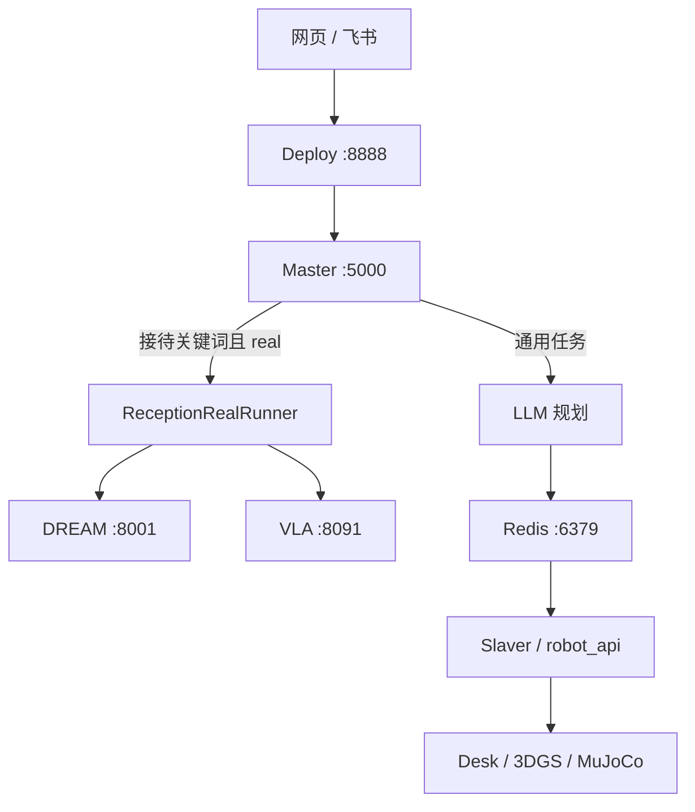

# FQPlanner 项目快速上手指南

面向要在本机把大脑跑起来、从网页或飞书发任务、看仿真画面的人。仓库 `<CONNECTION_ROOT>`，本机 `ubuntu@192.168.5.35`。

真机接待逐步启动看 [三端联调启动全流程](联调核心文档/三端联调启动全流程.md)。VLA 口径看 [G1 Brain–VLA 桥接（当前版）](联调核心文档/G1%20Brain–VLA%20桥接（当前版）.md)。面板按钮看 [Linux 控制面板](../web/README.md)。

---

## 1. 大脑做什么

FQPlanner 是任务编排层，不直接控电机。飞书或网页把任务交给 Master；导航走 DREAM，抓放走 VLA。



两条链不要混：

| | 通用任务 | 公司任务（接待） |
|---|---|---|
| 入口 | 网页 / 飞书自然语言 | 飞书或网页触发，Master 判 `reception` |
| 本机仿真 | Desk `:5008`（无画面） | 看图优先 3DGS `:5002`，否则 MuJoCo `:5001` |
| 真机 | 无 | DREAM `:8001` + VLA `:8091` |
| 网页四宫格 | 取决于谁在听；Desk 本身不出图 | 当前仿真后端的四路相机 |

接待固定顺序：导航到茶水间（table2）→ 抓瓶装可乐 → 过门 → 导航回工位（table1）→ 放下。VLA 当前是 `hand_state_only`：终态 `COMPLETED_HAND_STATE_ONLY` 只说明左手开合加至少 3 帧证据，**不等于**图像证实可乐在手上或已放到桌面。

飞书和 8888 网页共用 `robot_api.intent`，只分两类：天气/百科等闲聊不 `publish_task`；「开始接待」「桌上有什么」等交给大脑。认不出、又可能动手的句子按任务处理，避免误聊把真动作吃掉。

通用、看图、接待这三类顶层任务，**仿真和真机跑完都会做事后复盘**。真机接待仍是固定 DREAM → VLA 顺序，复盘不改规划、不重放动作。DeepSeek 根据执行账本写候选经验，调不通就降模板；默认只落到 `master/memory/reflections/`（git 忽略），**不改 SOP**。只有 mock「开始接待」还兼容原来的 `write_sop`。飞书任务卡会多一行「复盘：」。关掉：`master/config.yaml` 里 `reflection.enabled: false`，或环境变量 `REFLECTION_ENABLED=0`。只要模板、不要调模型：`FQPLANNER_REFLECTION_LLM=off`。

---

## 2. 冷机怎么开

面板 `http://192.168.5.35:5678`（`web/run_panel.py`，systemd `fqplanner-panel`）。无登录，只在可信网络用。冷机只有面板自启，业务进程默认全停。

建议顺序：

1. **Redis** `:6379` → **Master** `:5000`。这两张是大脑核心。重启 Master 会按 `collaborator.clear=true` 清空协作库，面板会先确认。
2. **Deploy** `:8888`、要发飞书再起 **飞书**、通用任务再起 **Slaver**。Deploy 和飞书都只是给 Master 下任务。
3. 要看图：先起 **3DGS** `:5002`，起不来再起 **MuJoCo** `:5001`。不要和 Desk 抢画面。
4. 真机接待另起 DREAM / VLA；面板真机层两张卡片同时绿灯才允许发接待任务。

面板启停的是本机 tmux，不会替你发任务。DREAM「启动」是一键脚本；「站立 Enter」每点一次只向导航机 `adapter` 窗口发一个 Enter。

| 服务 | 地址 |
|---|---|
| 面板 | `http://192.168.5.35:5678` |
| 任务网页 | `http://192.168.5.35:8888` |
| Master | `http://127.0.0.1:5000`（浏览器里用网页同源 `/api/task_status`，不要直接打这个地址） |
| 3DGS | `http://127.0.0.1:5002` |
| MuJoCo | `http://127.0.0.1:5001` |
| Desk | `http://127.0.0.1:5008`（无画面） |
| DREAM | `dream:8001`（审核页 9882） |
| VLA | `gpu4090:8091` |

`.env` 在仓库根，`cp .env.example .env`。飞书、SSH、远端地址从这里读。不要把填好的 `.env` 提交进 git。老配置里的 `192.168.5.185`、`192.168.0.108` 已不是现场地址。

每个服务一个 tmux session，名字就是服务 id：`tmux attach -t redis|master|deploy|feishu|slaver|desk|mujoco|gs`。日志在 `log/YYYY-MM-DD/<服务>/`。

---

## 3. 仿真后端和网页四宫格

`:8888` 任务控制台中间的四宫格 **不是四个仿真**，是 **当前那一个仿真后端的四路相机** 拼在一起。哪个后端在听，画面就是哪种风格。

Deploy 选画面的顺序写在 `deploy/run.py` 的 `VISION_CANDIDATES`：先 3DGS `:5002`，再 MuJoCo `:5001`。Desk `:5008` 没有 `/camera/latest`，四宫格不会走它。

| 后端 | 端口 | 画面 | 四路相机（左上、右上、左下、右下） |
|---|---|---|---|
| 3DGS | `:5002` | 扫描高斯场景，室内实景感 | 俯视 `overhead_cam`、头 `head_cam`、右腕 `right_arm_cam`、左腕 `left_arm_cam` |
| MuJoCo | `:5001` | 几何厨房 / 轻量台面 | `overhead_cam`、`robot0_frontview`、`robot0_eye_in_hand`、`robot0_agentview_center` |
| Desk | `:5008` | 无 | — |

直播是现渲；回放是该任务逐步截的 JPEG，点进度条可拖。两边都是同一套相机位，只是时间点不同。

3DGS 第一次出图会 CUDA JIT，大约一分多钟。这期间 `/camera/latest` 可能给出很小的黑 JPEG（一两 KB），属正常；JIT 结束后应是约 640×480、几十 KB 的室内扫描图。依赖在仓库 `.venv_3dgs`，驱动是本机 NVIDIA（当前 595 + CUDA 12.8）。需要代理时：

```bash
export http_proxy=http://127.0.0.1:7897 https_proxy=http://127.0.0.1:7897
```

真机接待不经过 3DGS。3DGS / MuJoCo 只给网页和飞书看图；机器人走的是 DREAM 和 VLA。

---

## 4. 网页和飞书怎么发任务

两个入口等价，都落到 Deploy `:8888` → Master `:5000`。

- 网页：任务框提交。闲聊会提示「识别为闲聊，未发送给大脑」；运动类会先弹出确认。「开始接待」按钮视为已确认。真机接待中途失败修好现场后，用旁边的 **断点继续**（不要再点开始接待走空手预检）。
- 飞书：私聊直接发；群里 `@机器人 /task <内容>`。`/help`、`/status` 是桥接自带命令。运动类要原发送者点确认；只读的「看一看 / 桌上有什么」不用确认。`LARK_TASK_MODE=dry_run` 只发卡不提交，`active` 才真发。

飞书看图走 `robot_api/look.py` 的 `look_around`，图源同样按 3DGS → MuJoCo 排序，跟网页四宫格一致。「桌上/前面有什么」由 Master 规划一步拍照，Slaver 调 `capture_image`；Desk 无画面时会改打 3DGS / MuJoCo。真机 VLA 没有闲时取帧。

飞书本机配置：根目录 `.env` 填 `LARK_APP_ID` / `LARK_APP_SECRET`，`LARK_BRAIN_URL=http://127.0.0.1:8888`。先起 Deploy、Master、Slaver（看图再起 3DGS 或 MuJoCo），再：

```bash
.venv_feishu/bin/python integrations/feishu/run.py
```

同一应用同时只跑一个桥接进程。本机要能访问 `open.feishu.cn`。

Master 在 `POST /publish_task` 前会拒闲聊，接待任务再做 `task_preflight`。接待要求 DREAM `:8001` 和 VLA `:8091` 都通；不通则 `status=rejected`，日志应有 `[task] preflight … ready=false`，不会跑进 skill 再 `FAILED FETCHING_WORLD`。通用任务不探这两端口。

---

## 5. 发任务前 30 秒

1. 面板 Redis / Master 绿。
2. 要看图：3DGS 或 MuJoCo 绿；四宫格应是扫描室内或几何厨房，不应是持续 1～2KB 的黑图。
3. 飞书要发：飞书卡片绿，`.env` 里 `LARK_TASK_MODE=active`。
4. 真机接待：DREAM 与 VLA 两张卡片都绿，再发。不要在 `rejected` 时反复点确认。

看执行过程：面板日志区或 `log/YYYY-MM-DD/master/`，正文看 `[task]` / `[reception]`。Flask 访问日志只有方法和路径。DREAM / VLA 的探测在当天 `monitor.log`。闲聊、预检这类还没有 `task_id` 的入口日志不再沿用上一次任务编号，按任务 grep 时不会串台。导航失败时 Master 会写出缺了哪条成功证据（`state=succeeded` / `success` / `reached` / `navigation_stopped`），以及 DREAM 返回的 `code` / `reason`。

---

## 6. 排障速查

| 现象 | 先看 |
|---|---|
| 网页提交没反应 | Master / Redis 是否在听；Deploy 日志有无打到 Master |
| 网页提示闲聊 | 句子没被判成任务；改口「开始接待」「桌上有什么」 |
| 四宫格全黑且 JPEG 只有一两 KB | 3DGS 是否还在首次 JIT；`serve_3dgs` 日志有无 `render_frame` 异常 |
| 四宫格是几何块面，不是扫描实景 | `:5002` 没起来，Deploy 落到了 `:5001` |
| 飞书能聊不能发任务 | `LARK_TASK_MODE`；运动类是否已点确认 |
| 接待一发就 `rejected` | `task_preflight`：DREAM 8001 / VLA 8091 |
| 预检未通过仍持有 `cola_can_1` | 多半是抓取后失败又点了「开始接待」；改点「断点继续」 |
| 导航失败看不出卡在哪 | Master 日志里的 `未满足:` 字段；缺 `reached` 或 `navigation_stopped` 就是终态证据不齐 |
| 飞书任务卡没有「复盘」 | 任务是否已结束；`reflection.enabled`；`CLOUD_API_KEY` 不通时仍应有模板档摘要 |
| CUDA / 3DGS 起不来 | `nvidia-smi`；不要用 nouveau；venv 用 `.venv_3dgs` |

---

## 7. 还要深入时

| 文档 / 文件 | 用途 |
|---|---|
| [三端联调启动全流程](联调核心文档/三端联调启动全流程.md) | 真机接待逐步启动、预检、收工 |
| [G1 Brain–VLA 桥接（当前版）](联调核心文档/G1%20Brain–VLA%20桥接（当前版）.md) | 抓放怎么发、证据等级 |
| [Linux 控制面板](../web/README.md) | 5678 启停、一键脚本、站立 Enter |
| [联调文档目录](联调核心文档/README.md) | 其余联调材料索引 |
| `master/sop/reception_real.py` | 一次真机接待有哪些阶段 |
| `master/sop/episode.py`、`master/sop/reflect.py` | 统一任务账本和事后复盘 |
| `master/run.py`、`deploy/run.py` | 网页如何转到 Master、四宫格从哪取图 |
| `robot_api/intent.py` | 闲聊 / 公司任务怎么分 |
| `robot_api/look.py` | 飞书看图 |
| `web/run_panel.py` | 面板启停哪些进程 |
