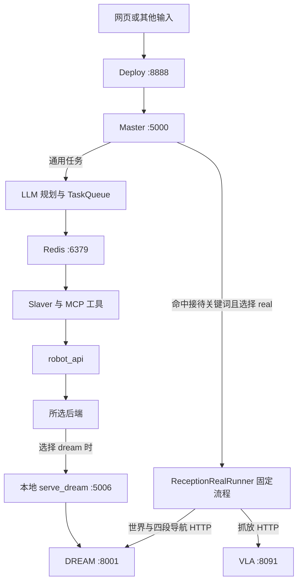

# Brain / FQPlanner 项目接手指南

面向：同时承担大脑开发、部署维护、三端联调和现场排障的新同事。  
核对日期：2026-09-14，约 13:44，UTC+08:00。  
项目目录：`C:\Program Files (x86)\brain`。下文代码路径相对此目录。

本指南对照当前工作区源码、配置、已有联调文档、Windows 服务和任务配置编写，并运行了已有本地模拟测试。没有启动业务服务、发布接待任务、修改业务代码或配置，也没有执行机器人动作。远端只尝试读取健康和状态接口，均超时；远端实现与物理状态没有在本次确认。

## 1. 先理解这个项目在整个机器人系统中的位置

**Brain 是机器人的任务编排层：把人的要求变成有顺序、有前置条件、可追踪结果的执行任务。**

以当前 G1 单罐接待为例：从 table2 取一罐可乐，经过门口和横移过门点，到 table1 放下。大脑负责决定下一步什么时候能开始；DREAM 负责定位和导航；VLA 负责抓取、放置及相应控制通路交接；NX / SONIC 是实际运动执行侧。

你接手的核心责任是：保证任务顺序正确、请求和回执能对上、失败后状态说得清楚、三端接口一致，并能从证据定位问题归属。

| 名称 | 含义与职责 |
|---|---|
| Master | 大脑主控服务：接任务、选择执行路径、管理进度与结果 |
| Deploy | 网页控制台，负责交互和转发；此目录名不代表完整部署系统 |
| Slaver | 仓库沿用的执行端命名：在通用任务链中选工具、调用工具并回传结果 |
| LLM | 语言模型，用于通用任务规划等；当前真机接待的动作顺序由代码固定 |
| VLM | 看图模型，用于视觉证据分析；当前真机抓放照片验证开关关闭 |
| VLA | 视觉、语言、动作相关执行子系统；大脑通过 HTTP 提交 pick / place |
| DREAM | 外部世界信息与导航服务；保留人工定位审核和运动准入条件 |
| SOP / skill | 标准流程 / 封装后的技能；本仓库有多代实现，需分清适用路径 |
| Redis | 通用任务链的协作状态与消息总线；不等于完整任务恢复数据库 |
| MCP | Slaver 调用机器人工具的协议层 |
| PBD | 早期世界模型对接，提供语义物体、地图等；有单独客户端 |
| 3DGS / MuJoCo | 场景渲染 / 仿真相关能力，可用于开发验证 |

## 2. 必须分清的两条执行链



### A. 当前固定真机接待

`deploy/run.py::publish_task` → `master/run.py::publish_task` → `GlobalAgent.publish_global_task()` → `_run_reception_skill()` → `reception_skill.run_reception_skill(mode="real")` → `ReceptionRealRunner.run()`。

Master 内的后台线程直接调用 DREAM / VLA HTTP。每一步动作不经过 Slaver，也不让通用 LLM 改写顺序。入口按“接待、补货、迎宾、准备会议”等关键词匹配，范围比只有“开始接待”更广。

注意：Master 初始化仍构造 Redis 协作对象和规划器。因此“真机步骤不经 Slaver”不代表 Master 启动完全不依赖 Redis 或模型配置。

### B. 通用自然语言任务

Master → `GlobalTaskPlanner.forward()` → `TaskQueue` → Redis → Slaver → MCP 工具 → `robot_api` → 后端 → 结果回传。

通用 DREAM 导航还经过 `dream_route_policy.py` 与 `serve_dream/dream_navigation_sop.yaml`，把 table2 → table1 展开成带两个门段的路线。当前这条链与固定真机接待使用了不同的点位来源。

### 还有一套较早的接待演示

`reception_loop.py` 实现开灯、扫描、数缺口、逐罐补货、复核、播报、反思等流程；支持 mock / robot_api 后端。`/reception` 展示页和 `/api/reception/run` 使用这一套。

**当前 real 接待在 `reception_skill.py` 中直接返回到 `reception_real.py`，不会继续执行后面的示范经验检索与旧补货循环。** 修改旧 SOP、示教文件，不等于改了当前 G1 真机的四段固定路线。

## 3. 当前真机接待：一条任务如何完成

```text
世界、定位、VLA、点位合同预检
 → 导航到 table2
 → VLA pick
 → 抓取结果确认〔照片验证可选，当前关闭〕
 → 导航到 relay2：门外接近点
 → 横移到 relay3：过门点
 → 导航到 table1
 → VLA place
 → 放置结果确认〔照片验证可选，当前关闭〕
 → 输出任务终态
```

DREAM 细检及相机交接是可选分支，当前 `dream_inspection_enabled=false`，会跳过。

| 阶段 | 大脑关键检查 | 下一步 |
|---|---|---|
| 预检 | DREAM 在线、世界可用、定位已批准、无冲突命令、通路就绪；关系图与四段合同一致；VLA 可用、无活动策略、无待恢复状态、未持物 | 才允许第一段导航 |
| 每段导航 | POST 后按原 command_id 查询；必须 `succeeded`、`success=true`、`reached=true`、`navigation_stopped=true` | 才推进依赖步骤 |
| 抓取 | 身份与时间字段一致；成功、持物、策略已停、导航通路归还；按当前策略检查手部证据 | 才进入门段 |
| 放置 | 成功、释放、未持物、策略已停、通路归还；按当前策略检查手部或物体证据 | 才计算最终状态 |
| 图片验证开启时 | 动作完成后的新图片：`captured_at > completed_at`；VLM 分析，再由 LLM 结合结果判真 | 验证通过才推进 |

关键区别：HTTP 202 代表“收到请求”，不代表“机器人做完了”。网页显示请求成功，也不能代替动作终态。

### 当前成功的证据等级

`master/config.yaml` 当前为：

```yaml
reception_real:
  enabled: true
  vla_result_policy: hand_state_only
  dream_inspection_enabled: false
  grasp_photo_verification_enabled: false
  place_photo_verification_enabled: false
```

`hand_state_only` 还要求左手开合确认、至少 3 帧证据及通用结果字段。它不等价于通过图像证实“可乐确实在手中 / 桌面上”。当前策略下完整流程的终态是 `COMPLETED_HAND_STATE_ONLY`，不能对外直接宣称已经完成物体视觉验收。

当前网页顶层成功标签主要看子任务是否报错，未专门展示此证据等级；部分入口说明也固定写着 VLM+LLM 判真。联调以配置和 `reception_state` 为准，界面措辞需要后续对齐。

## 4. 服务在哪里，配置从哪里来

### 4.1 服务地图

| 服务 | 本地配置中的地址 / 端口 | 角色 |
|---|---|---|
| Deploy | `127.0.0.1:8888` | 网页、任务提交、进度转发 |
| Master | `127.0.0.1:5000` | 任务编排与状态 API |
| Redis | `127.0.0.1:6379` | 本机协作总线 |
| Slaver | 没有在本表中统一指定 HTTP 端口 | 通用链执行进程 |
| 本地 DREAM 适配 | `127.0.0.1:5006` | 通用 robot_api 到远端 DREAM 的适配 |
| DREAM | `192.168.5.185:8001` | 固定真机接待的远端导航和世界接口 |
| DREAM 审核页 | `192.168.5.185:9882` | 导航组的人工审核入口 |
| VLA | `192.168.5.194:8091` | 固定真机抓放和结果查询 |
| MuJoCo | `127.0.0.1:5001` | 仿真后端 |
| 3DGS | `127.0.0.1:5002` | 带 3DGS 渲染的后端 |
| Desk | `127.0.0.1:5008` | 轻量桌面 mock 后端 |

这些是配置值，不代表当前服务已启动。网络配置文件把大脑主机写为 `192.168.5.108`；本次未核验该地址是否仍分配给本机。

### 4.2 配置分工和覆盖关系

| 文件 / 环境变量 | 管什么 | 接手重点 |
|---|---|---|
| `master/config.yaml` | 大脑模型、Redis、真机接待地址、时限、证据策略 | 当前 real 已启用 |
| `RECEPTION_MODE` | 覆盖 Master 接待模式 | `real` / `mock`；以启动该进程时的环境为准 |
| `DREAM_BASE_URL` / `VLA_BASE_URL` | 覆盖真机 Runner 的远端地址 | 普通终端和 Windows 托管任务环境可能不同 |
| `robot_api/config.yaml` | 通用工具后端路由 | 当前 `active_backend=dream`，指向本地 5006 |
| `serve_dream/config.yaml` | 本地 5006 的远端地址、协议、动作准入 | 当前地址仍是 `192.168.0.185:8001`，与 Master 不同 |
| `serve_dream/dream_navigation_sop.yaml` | 通用 DREAM 路径的审核点与门段规则 | table2 仍使用旧点位 |
| `tools/g1_reception_network.json` | 接待启动器的检查地址 | 启动器读取它，但不会自动同步 Master 的配置文件 |
| `slaver/config.yaml` | 工具调用、执行端模型与感知模式 | 与固定接待照片验证开关不是同一件事 |
| `.env` | 密钥等本地环境配置 | 本指南不读取或收录密钥值 |

**切换 `active_backend` 并不能单独决定固定接待是否走真机。** 两条链需要分别核对；修改配置后，也要确认对应进程已加载新值。

## 5. 看代码的推荐顺序

| 顺序 | 文件 | 阅读时回答的问题 |
|---:|---|---|
| 1 | `master/sop/reception_real.py` | 一次真机接待有哪些阶段，在哪里失败，怎样保存状态？ |
| 2 | `master/integrations/dream_client.py` | 导航如何提交、查询、判断到达、处理结果不确定？ |
| 3 | `master/integrations/vla_client.py` | 抓放的身份、终态和证据如何核验？ |
| 4 | `master/sop/reception_store.py` | 状态快照、事件、图片保存在哪里？ |
| 5 | `master/agents/agent.py` | 接待路由与通用路由如何选择，前端进度如何生成？ |
| 6 | `master/run.py`、`deploy/run.py` | 网页请求如何传到 Master，哪些 API 只是查询？ |
| 7 | `master/agents/planner.py`、`agent/collaboration/collaborator.py` | 通用 LLM 计划如何经 Redis 发送？ |
| 8 | `slaver/run.py`、`slaver/robot/skill.py`、`slaver/robot/module/` | 执行端怎样接任务、注册工具、回传结果？ |
| 9 | `robot_api/runtime.py`、`serve_dream/service/server.py` | 语义动作怎样转成后端 HTTP？ |
| 10 | `master/tests/`、`serve_dream/test_agent_http.py` | 当前哪些合同和失败分支已有模拟测试？ |

其他目录按任务需要再看：

- `serve/`、`serve_3dgs/`、`serve_desk/`：三种开发后端。
- `serve_real/`：另一套真机桥接和驱动代码；不能仅凭目录名就当成当前 G1 接待入口。
- `nav2/`：地图、可通行点、工作点生成；`docker/nav2/` 还有 ROS2 桥。
- `master/sop/reception_workpoints.py`：早期按物体 / 椅子生成工作点；当前 real 固定路线直接用 `NAVIGATION_LEGS`。
- `master/memory/`：通用任务技能与经验；`master/sop/reception_memory/`：接待示范和全局经验。
- `master/sop/video_to_actions.py`、`learn_from_demo.py`、`reflect.py`：视频示教、规则提炼、反思。
- `services/`、`teleop/`：ACT、pi0.5 推理、数据采集和训练相关。
- `nx_voice/`：语音触发入口；`integrations/feishu/`：已有飞书桥接代码，本次未验证运行，9 月恢复设计明确不以飞书为本期依赖。
- `PBD_AG_大脑端轻量客户端_v0.1.0/`：PBD 对接样例；部分历史说明已移出工作区。

## 6. 怎么启动和验证：分开“起服务”和“执行任务”

### 6.1 本机环境事实

- 当前托管任务使用 `.venv\Scripts\python.exe`，实际版本为 **Python 3.11.3**。
- `pyproject.toml` 声明 **Python >=3.10,<3.11**，并指定 Linux x86_64 环境。
- `requirements.txt` 与 `pyproject.toml` 的 torch、numpy 等版本也不同。

因此新机器不能仅凭其中一个依赖文件就认为能复现这台 Windows 工作区。交接时应另行确认：Windows 大脑环境、Linux / GPU 仿真环境、模型服务环境各自的安装方法与版本清单。

### 6.2 本机已经注册的管理入口

Windows 服务：`FQPlannerRedis`。

Windows 计划任务：`G1BrainMasterManaged`、`G1BrainSlaverManaged`、`G1BrainDeployManaged`。本次查询到三者都从项目根目录使用 `.venv` Python 启动对应 `run.py`，不是通过 `master/run_master_managed.cmd` 启动。

常规启动关系：Redis → 所需后端 / 远端就绪 → Master → Slaver（通用链需要）→ Deploy。固定接待现场启动器也会启动 Slaver，以保持现有整套服务方式。

**启动 Master 有状态影响：** `master/config.yaml` 的 `collaborator.clear=true`，协作层初始化会清空选定 Redis 数据库；规划器也会构造协作对象。不要把重启 Master 当成无影响的健康检查。

### 6.3 一个容易误点的入口

`tools/Start-G1Reception.ps1` 会依次：启动本地服务 → 检查三端 → 生成 task_id → 发布“开始接待” → 监控。

它会提交真实业务任务。`-NoBrowser` 只是不打开页面，`-NoMonitor` 只是跳过监控，**都不是演练模式**。退出监控也不会取消机器人任务。

该脚本检查的地址可由参数 / 网络 JSON 覆盖，但它不把这些地址写回 Master。检查对象与实际执行对象需要一致。

### 6.4 先做不发动作的检查

在项目根目录的 PowerShell 中，可查看本地管理状态：

```powershell
Get-Service -Name FQPlannerRedis
Get-ScheduledTask -TaskName 'G1Brain*'
Get-NetTCPConnection -State Listen |
    Where-Object { $_.LocalPort -in @(5000,5006,6379,8888) }
```

服务启动后，可只读查询任务状态。专门的预检 API 使用 POST，但当前实现只读取下游状态，不提交导航或抓放：

```powershell
Invoke-RestMethod 'http://127.0.0.1:5000/api/task_status'
Invoke-RestMethod 'http://127.0.0.1:8888/api/task_status'
Invoke-RestMethod -Method Post `
    -Uri 'http://127.0.0.1:5000/api/task_preflight' `
    -ContentType 'application/json' `
    -Body '{"task":"开始接待"}'
```

本指南没有执行这些业务服务启动或任务提交操作。现场定位审核、机器人执行准备由对应负责人完成后，再进入动作联调。

## 7. 三端联调应该怎样组织

### 7.1 对齐清单

| 对齐对象 | 应确认什么 | 交付证据 |
|---|---|---|
| 大脑 ↔ DREAM | 8001 地址；合同版本；map 坐标系；四段坐标、phase、leg_index、motion_mode、最终朝向 | 同一版本关系图与导航合同、预检结果 |
| 大脑 ↔ VLA | 8091 地址；pick/place 入参；同一 task_id 与各自 command_id；证据策略；停止与归还字段 | 原请求、接受回执、终态 JSON |
| DREAM ↔ VLA | VLA 能查询导航凭证；切换前导航真正停止；控制源互斥 | command 查询结果、控制权记录 |
| VLA / relay ↔ NX | 动作发布者停止、出口所有权、手部目标、NX 是否真正接管下一控制源 | 带身份的交接与执行侧回执；目前增强协议仍待实现 |
| 相机相关 | 唯一采集者、视角、帧时效；是否启用照片判真 | 相机状态、快照时间与动作完成时间 |

合同版本目前为 `fq/reception-lan/v1`；导航使用 `map`，真机合同 yaw 为弧度。通用工具层可能输入角度，适配层负责转换，不要把同一数值直接套进两层接口。

### 7.2 核心接口速查

| 服务 | 读取与检查 | 动作提交 |
|---|---|---|
| Master / Deploy | `GET /api/task_status`；`POST /api/task_preflight` 是只读预检 | `POST /publish_task` |
| DREAM | `GET /health`、`/v1/status`、`/v1/world`、`/total_scene_graph_latest.json`、`/v1/commands/{command_id}` | `POST /v1/navigation/goals` |
| VLA | `GET /health`、`/v1/vla/control/status`、`/v1/vla/tasks/{command_id}` | `POST /v1/vla/tasks` |
| 照片验证 | `GET /v1/camera/status`；读取 snapshot 图片 | `POST /v1/camera/snapshots` |

客户端还封装了下游取消接口，但当前固定 Runner 的异常处理并没有自动调用它们，也没有完整的大脑暂停 / 续跑控制面。**大脑失败或停止轮询，不等于已经取得机器人停止证据。**

### 7.3 联调顺序

1. 先锁定代码版本、运行环境、网络、点位合同和验收标准。
2. 跑本地模拟测试，再只读核对三端状态和完整预检。
3. 现场确认后，分别验证导航到达、抓取、放置以及必要的控制源切换。
4. 验证四段路线的顺序、门段模式与最终朝向；不能跳过 relay2 / relay3 直达。
5. 跑一次固定单罐流程，每步保存三端共同身份的证据。
6. 再覆盖失败场景：未批准定位、点位合同不一致、活动任务冲突、POST 回执丢失、查询超时、抓放失败、控制交接未完成。

每次联调记录：代码版本及未提交差异、配置版本、task_id、各段 command_id、时间、最后确认成功阶段、失败阶段、下游原始错误、位置 / 持物 / 控制权、现场处理人和结果。传递日志时应剔除密钥等无关配置。

## 8. 如何排障：先找原命令，再判断责任端

### 8.1 从这几个文件和字段入手

| 位置 | 内容 |
|---|---|
| `master/sop/runtime/reception/current_task.json` | 当前快照：task_id、state、runtime_phase、verified_state、commands、failed_phase、failure_reason |
| 同目录 `events.jsonl` | 命令准备、接受回执、状态切换和错误；按 task_id 过滤 |
| 同目录 `verification.jsonl`、`images/` | 开启视觉判真后才有相应证据，不保证当前存在 |
| `master/.logs/master_agent.log` | 当前 Master 配置对应的主日志位置 |
| `.logs/reception_launcher/` | 启动器每次执行的日志 |
| `.logs/`、`.log/` | 历史不同启动方式的输出；先看时间和实际启动方式 |

`runtime_phase` 是“现在在做什么”；`verified_state` 是“最后确认到什么业务阶段”。报错时两者不一定相同。`holding` / `object_location` 还需结合证据等级理解，不能一律当作实时物理真值。

### 8.2 常见现象与检查方向

| 现象 | 优先检查 | 责任入口 |
|---|---|---|
| 网页打不开 | 8888 是否监听、Deploy 计划任务状态 | 大脑部署 |
| 网页能开但任务状态查不到 | 5000、MASTER_URL、Master 日志、Redis | 大脑部署 / 主控 |
| 一启动接待就在 FETCHING_WORLD 失败 | 远端连通性、定位批准、关系图、四段合同、VLA 残留状态 | 大脑配置 + DREAM / VLA |
| 接口返回 202 后一直没完成 | 用原 command_id 查下游；区分等待审核、执行中、失联、明确失败 | 对应执行端 |
| VLA 抓取失败 | 原任务结果、手部 / 物体证据、策略是否停止、控制权 | VLA |
| 抓完后下一段导航不动 | 端口归还与 NX 实际接管分别核查 | VLA / relay / NX + DREAM |
| 大脑显示 FAILED，但现场还在动 | 下游是否仍执行，停止请求是否被确认；大脑异常不自动完成取消 | 三端联合 |
| 通用任务卡住，接待直连却正常 | Redis 注册 / busy / 结果回传、Slaver、5006 的远端配置 | 大脑执行链 |
| 重启后网页无任务，但磁盘有旧任务 | 当前 UI 用内存队列；磁盘快照不等于完整启动恢复已实现 | 大脑持久化 |
| mock 完成，真机预检失败 | 两条执行体、地址、点位与证据合同是否不同 | 大脑配置 / 联调 |

对于 POST 结果不确定，当前 DREAM / VLA 客户端会有限次查询原 command_id，确认不了则进入人工恢复分支。不要为了“再试一次”直接创建一个新的接待任务；原动作可能已经发生。

### 8.3 当前恢复能力的实际边界

已实现：原子写状态快照、追加事件、动作前保存 command_id、部分通信不确定场景查原命令、部分情况进入 `RECOVERY_REQUIRED`。

尚未形成完整能力：跨进程重启恢复业务步骤、统一暂停 / 取消 / 续跑接口、持久任务调度、三端停止确认后的资源释放。

源码中的旧状态检查在 `_start_state()`，即再次运行接待时触发；不是 Master 启动时全面重建任务。`RECOVERY_REQUIRED` 还被列入终态集合，不能将这一标记理解为永久阻止后续新任务的完整恢复锁。

## 9. 2026-09-14 实查结果：接手基线

### 9.1 仓库和环境

- 当前分支：`robocasa-on-3dgs`；本地 HEAD：`aa5faf5`，日期 2026-08-13。
- 工作区已有大量修改、未跟踪文件及文档删除。文档索引说明历史说明已移出归档，不能把这些删除直接认定为误删。
- `reception_real.py`、`master/integrations/`、`master/tests/` 等关键新增实现仍显示为未跟踪；只交付 HEAD 会遗漏当前重要功能。
- 虚拟环境与依赖声明存在版本差异，详见第 6 节。

### 9.2 本机及网络快照

| 检查项 | 本次结果 | 含义 |
|---|---|---|
| Redis | 服务 Running，127.0.0.1:6379 监听 | 本机 Redis 已启动 |
| Master / Slaver / Deploy 计划任务 | 三者均为 Ready | 已注册、当前未显示 Running |
| 5000 / 8888 / 5006 | 未发现监听 | 本机大脑 API、网页、DREAM 本地桥当前未就绪 |
| DREAM 8001 健康与状态 | 从本机直连查询均在 4 秒时限内超时 | 未确认远端在线；不能仅据此判定远端程序故障 |
| VLA 8091 健康与状态 | 同上 | 需现场网络 / 远端服务进一步核查 |

### 9.3 已有测试

运行方式：使用现有 `.venv` Python；大脑测试依赖本机随机端口的 Fake DREAM / VLA；适配测试进程移除了真机动作授权环境变量。没有发布真实动作。

| 测试范围 | 结果 | 说明 |
|---|---|---|
| `master/tests/test_*.py` | 7 项：3 通过、4 失败 | 4 项均先碰到 table2 点位合同不一致 |
| `serve_dream/test_agent_http.py` | 7 项全部通过 | 覆盖查询终态、失败处理、角度转换、审核点及本地动作准入等 |

失败基线的具体差异：

```text
固定真机 Runner 的 table2：
[0.9083733639083396, 1.1619836672443717, -0.3050338025357986]

测试夹具 / 通用 DREAM SOP 的 table2：
[0.9948137550501258, 1.402057782965935, -0.3193204258080712]
```

`_validate_graph_contract()` 对点位做严格核对，因此测试在预检阶段失败；其中“持物残留”测试也被更早的点位错误挡住。这次没有修改任一点位。应先和导航组确认当前审核点，再同步来源和测试，不应反过来以测试里的旧值决定现场坐标。

### 9.4 留在磁盘上的最近任务记录

当前快照对应 **2026-09-07 17:47** 的任务 `d6793922d6c9465babb9c9ccd3796c66`：

- 状态 `FAILED`，失败阶段 `NAVIGATING_TO_TABLE2`，最后确认状态 `INITIALIZED`。
- 原命令 `nav-table2-c9ccd3796c66`。
- 下游错误 `NAVIGATION_EXECUTION_FAILED`，记录了 `no progress for 18.0s`，状态 `FORWARD_SLOW_CAUTION`，距离约 0.764 m。

这是历史记录，不是当前实时任务，也不是一次全链路成功验收记录。不能把它与 9 月 9 日方案中的“抓取后 relay2 无进展”历史任务混为同一故障。

## 10. 接手后优先做什么

| 优先顺序 | 工作 | 完成标准 |
|---:|---|---|
| 1 | 建立可复现交接基线 | 分清源码、运行数据、备份、归档；纳入关键新增源码；记录三端实际版本与 Python 环境 |
| 2 | 统一网络与审核点来源 | Master、5006 桥、启动器、测试、DREAM 关系图使用一致的现场合同；已有测试恢复通过 |
| 3 | 明确并展示结果证据等级 | 页面区分 hand_state_only 与物体 / 照片验证，统一验收口径 |
| 4 | 落实控制切换专项 | 原发布者停止、出口归还、NX 实际接管分别取得证据；不能只看 navigation_port_ready |
| 5 | 实施恢复与续跑设计 | 原命令查询、停止确认、持久断点、恢复预检、受控续跑逐项验收 |
| 6 | 整理部署和日志方式 | 托管入口、工作目录、环境覆盖、重启影响、日志位置有唯一说明 |

第 4、5 项已有设计，不必从零重新讨论需求：

- [控制切换方案，2026-09-09](联调核心文档/三端Pipeline导航与VLA全链路控制切换解决方案_20260909.md)：明确标注“待评审、未实施”，覆盖双向控制切换、导航段间条件和最终安全待机。
- [中断恢复与断点续跑设计，2026-09-08](联调核心文档/Pipeline中断恢复与断点续跑优化设计_20260908.md)：v1.2 设计稿，新增接口和数据结构是拟议功能。

两份文档是独立专项。控制切换不能仅靠重启或补发 START 解决；有恢复设计也不代表当前已经有可调用的“继续”接口。

## 11. 第一周建议安排与交接问题

| 时间 | 重点 | 当天产出 |
|---|---|---|
| 第 1 天 | 阅读第 1–5 节及核心 Runner；盘点三端负责人和版本 | 能讲清两条链，列出代码与配置基线 |
| 第 2 天 | 复现测试；对齐网络、table2 点位、Python 环境 | 可重复执行的本地测试记录和差异处理方案 |
| 第 3 天 | 与导航 / VLA 完成只读接口预检、审核流程走查 | 三端 readiness、合同与字段对照表 |
| 第 4 天 | 现场分段验证、控制切换验证，再做单罐联调 | 带共同 task_id / command_id 的证据包 |
| 第 5 天 | 复盘失败、明确证据标准、拆分后续专项 | 已验收 / 未验收清单和下一轮排期 |

交接会上应拿到明确答案：

1. 当前正式演示和验收范围究竟是单罐搬运，还是包含开灯、数人数、补多罐的完整接待？
2. 谁批准导航定位、谁确认抓放效果、谁负责 NX 和控制切换、谁有现场停机职责？
3. 哪一次完整跑通有原始证据？当时三端版本、点位、照片开关是什么？
4. `hand_state_only` 是临时演示口径还是当前验收口径？何时要求物体或照片证据？
5. table2 当前审核点是哪一个，为什么改变，各端是否同步？
6. 真正运行的服务路径、启动方式、账号权限、依赖清单、模型 / 相机接口分别由谁维护？
7. 控制切换和续跑两份设计是否已评审，依赖谁、交付顺序和验收负责人是什么？

## 12. 资料入口与关键源码跳转

历史文档按日期理解，当前行为对照源码和进程配置；远端行为以实际部署和现场验收为准。

- [三端文档总索引](联调核心文档/README.md)
- [统一联调方案](联调核心文档/G1_DREAM_VLA_Agent统一联调设计方案_20260827.md)
- [大脑接口说明](联调核心文档/01_大脑侧_单链路联调实现与接口说明.md)
- [DREAM 接口说明](联调核心文档/03_DREAM导航侧_单链路联调实现与接口说明.md)
- [VLA 接口说明](联调核心文档/02_VLA侧_单链路联调实现与接口说明.md)

源码入口：

- [固定真机流程](../master/sop/reception_real.py)：`NAVIGATION_LEGS`、`_collect_preflight()`、`_navigate()`、`_vla_action()`、`run()`。
- [任务分流与进度](../master/agents/agent.py)：`publish_global_task()`、`_run_reception_skill()`、`get_task_status()`。
- [DREAM 客户端](../master/integrations/dream_client.py) / [VLA 客户端](../master/integrations/vla_client.py)。
- [真机接待配置](../master/config.yaml) / [通用后端配置](../robot_api/config.yaml) / [5006 桥配置](../serve_dream/config.yaml)。
- [接待启动器](../tools/Start-G1Reception.ps1)：阅读后再使用，会自动发布任务。
- [本地接待测试](../master/tests/test_reception_real.py) / [DREAM 适配测试](../serve_dream/test_agent_http.py)。

本次新增的只有这份接手指南。已有源码、运行配置和历史任务记录保持原状。
